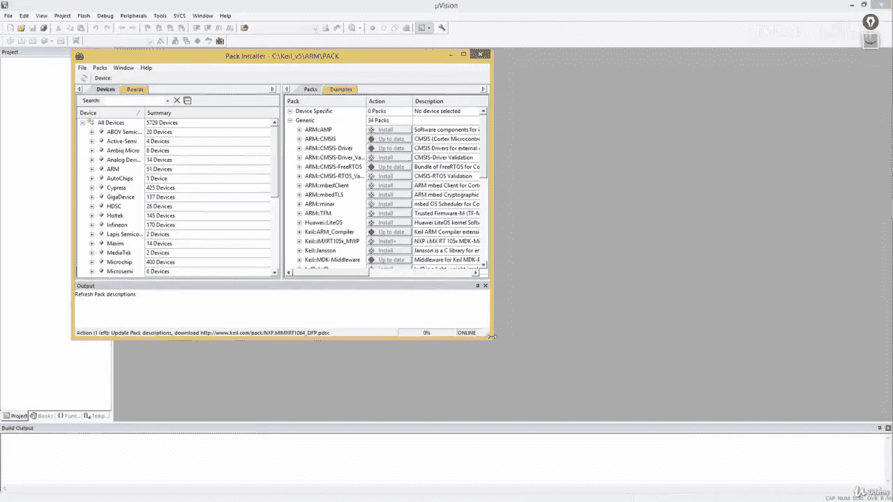
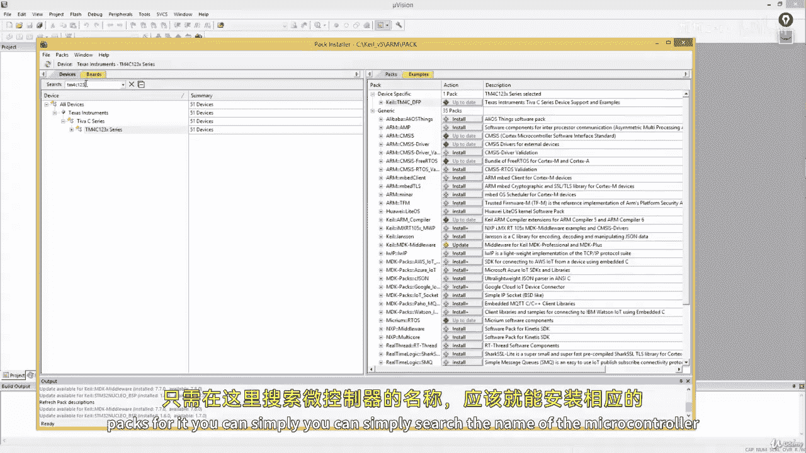
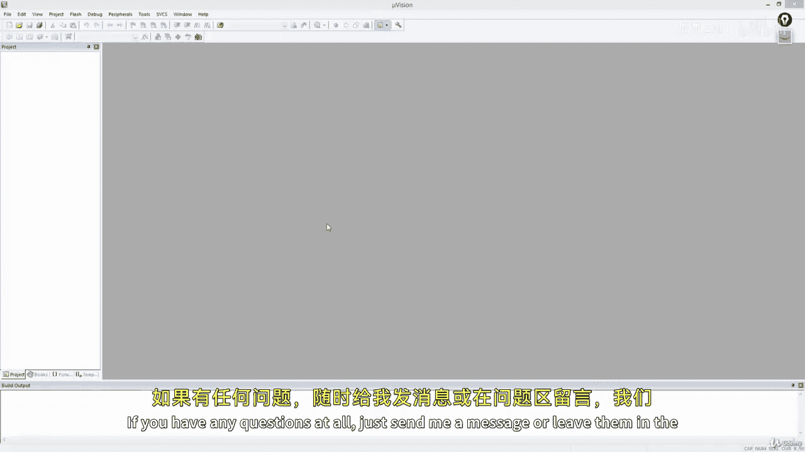

# ARM汇编语言入门：II：11.3 安装设备支持包

在本节课中，我们将学习如何为特定的Cortex微控制器安装设备支持包。这是使用Keil MDK进行开发前的必要步骤。

## 概述

上一节我们介绍了开发环境的搭建，本节中我们来看看如何为你的目标微控制器安装对应的设备支持包。设备支持包包含了芯片的启动文件、外设寄存器定义和系统初始化代码，是项目能够正确编译和调试的基础。

## 安装步骤

以下是安装设备支持包的具体流程。

1.  打开Keil MDK软件，点击工具栏上的 **Pack Installer** 图标（一个立方体盒子），启动包管理器。

    

2.  在Pack Installer窗口中，展开左侧的“Device”列表。如果你已经为你的开发板安装过支持包，可以跳过此课程。本教程适用于首次在Keil MDK中使用特定开发板的用户。

3.  根据你使用的开发板品牌，在搜索框或列表中查找你的微控制器型号。
    *   **对于STM32 F4系列**：搜索“STM32F411CE”。如果已安装，对应DFP（设备系列包）会显示“Up to Date”。如果未安装，你会看到“Install”按钮。
    *   **对于NXP KL25Z系列**：展开“NXP”列表，找到“KLxx Series”，然后选择你的具体型号（如KL25Z）。点击对应的DFP进行安装。如果版本显示为“Deprecated”（已弃用），请展开列表，安装其下方的旧版本。
    *   **对于Texas Instruments TM4C123系列**：搜索“TM4C123”，找到“TM4C_DFP”并点击安装。

4.  点击“Install”后，安装过程将在窗口底部显示进度。请等待安装完成，提示“Completed requested actions”。

    

    

5.  安装完成后，对应条目会显示“Up to Date”。如需卸载，可点击“Remove”。

## 总结

本节课中我们一起学习了如何在Keil MDK的Pack Installer中为STM32、NXP和TI的Cortex-M微控制器安装设备支持包。核心操作是**搜索芯片型号 -> 定位对应的DFP -> 点击安装**。如果你使用的是其他ARM微控制器，也可以遵循同样的方法搜索并安装其支持包。安装成功后，你就可以基于该芯片创建和开发项目了。下一节课，我们将编写一个简单的程序来测试安装是否成功。