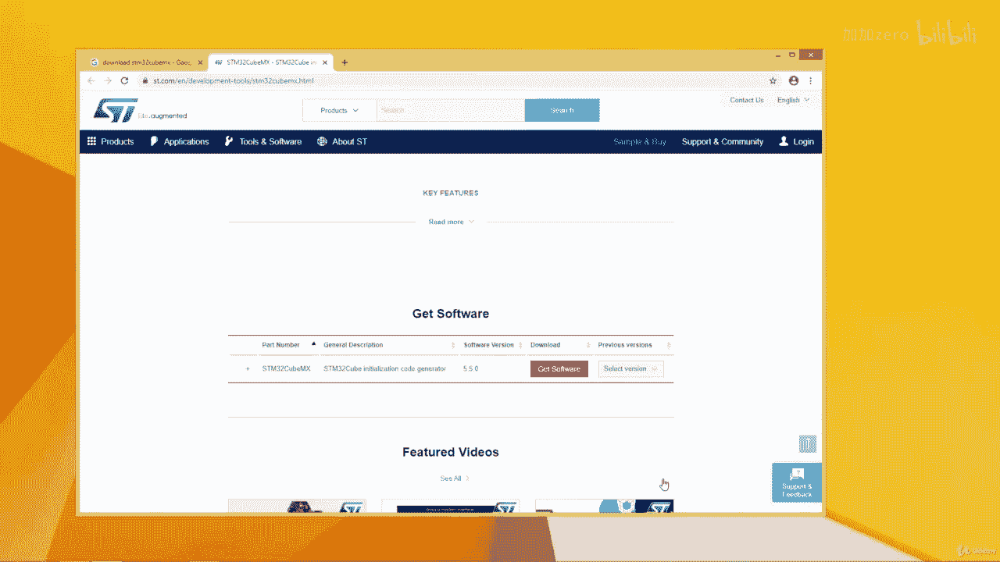
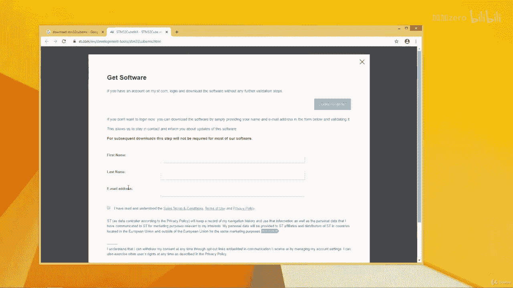
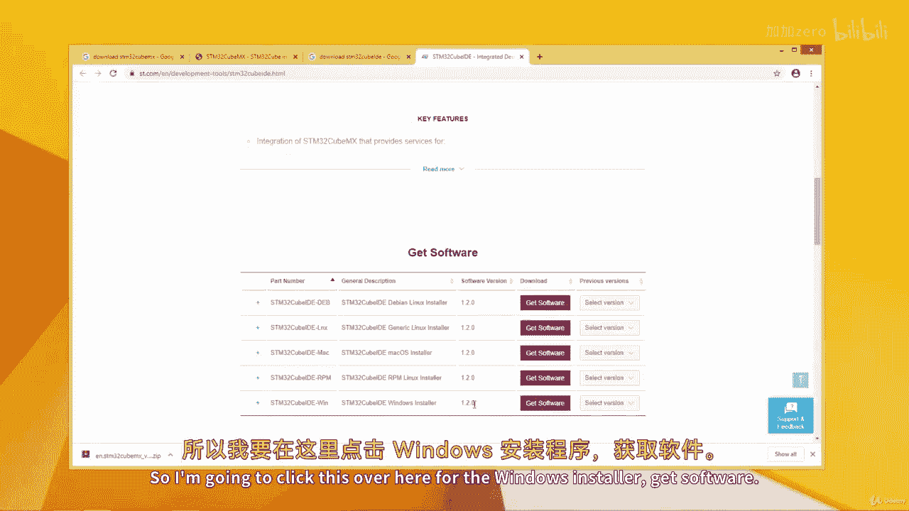
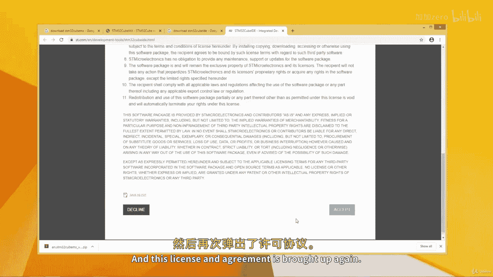
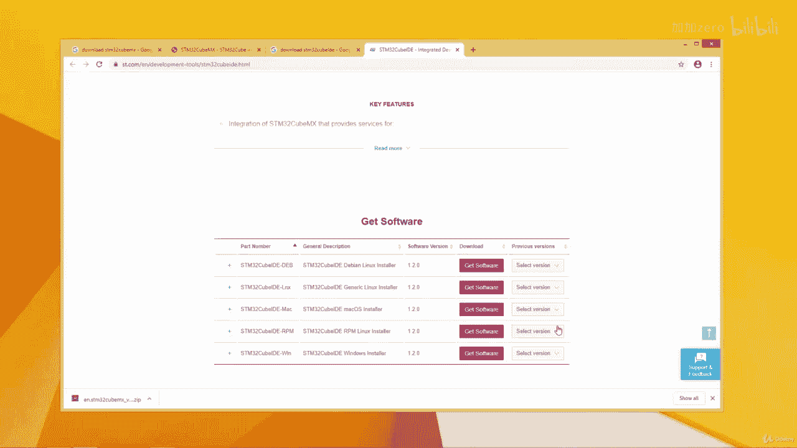
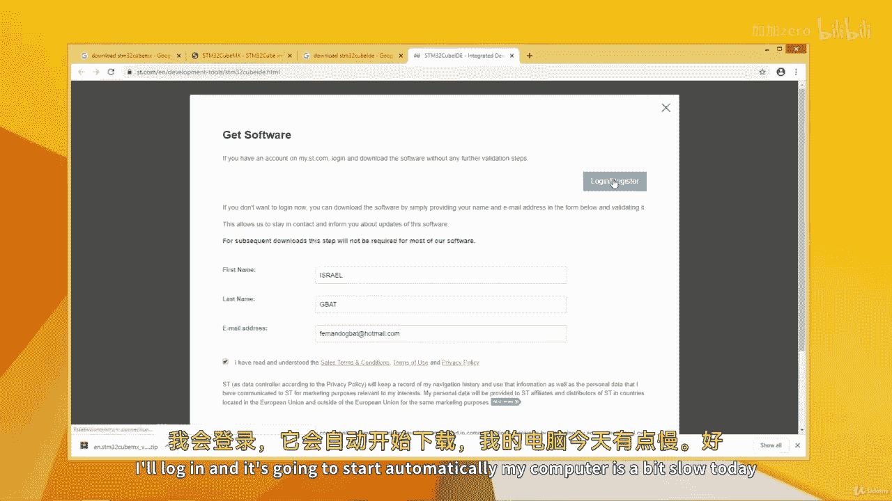
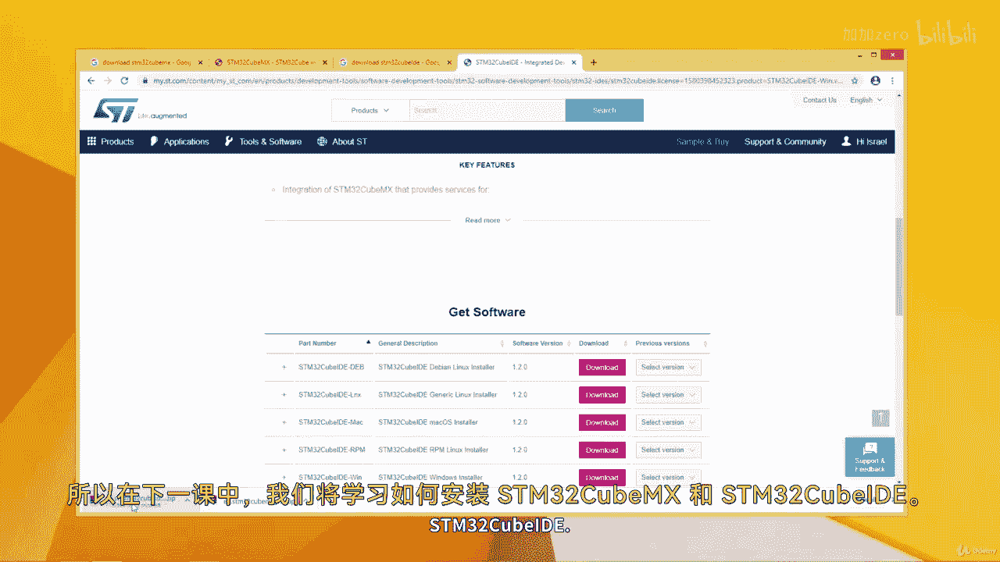

# 【从零开始学习 ARM 汇编语言II Udemy】 p49 p48 12.1. Download  CubeIDE -BV1RJU6YwEM8_p49-

Hello， welcome back。 And this lesson， we going to see how to download cubebe M X 5 and the new cube I D E released by S T microcroelectronics。

 So I'm a Google over here。 I'm simply going to search。Download STM 32 cube MX。Okay， let's see。

So we can come to the SD。com， that's the official website of SD microelectronics。

I'll click over here。😔，I'll open in a tub over here。😔，And here it is。Let's scroll down。

And I'll click get softwareft。The latest version is 5。5， as we can see over here。Over here。

 if you want to select a previous version， you can select that as well。

I'll just click get softwareftware over here。And it gives this license agreement。

 I've read this before， so I'll simply go ahead and accept。

Once that is done， you've got to input your email address and your name over here。

And once I lo in。I'm brought back here。I'll click download。So the first time said get softwareftware。

 you can either click download。Or wait for the download to begin automatically as it has begun over here。

 So it is downloading it now。Right， the download is complete。

I'm going to download the SDM32 cube IDE， this a new IDE released by ST microcroelectronics。

 orll say STM 32 or STM cube IDE， as it is called。Put download here。

And then I'll right click over here。😔，So this IDE is free of charge and there are no code limits。

Unlike Ku Viion， where the trial version gives you 32 kiloB of code limit。 This one here。

 you can have， however， larger code is。And it's all for free。So I'm brought over here。

 I can download the version that corresponds to my operating system。

I'm currently running windows as you can see， so I'm going to click this over here。

For the Windows installer， get software。

And this license and agreement is brought up again。 I'm going to accept。

And we brought here again。😔，I'll log in。

And it's going to start automatically。My computer is a bit slow today。😔，Okay。

 its started downloading。It's called both 665 meby， so this would take a while。So in the next lesson。

 we shall see how to install both the STM 32 cubeMX and the STM32 cube IDE I'll see you in the next lesson。

