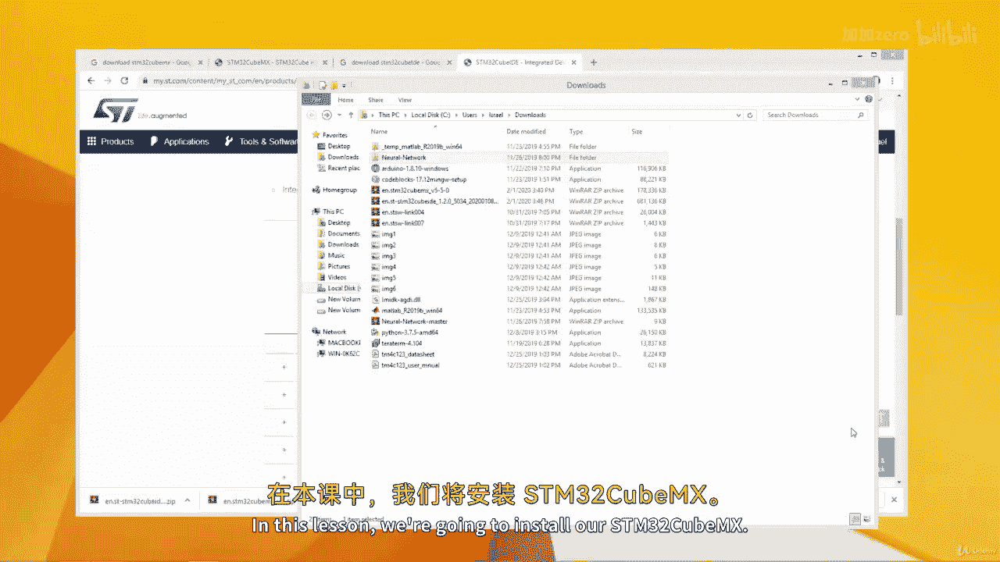
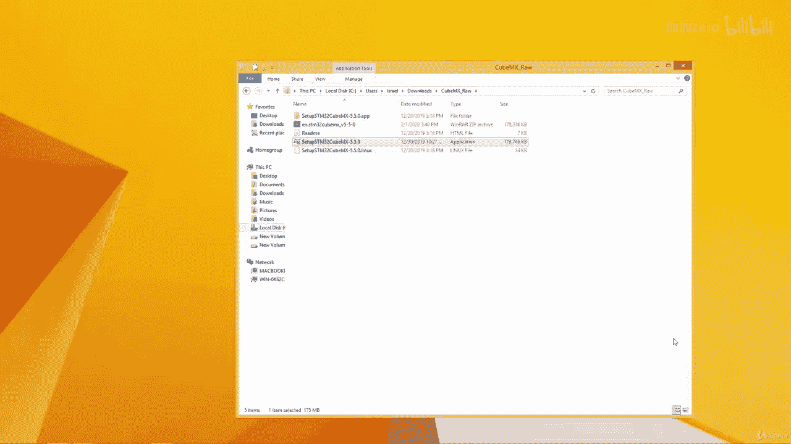
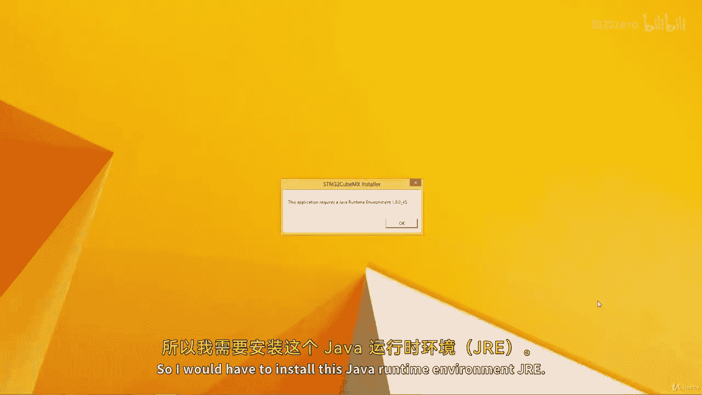
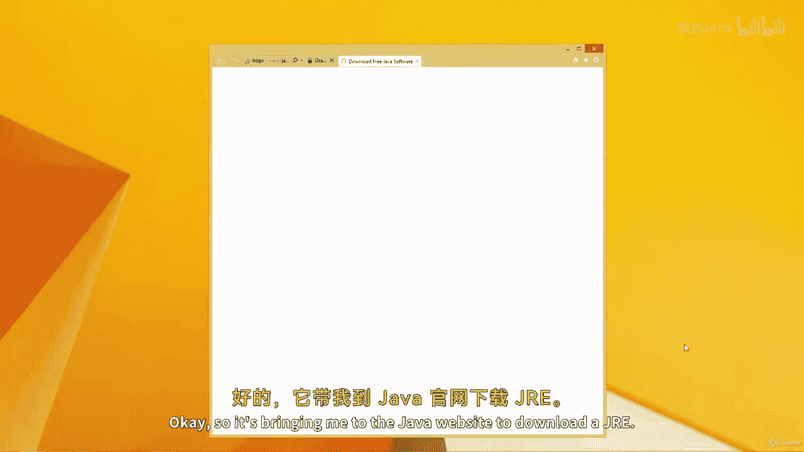
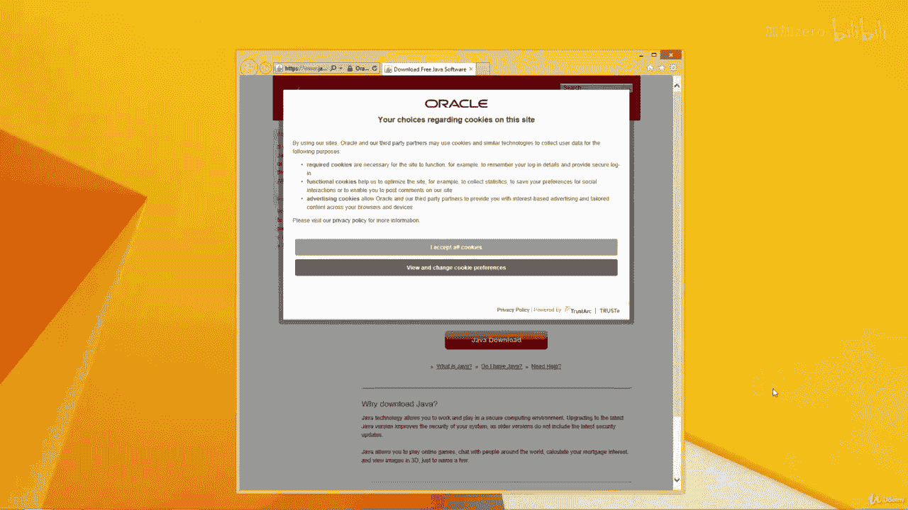
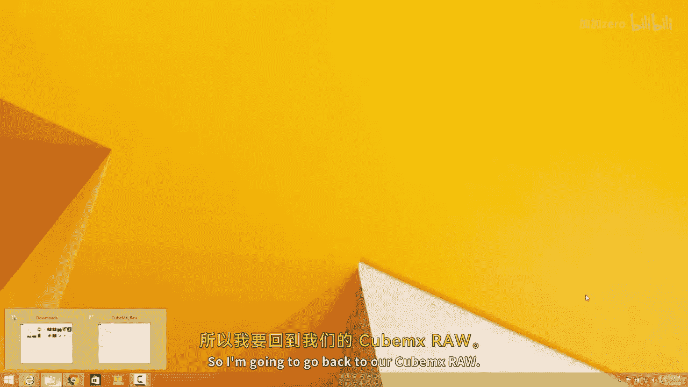
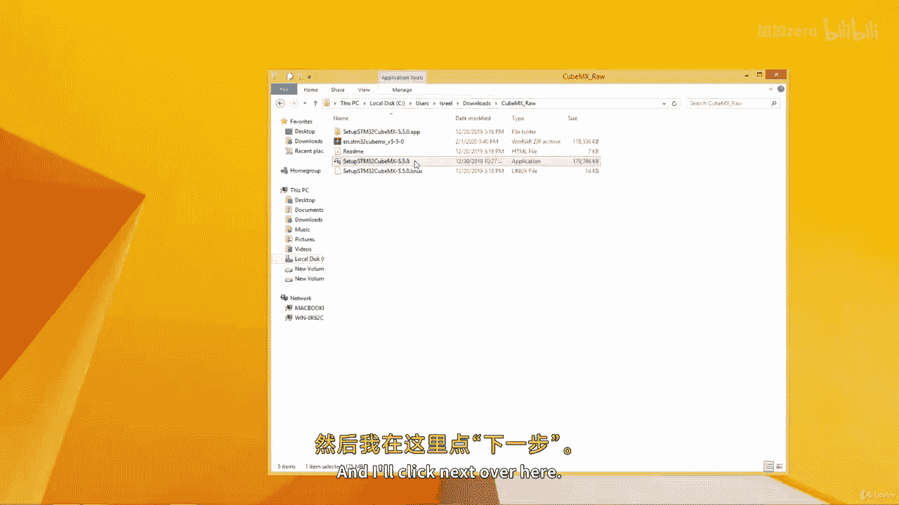
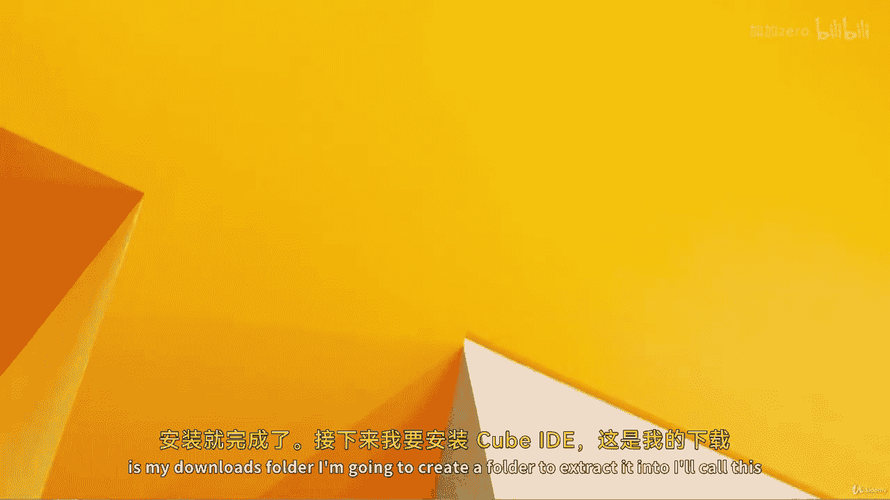
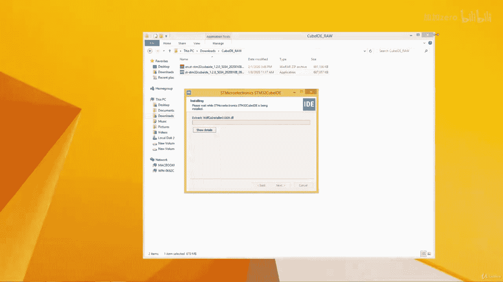

# ARM汇编语言入门II：12.2：STM32CubeIDE安装指南 🛠️

在本节课中，我们将学习如何下载并安装STM32开发所需的两个核心软件：STM32CubeMX和STM32CubeIDE。我们将分步完成从解压文件到成功安装的全过程。

## 下载与解压STM32CubeMX

首先，我们获得了完整的STM32CubeMX下载包。右键点击该压缩文件，选择“解压到当前文件夹”。

解压完成后，双击进入文件夹查看内容。我发现最初解压出的似乎是macOS版本。请确保你下载的是Windows版本。实际上，下载包内通常同时包含了Windows、macOS和Linux版本。为了管理方便，我决定新建一个专用文件夹。

以下是操作步骤：
1.  创建一个新文件夹，命名为 `STM32CubeMX`。
2.  将压缩包内容解压到这个新文件夹中，以避免文件混杂。

完成清理后，我们可以在文件夹内看到Windows、macOS和Linux三个版本的安装程序。

## 安装STM32CubeMX

双击Windows版本的安装程序开始安装。

安装程序提示需要Java运行时环境（JRE）。如果你的电脑上没有安装JRE，则需要先安装它。

系统自动跳转到Java官网以下载JRE。

点击下载，保存文件，然后运行安装程序，按照提示完成JRE的安装。

JRE安装成功后，返回STM32CubeMX安装程序，再次双击进行安装。点击“是”和“下一步”。

阅读并接受许可协议和隐私政策，然后点击“下一步”。保持默认安装路径，继续点击“下一步”。

安装过程需要一些时间。安装完成后，点击“下一步”，然后点击“完成”。

## 下载与安装STM32CubeIDE

接下来，我们安装STM32CubeIDE。首先，在下载文件夹中创建一个名为 `STM32CubeIDE` 的新文件夹。

将STM32CubeIDE的压缩包拖入此文件夹并解压。解压完成后，双击其中的安装程序。

点击“是”开始安装，然后点击“下一步”。同意许可协议，保持默认安装目录，继续点击“下一步”。

安装过程会持续一段时间。安装完成后，点击“下一步”。你可以选择创建桌面快捷方式，最后点击“完成”。

## 总结

本节课中，我们一起完成了STM32开发环境的搭建。我们首先下载并解压了STM32CubeMX，在安装过程中解决了Java运行时环境（JRE）的依赖问题，并成功完成了安装。随后，我们以类似的步骤下载、解压并安装了STM32CubeIDE集成开发环境。现在，你的电脑上已经具备了进行STM32项目配置和代码开发的基本工具。下节课我们将开始学习如何使用这些工具。