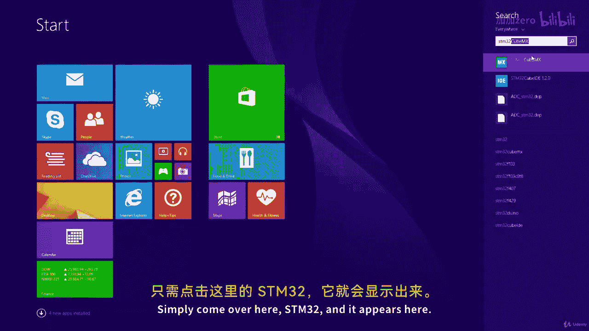
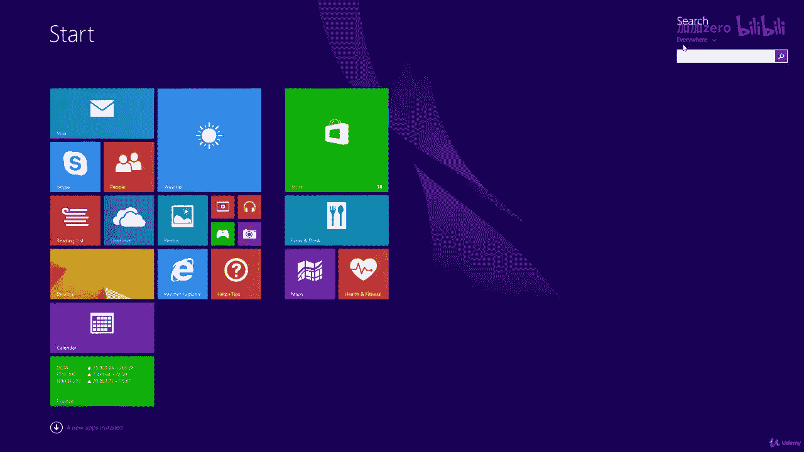
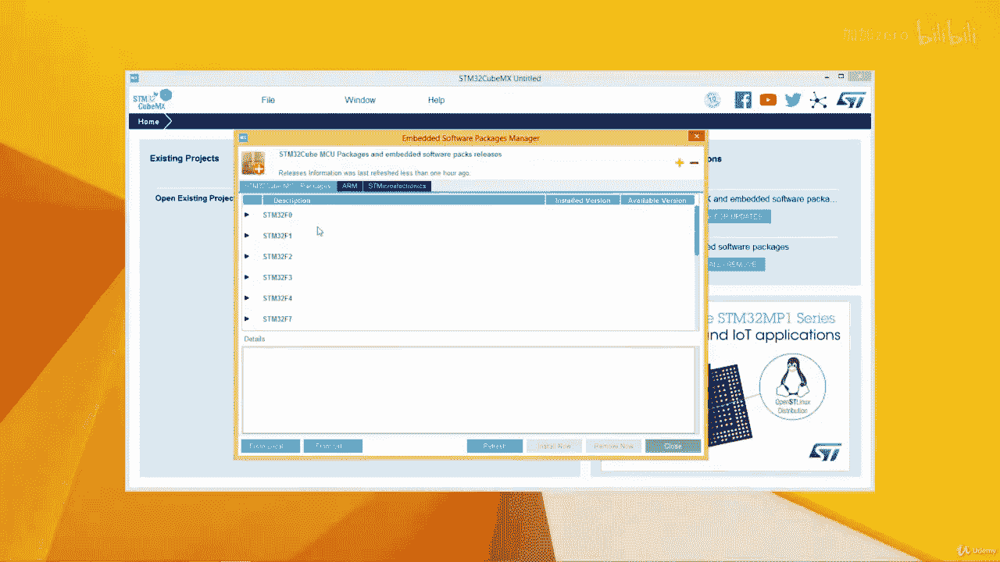

# ARM汇编语言入门II：12.3：安装软件包 📦

在本节课中，我们将学习如何为STM32CubeMX安装必要的软件包，以便为我们的ARM微控制器项目生成代码。

上一节我们完成了STM32CubeMX的安装，本节中我们来看看如何为其安装核心的微控制器支持包和工具链。

## 解决Java版本问题

启动STM32CubeMX时，可能会遇到Java版本不兼容的警告。软件提示检测到32位Java，但强烈建议使用64位版本，否则某些功能可能无法使用。

以下是解决此问题的步骤：

1.  打开浏览器，访问Oracle官方网站的Java下载页面。
2.  在下载页面中，找到并接受许可协议。
3.  找到适用于Windows x64系统的`.exe`安装程序并下载。
4.  运行下载的安装程序，按照提示完成64位Java运行环境的安装。
5.  安装完成后，重新启动STM32CubeMX，警告信息应不再出现。

## 安装微控制器支持包

成功启动STM32CubeMX后，我们需要安装针对特定微控制器系列的支持包。本课程主要使用STM32 F4系列。

以下是安装支持包的步骤：

1.  点击顶部菜单栏的 **Help**（帮助）。
2.  在下拉菜单中选择 **Manage Embedded Software Packages**（管理嵌入式软件包）。
3.  在弹出的窗口中，会列出所有可用的微控制器系列支持包。
4.  找到 **STM32F4** 系列，展开其版本列表。
5.  选择最新的版本，点击旁边的 **Install Now**（立即安装）按钮。
6.  软件将自动下载并解压该支持包，此过程需要一些时间。

## 安装ARM工具链包

除了微控制器支持包，我们还需要安装ARM的编译工具链（CMSIS包），这是生成和编译代码所必需的。

以下是安装ARM工具链的步骤：

1.  在同一个“管理嵌入式软件包”窗口中，切换到 **ARM** 标签页。
2.  在列表中找到 **CMSIS** 包。
3.  选择可用的最新版本。
4.  点击 **Install Now**（立即安装）按钮，等待下载和安装完成。

所有软件包安装完毕后，关闭管理窗口即可。

本节课中我们一起学习了如何为STM32CubeMX配置正确的Java环境，并安装了STM32 F4微控制器的支持包以及ARM CMSIS工具链包。这些步骤为后续生成和开发ARM汇编项目打下了必要的基础。下一节课，我们将开始创建第一个工程。