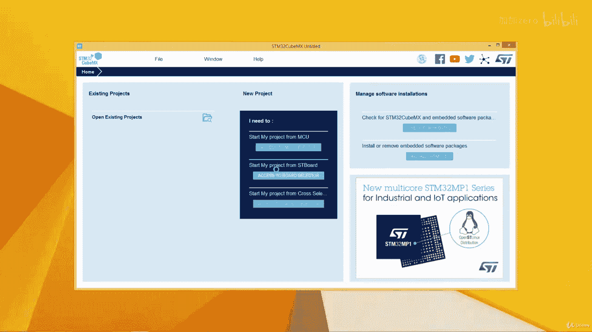
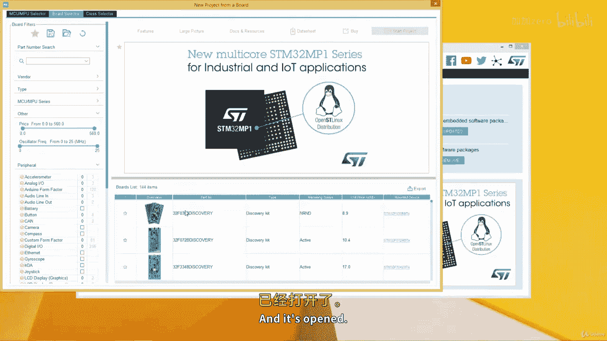
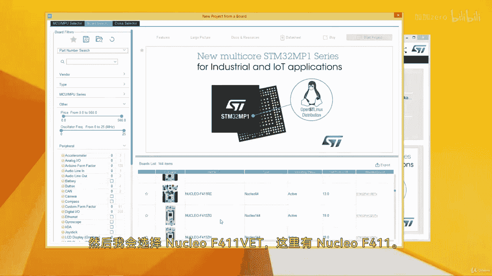
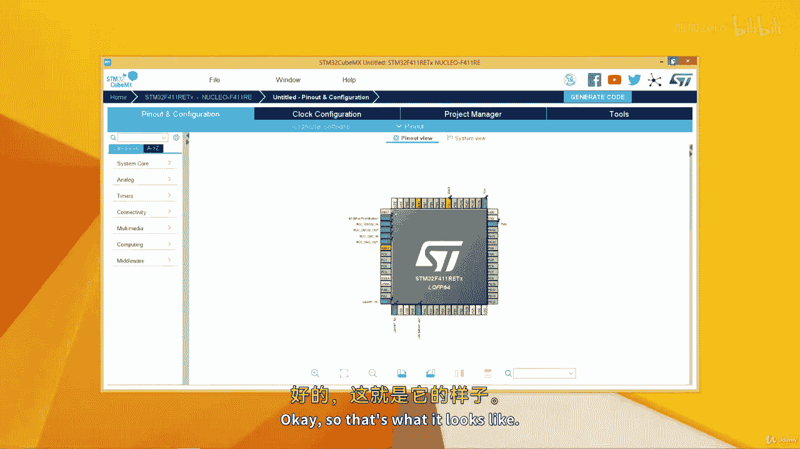
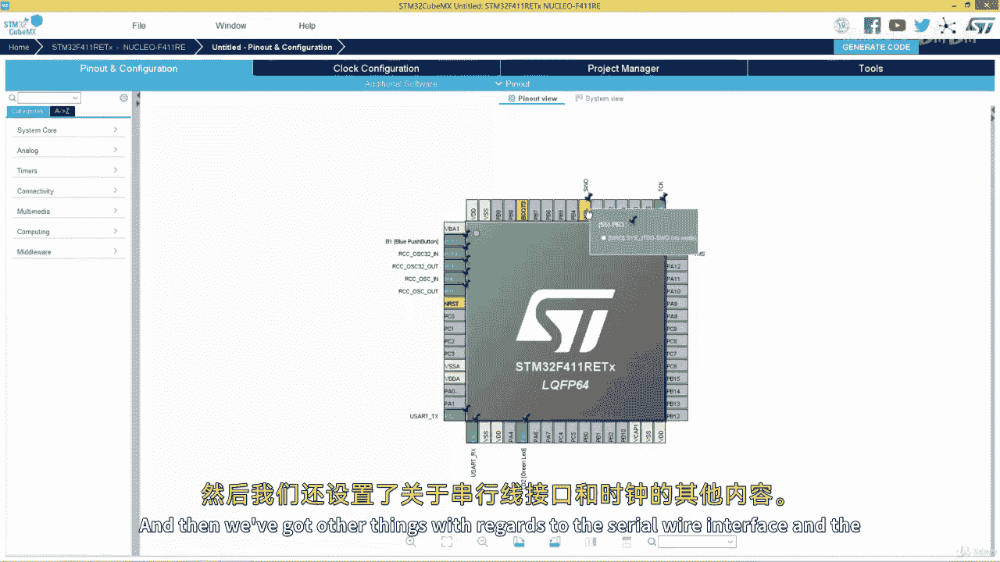
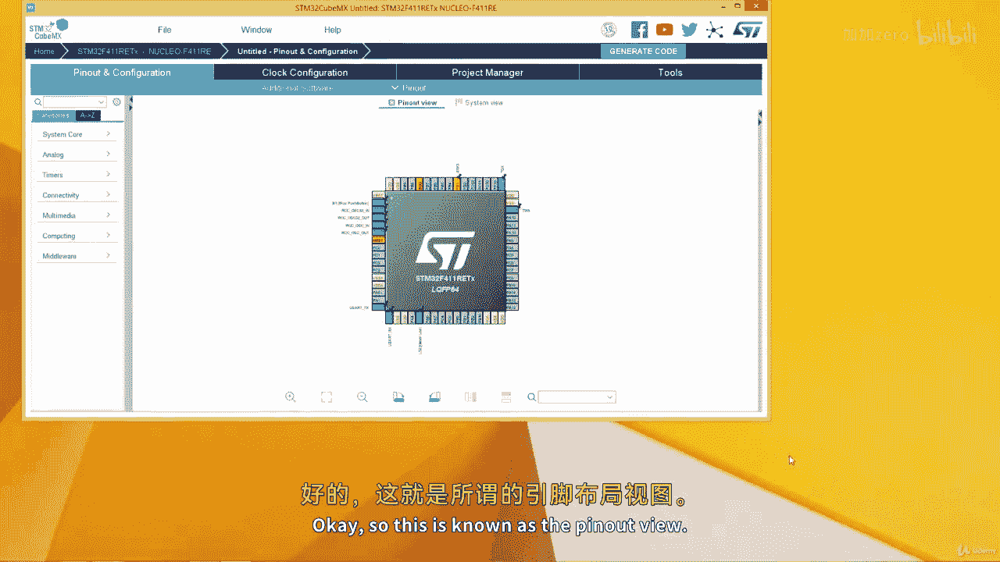
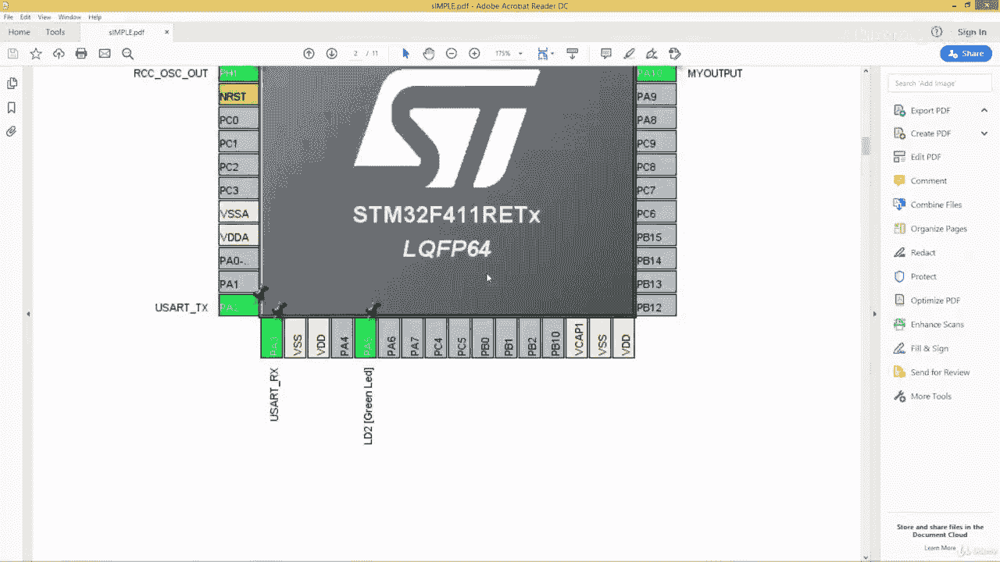
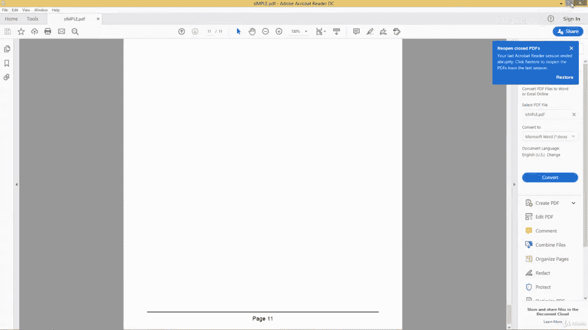
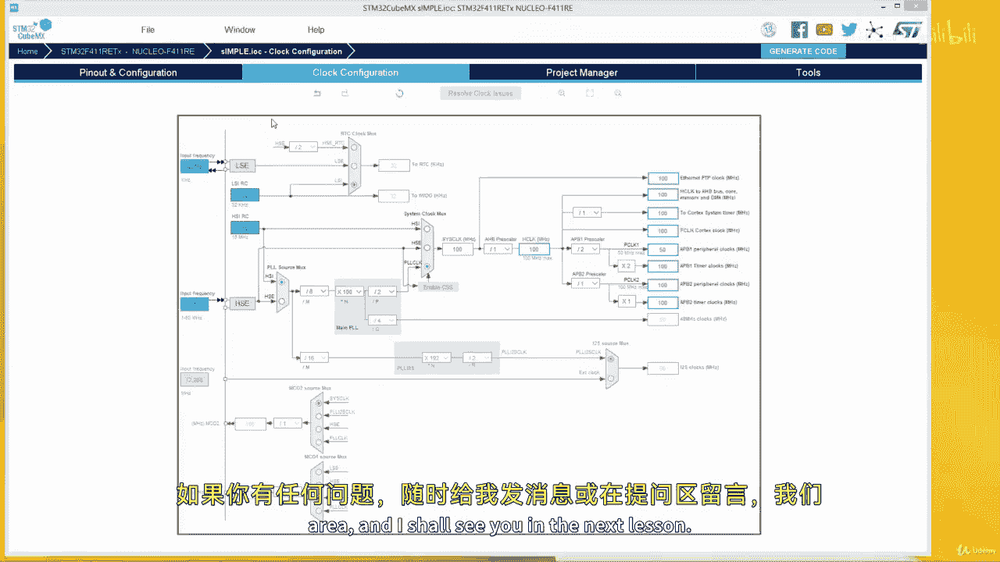

# 从零开始学习 ARM 汇编语言II：12.4：STM32CubeMX 快速概览 🚀

在本节课中，我们将快速概览 STM32CubeMX 软件，学习如何创建新项目、配置微控制器引脚和时钟，并生成初始化代码。

## 项目创建与界面概览

上一节我们介绍了 ARM 汇编的基础知识，本节中我们来看看如何使用 STM32CubeMX 工具来配置硬件项目。

启动 STM32CubeMX 后，主界面提供了几个核心选项。以下是创建新项目的几种方式：
*   **MCU 选择器**：直接根据微控制器型号选择。
*   **开发板选择器**：根据 ST 官方开发板型号选择。
*   **示例项目选择器**：从现有示例项目开始。

界面顶部包含多个选项卡。以下是各选项卡的主要功能：
*   **文件**：用于新建、加载或列出最近的项目。
*   **窗口**：用于调整字体大小等界面设置。
*   **帮助**：此选项卡非常重要，可以检查更新、管理嵌入式软件包（如蓝牙协议栈）以及设置用户偏好。

## 选择目标硬件

我们可以通过开发板选择器来快速开始一个项目。例如，选择 Nucleo-F411RE 开发板。选中后，软件会显示该板的规格、市场价格和功能列表。点击相关链接可以查看数据手册等文档。

双击选中的开发板或点击“Start Project”按钮，软件会询问是否以默认模式初始化所有外设。选择“是”后，项目即开始创建。

## 引脚配置与视图

项目创建后，会进入引脚配置视图。此视图直观地展示了微控制器的所有引脚。以下是配置引脚的基本操作：
*   要将某个引脚（如 PB1）设置为输出，只需点击该引脚并选择 **GPIO_Output**。
*   可以重命名引脚的用户标签，例如将其命名为“My_Output”。
*   引脚颜色代表其状态：**绿色**表示配置完成，**黄色**表示配置不完整。

在此视图中，可以拖拽、缩放或旋转芯片视图以便查看。

## 外设与系统配置

引脚配置视图的左侧是配置选项卡，用于详细设置各个外设。以下是主要配置类别：
*   **系统核心**：配置 GPIO、RCC（复位与时钟控制）等。例如，在 RCC 中可以选择使用外部晶振（HSE）或内部时钟（HSI）。
*   **模拟**：配置 ADC（模数转换器）等模拟外设。
*   **定时器**：配置通用定时器、高级定时器和实时时钟。
*   **连接性**：配置通信接口，如 **I2C**、**SPI** 和 **UART**。例如，配置 UART 时，可以设置波特率、字长等参数，公式如下：
    `波特率 = 外设时钟频率 / (采样率 * (分频值))`
*   **中间件**：可以添加文件系统（FATFS）、实时操作系统（如 FreeRTOS）或 USB 设备支持。

## 时钟树配置

“时钟配置”选项卡提供了一个图形化的时钟树。在这里，可以调整系统核心时钟和各总线时钟的频率。例如，可以将主频设置为允许的最大值（如 100 MHz）。配置时需确保所有时钟路径有效，否则相关设置会显示为红色提示错误。

## 项目管理与代码生成

所有硬件配置完成后，需要切换到“项目管理”选项卡来设置项目并生成代码。以下是关键步骤：
1.  输入项目名称。
2.  选择项目保存位置。
3.  在“工具链/IDE”下拉菜单中选择目标 IDE，例如 **STM32CubeIDE** 或 **Makefile**。
4.  在“代码生成器”选项卡中，建议勾选“为每个外设生成独立的 `.c/.h` 文件”，这有助于代码管理。
5.  最后，点击“生成代码”按钮。软件会根据所有配置，自动生成完整的初始化代码和项目文件。

此外，还可以通过“文件”菜单下的“生成报告”功能，创建一份包含所有引脚分配、时钟设置和外设配置的 PDF 或文本报告，便于存档和查阅。

## 总结

本节课中我们一起学习了 STM32CubeMX 的基本使用方法。我们了解了如何创建新项目、通过图形界面配置微控制器的引脚和外设、调整系统时钟，并最终生成针对特定 IDE 的初始化代码。这个工具极大地简化了 STM32 微控制器的启动过程，让开发者能更专注于应用逻辑的开发。