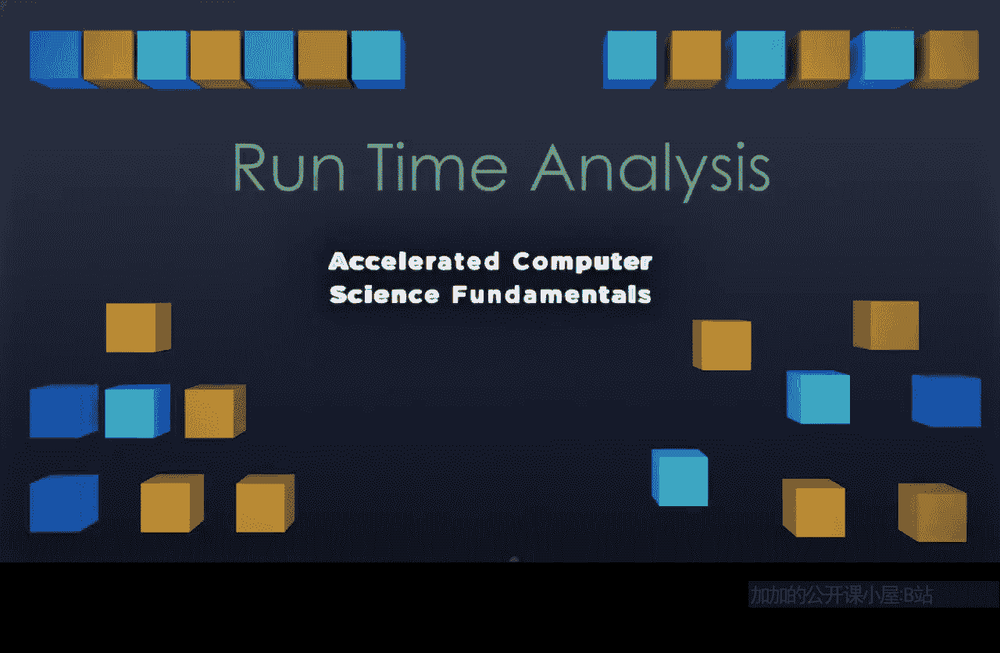

# 003：运行时分析

## 概述

在本节课中，我们将学习**运行时分析**。这是一种形式化的方法，用于比较算法在处理不同规模输入时的速度。我们将通过对比**数组**和**链表**这两种数据结构来理解这个概念，并学习如何使用**大O符号**来描述算法的时间复杂度。

---

## 数组与链表的访问时间对比

上一节我们提到了数据结构，本节中我们来看看两种基本数据结构——数组和链表——在访问元素时的性能差异。

*   **数组**：内存中连续的数据块。访问特定索引的元素时，只需知道每个数据单元的宽度，然后执行一次乘法运算：`目标地址 = 起始地址 + 索引 * 数据宽度`。无论数组有多大，这都是一次操作。
*   **链表**：通过节点指针链接在一起的数据。要访问第 `n` 个元素，必须从头节点开始，依次跟随 `n` 次 `next` 指针。

以下是访问不同索引元素所需操作的对比表：

| 要访问的元素 | 数组所需操作 | 链表所需操作 |
| :--- | :--- | :--- |
| 第3个元素 | 1次乘法 | 3次指针跳转 |
| 第4285个元素 | 1次乘法 | 4285次指针跳转 |
| 第1,250,000个元素 | 1次乘法 | 1,250,000次指针跳转 |

用 `n` 表示要访问的元素索引：
*   数组的访问时间总是 **1次操作**。
*   链表的访问时间需要 **n次操作**。

我们使用**大O符号**来描述这种随着输入规模 `n` 增长，运行时间的变化趋势：
*   数组访问是 **O(1)**，称为**常数时间**。
*   链表访问是 **O(n)**，称为**线性时间**。

---

## 数组扩容策略的运行时分析

现在，让我们将运行时分析应用到另一个场景：动态数组的扩容。不同的扩容策略会导致完全不同的时间复杂度。

### 策略一：每次扩容增加固定容量（+2）

假设数组初始容量为2。每当数组满时，我们将其容量增加2，以容纳新元素并预留一点空间。

以下是扩容过程的简化描述：
1.  初始容量为2。
2.  第一次满时，扩容至4，需要复制2个元素。
3.  第二次满时，扩容至6，需要复制4个元素。
4.  第三次满时，扩容至8，需要复制6个元素。
5.  ... 以此类推，直到容量达到 `n`。

设总共进行了 `R` 轮扩容（`R = n/2`），那么总复制次数是各轮复制次数的和：
`总复制次数 = 2 + 4 + 6 + ... + 2R`

这个求和公式可以表示为：
`总复制次数 = Σ (k=1 到 R) 2k = 2 * [R(R+1)/2] = R² + R`

由于 `R = n/2`，代入公式得到：
`总复制次数 = (n/2)² + (n/2) = (n² + 2n) / 4`

在**大O符号**中，我们只关注增长最快的项，并忽略常数系数。这里增长最快的是 `n²`。因此，这种策略下，插入 `n` 个元素的总时间复杂度是 **O(n²)**。

### 策略二：每次扩容容量翻倍

现在，我们换一种策略：数组满时，将其容量**翻倍**。

扩容过程如下：
1.  初始容量为2。
2.  第一次满时，扩容至4，复制2个元素。
3.  第二次满时，扩容至8，复制4个元素。
4.  第三次满时，扩容至16，复制8个元素。
5.  ... 以此类推。

设总共进行了 `R` 轮扩容（此时 `R = log₂(n)`），总复制次数为：
`总复制次数 = 2 + 4 + 8 + ... + 2^R`

这是一个等比数列求和：
`总复制次数 = Σ (k=1 到 R) 2^k = 2^(R+1) - 2`

代入 `R = log₂(n)`：
`总复制次数 = 2^(log₂(n)+1) - 2 = 2n - 2`

在**大O符号**中，增长最快的项是 `n`。因此，这种策略下，插入 `n` 个元素的总时间复杂度是 **O(n)**。

### 策略对比与均摊分析

对比两种策略：
*   **策略一（+2）**：总时间复杂度为 **O(n²)**。
*   **策略二（翻倍）**：总时间复杂度为 **O(n)**。

**O(n)** 远快于 **O(n²)**，这说明扩容策略的选择至关重要。

我们更关心**单次插入操作**的平均成本。虽然翻倍策略在某次扩容时需要复制大量数据（O(n) 操作），但在此之后可以进行很多次简单的插入（O(1) 操作），直到再次需要扩容。

将总时间 **O(n)** 平摊到 `n` 次插入操作上，平均每次插入的成本是 **O(1)**。这被称为**均摊时间复杂度**。这意味着，从整体运行时间来看，每次插入的平均耗时是一个常数。

---

## 总结

本节课中我们一起学习了**运行时分析**的核心内容：

1.  **目的**：形式化地比较算法速度随输入规模增长的变化。
2.  **核心工具**：**大O符号**，用于描述算法时间复杂度的上界，通常只保留公式中增长最快的项。
3.  **常见时间复杂度**：
    *   **O(1) - 常数时间**：运行时间不随输入规模变化（如数组访问）。
    *   **O(n) - 线性时间**：运行时间与输入规模成线性正比（如链表访问，翻倍扩容策略的总时间）。
    *   **O(n²) - 平方时间**：运行时间与输入规模的平方成正比（如固定增量扩容策略的总时间）。通常比线性时间慢得多。
4.  **关键洞见**：算法或策略的微小改变（如数组扩容从“+2”改为“翻倍”）可能带来时间复杂度数量级的提升（从 O(n²) 到 O(n)）。通过**均摊分析**，我们可以理解某些偶尔昂贵操作的平均成本其实很低（如 O(1)）。

在接下来的视频中，我们将继续探讨更多的运行时分析案例。