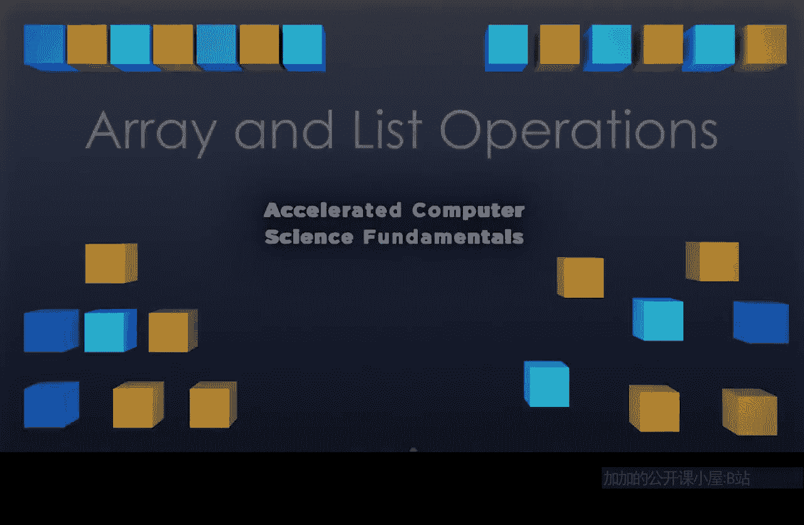
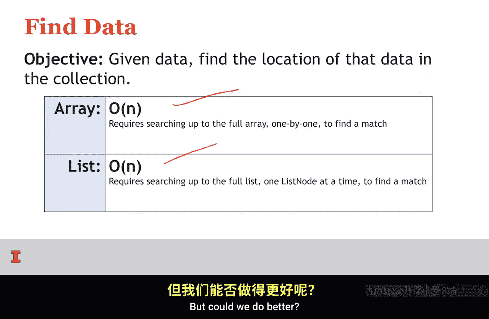
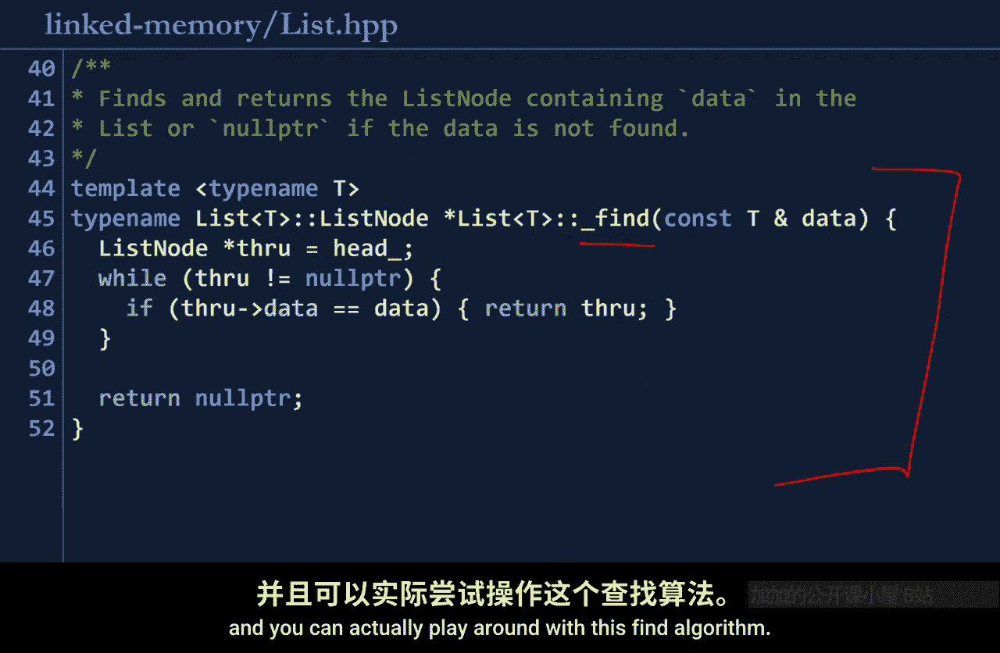

# 004：数组与列表操作




## 概述
在本节课中，我们将要学习数组和链表这两种有序数据集合的核心操作，并对比它们在不同场景下的性能差异。我们将重点关注访问、查找、插入和删除等操作的运行时间，并理解其背后的原理。

---

## 数组与链表的基本概念
数组和链表都是有序的数据集合。

上一节我们介绍了访问集合中给定索引的操作。本节中我们来看看查找、插入和删除等操作的性能对比。

### 访问给定索引
在之前的视频中我们看到，数组可以通过公式直接访问，时间复杂度为 **O(1)**。而链表必须遍历每个节点才能到达特定索引，因此访问给定索引的时间复杂度为 **O(n)**。

*   **数组访问时间：** `O(1)`
*   **链表访问时间：** `O(n)`

---

## 查找操作分析
给定数据，我们如何在集合中查找该数据的位置？

### 线性查找（未排序数据）
在数组中查找橙色方块时，我们别无选择，只能从第一个元素开始，逐个检查，直到找到目标。这需要检查集合中的每一个数据，因此时间复杂度为 **O(n)**。

在链表中查找紫色方块时，过程类似：从链表头部开始，逐个节点检查，直到找到目标或遍历完所有节点。因此，在链表中查找元素的时间复杂度也是 **O(n)**。



综上所述，给定数据并查找其位置：
*   在**未排序的数组**中，时间复杂度为 **O(n)**。
*   在**链表**中，时间复杂度也为 **O(n)**。



以下是查找操作的代码逻辑示意：

**数组查找（伪代码）：**
```python
for i in range(len(array)):
    if array[i] == target:
        return i
return -1
```

**链表查找（伪代码）：**
```python
current = head
while current is not None:
    if current.data == target:
        return current
    current = current.next
return None
```

---

## 利用排序优化查找
但是，如果我们的数据是**已排序**的，查找算法可以大幅改进。

### 二分查找（排序数组）
假设我们要在已排序的数组中查找数字17。我们不再从开头线性搜索，而是可以像查电话簿一样，从中间开始。

1.  跳转到数组中间。
2.  比较中间值（例如13）与目标值（17）。因为13 < 17，所以目标值必然在右半部分。
3.  在剩下的右半部分重复此过程，继续对半分割。

这种每次排除一半数据的策略称为**二分查找**。由于每次都将数据量减半，其时间复杂度为 **O(log n)**，其中 log 指以2为底的对数。

*   **排序数组查找时间（二分查找）：** `O(log n)`

### 链表查找的局限性
现在来看一个已排序的链表。我们想要查找17。问题在于，我们无法“跳转”到链表的中间。即使有一个指针指向链表中心，在链表头部插入新节点后，这个指针也会立刻失效。

因此，对于链表，即使数据已排序，我们仍然只能进行线性搜索，逐个节点检查。所以，链表的查找时间复杂度仍然是 **O(n)**。

*   **排序链表查找时间：** `O(n)`

**查找操作总结：**
*   **未排序数组：** `O(n)`
*   **排序数组：** `O(log n)` （使用二分查找）
*   **链表（无论是否排序）：** `O(n)`

---

## 插入与删除操作
最后，我们来看一个非常实用的操作：在给定元素**之后**插入新元素（或删除其后的元素）。

### 在给定位置后插入
**数组中的插入**
如果要在数组的橙色方块之后插入一个紫色方块，由于数组元素在内存中是连续存储的，我们无法直接在中间“塞入”新元素。我们必须将橙色方块之后的所有数据都向后移动一个位置，为新元素腾出空间。

如果插入点位于列表中部，平均需要移动 **n/2** 个元素。用大O表示法，这就是 **O(n)** 的时间复杂度。

**链表中的插入**
如果给定一个链表节点，要在它之后插入新节点，过程就简单多了：
1.  创建一个新节点。
2.  将新节点的`next`指针指向原节点的下一个节点。
3.  将原节点的`next`指针指向新节点。

这个过程只涉及修改几个指针，没有循环，无论链表多长，时间复杂度都是 **O(1)**。

*   **数组插入（给定索引后）：** `O(n)`
*   **链表插入（给定节点后）：** `O(1)`

### 删除操作
删除给定元素之后的节点，其时间复杂度分析与插入操作完全相同。
*   在数组中，需要移动后续元素来填补空隙，时间复杂度为 **O(n)**。
*   在链表中，只需重新连接指针，时间复杂度为 **O(1)**。

---

## 总结
本节课中我们一起学习了数组和链表这两种基础线性数据结构的核心操作及其性能对比。

*   **访问：** 数组 `O(1)`， 链表 `O(n)`。
*   **查找：**
    *   未排序数组 `O(n)`
    *   排序数组 `O(log n)`
    *   链表 `O(n)`
*   **在给定位置后插入/删除：** 数组 `O(n)`， 链表 `O(1)`。


可以看到，数组和链表各有优劣，在运行时间和实现灵活性之间存在权衡。我们后续将要构建的许多高级数据结构，都会基于数组或链表来实现。理解这些基础结构的特性，对于选择正确的底层实现至关重要。