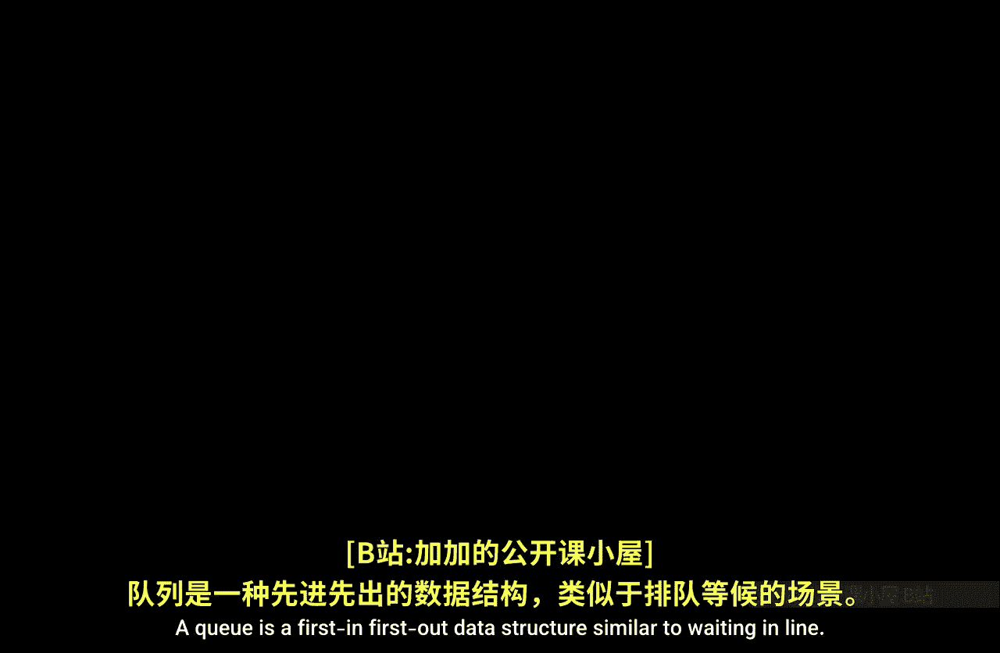
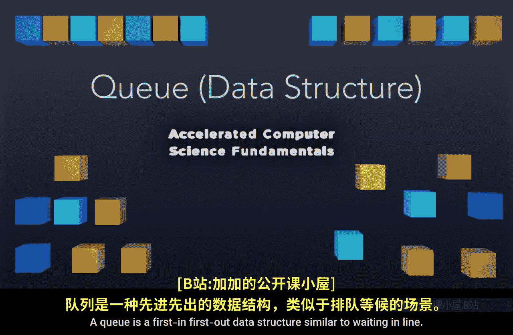
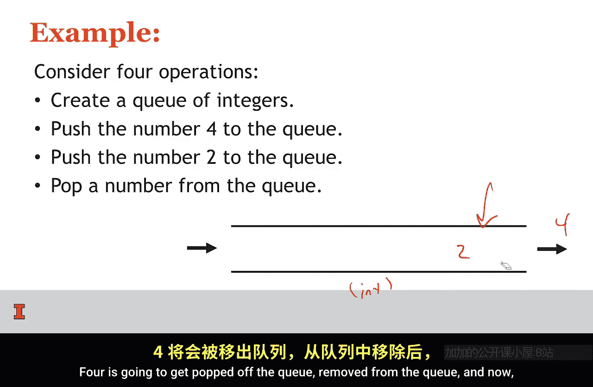
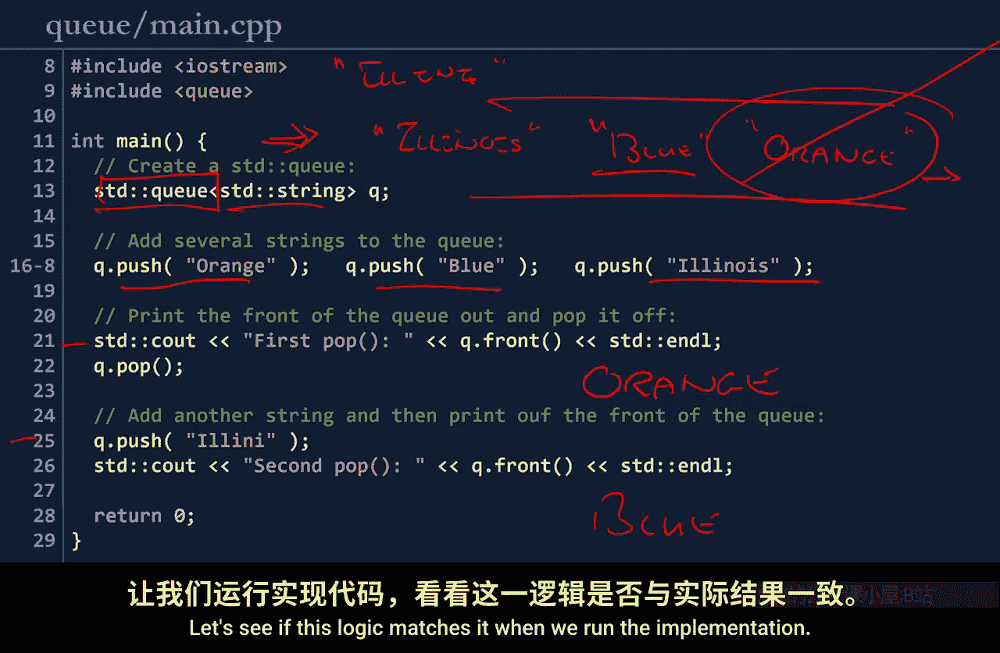
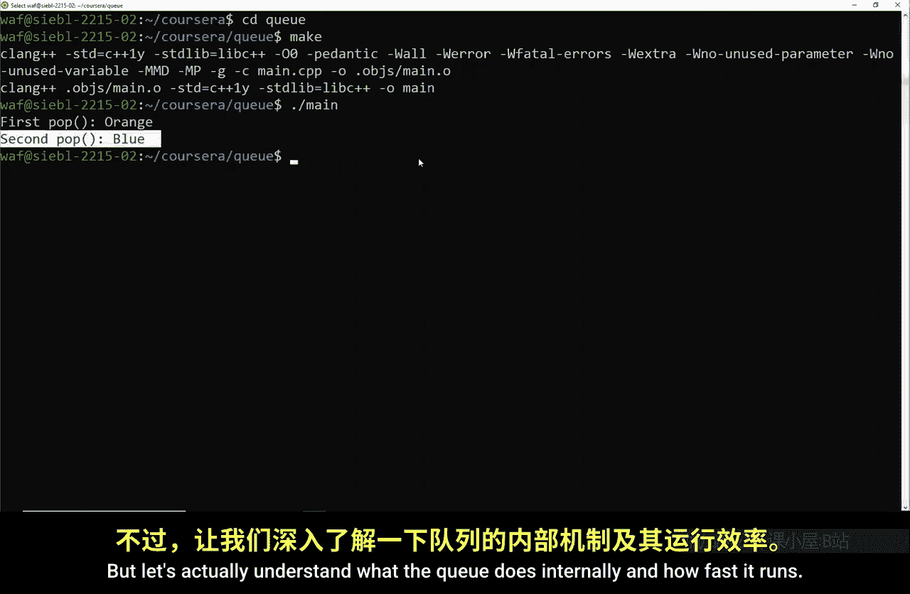
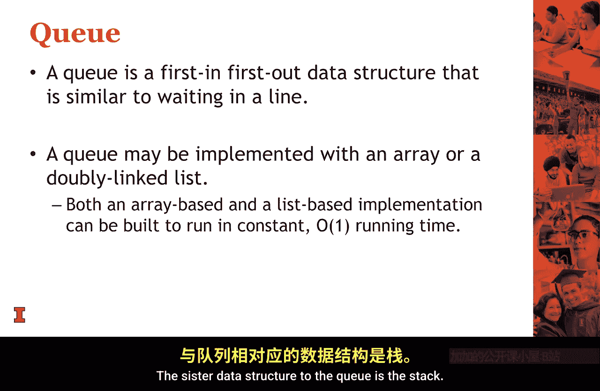

# 005：队列数据结构 🚶‍♂️➡️🚶‍♀️





在本节课中，我们将要学习一种名为“队列”的数据结构。队列遵循“先进先出”的原则，就像人们在咖啡店排队一样。我们将了解它的抽象数据类型、基本操作，并探讨其两种主要实现方式：基于数组和基于链表。最后，我们会分析这些操作的时间复杂度。

---

## 队列的抽象数据类型

上一节我们介绍了队列的基本概念，本节中我们来看看如何从抽象层面定义队列的操作，而不涉及具体实现。这被称为抽象数据类型。

抽象数据类型描述了数据结构能做什么，而不是如何做。对于队列，其ADT包含四个核心操作：

以下是队列ADT的四个基本函数：

1.  **创建队列**：创建一个空队列。
2.  **入队**：将数据添加到队列的**末尾**。
3.  **出队**：从队列的**前端**移除并返回数据。
4.  **判空**：检查队列是否为空。

---



## 队列操作示例

理解了抽象数据类型后，让我们通过一个简单的例子来看看队列如何工作。

我们首先创建一个整数队列。然后，我们将数字4和2依次入队。由于4先入队，它位于队列前端。当我们执行出队操作时，4将被移除。此时，2成为新的队首元素，等待下一次出队。

---

## C++标准库中的队列



在实际编程中，我们通常使用语言提供的标准库。C++标准库提供了 `std::queue` 模板类。



以下是一个使用 `std::queue` 的代码示例：

```cpp
#include <queue>
#include <string>
#include <iostream>

int main() {
    std::queue<std::string> q;

    // 入队操作
    q.push("orange");
    q.push("blue");
    q.push("Illinois");

    // 第一次出队，应输出 "orange"
    std::cout << q.front() << std::endl;
    q.pop();

    // 再次入队
    q.push("Alina");

    // 第二次出队，此时队首是 "blue"
    std::cout << q.front() << std::endl;
    q.pop();

    return 0;
}
```

运行此程序，第一次出队输出 `orange`，第二次出队输出 `blue`，这与我们基于“先进先出”原则的预期完全一致。

---

## 队列的内部实现与性能

我们已经看到了队列如何使用，现在让我们深入其内部，看看它是如何实现的，以及其操作的运行速度。

队列主要有两种实现方式：**基于数组**和**基于链表**。两种方式的目标都是使入队和出队操作非常高效。

### 基于数组的实现

在数组实现中，我们使用一个数组来存储元素，并维护两个索引或指针：一个指向队首（出队位置），一个指向队尾的下一个空位（入队位置）。

*   **入队**：在队尾索引处添加元素，然后更新队尾索引。时间复杂度为 **O(1)**。
*   **出队**：从队首索引处取出元素，然后更新队首索引。时间复杂度为 **O(1)**。
*   **数组扩容**：当数组空间不足时，需要分配一个更大的新数组（通常是原大小的两倍）并将旧数据复制过去。这个操作的成本是 **O(n)**，但平均分摊到每次入队操作上，其**摊还时间复杂度**仍可视为 **O(1)**。

### 基于链表的实现

在链表实现中，我们使用一个双向链表，并维护两个指针：一个指向链表的头部（队首），一个指向链表的尾部（队尾）。

*   **入队**：在链表尾部添加新节点，并更新尾指针。借助尾指针，此操作可在 **O(1)** 时间内完成。
*   **出队**：移除链表头部的节点，并更新头指针。此操作同样可在 **O(1)** 时间内完成。

---

## 总结 🎯

本节课中我们一起学习了队列数据结构。

*   队列是一种**先进先出**的数据结构，模拟了排队的场景。
*   其抽象数据类型包括创建、入队、出队和判空四个基本操作。
*   队列可以通过**数组**或**双向链表**高效实现。
*   在精心设计下，队列的**入队和出队操作的时间复杂度都是 O(1)**，即常数时间复杂度。这意味着无论队列中有1个还是100万个元素，这些操作的速度都同样快。




队列是一种强大且高效的数据结构，在后续课程中我们将用它来解决许多问题。与队列相对应的“后进先出”数据结构是**栈**，我们将在下一个视频中讨论它。