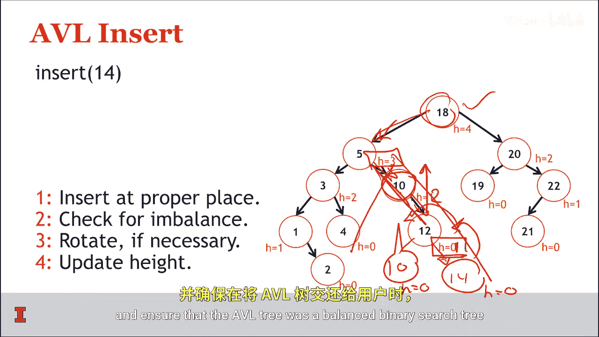
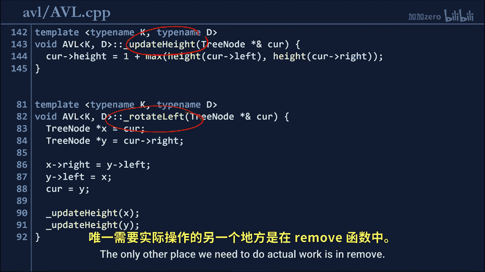
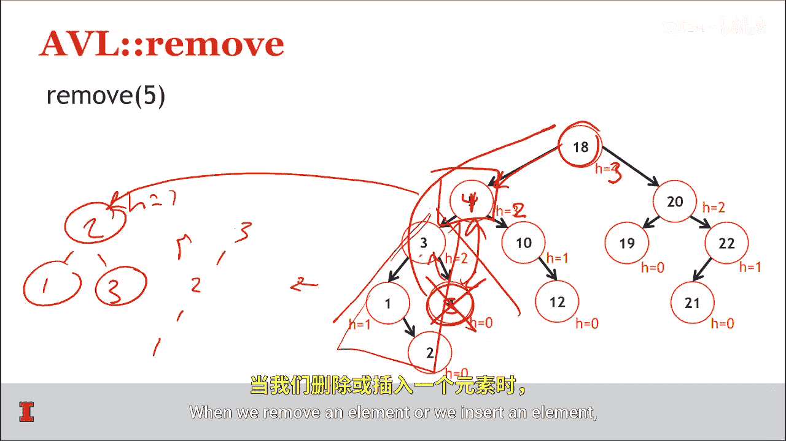
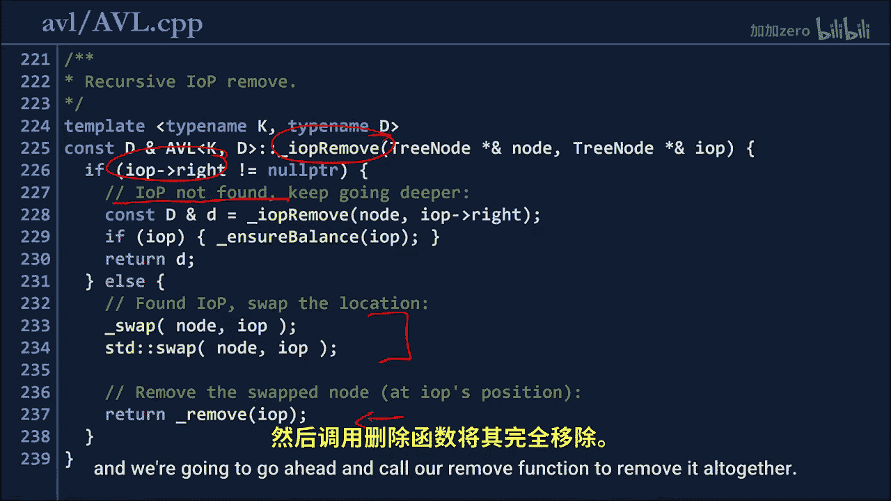
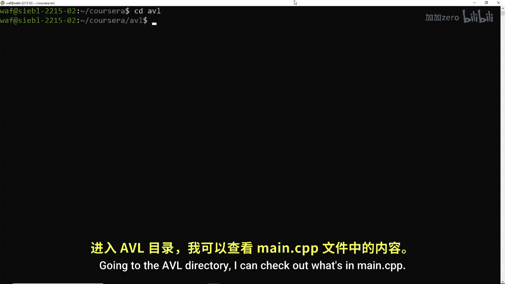
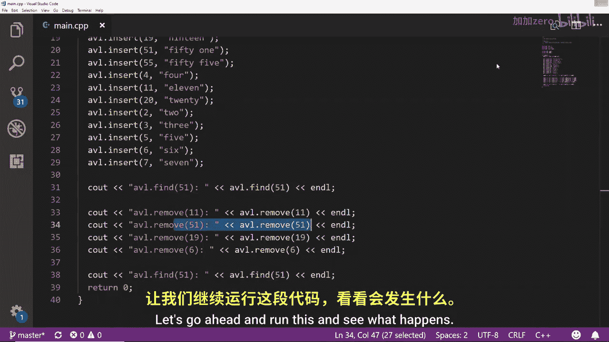
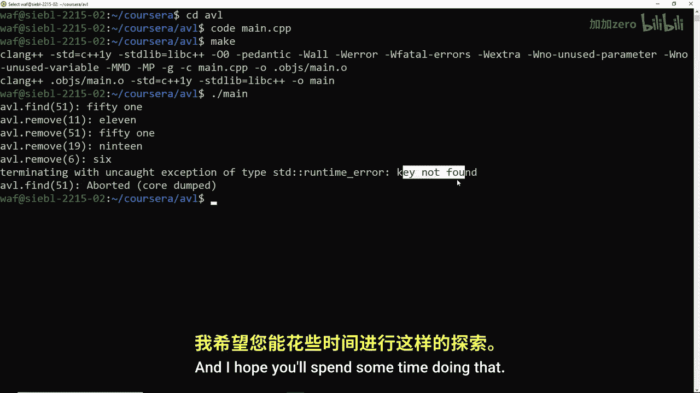
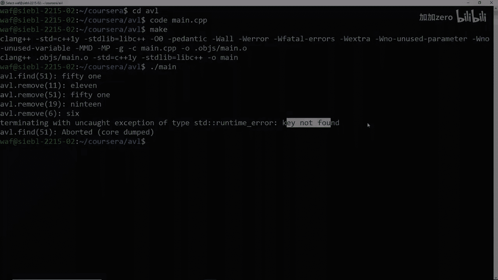

# 013：AVL树分析 🧮

在本节课中，我们将要学习一种特殊的二叉搜索树——AVL树。我们将了解它如何通过旋转操作在插入和删除元素后保持平衡，并分析其核心的实现逻辑。

---

上一节我们介绍了二叉搜索树的基本概念。本节中我们来看看如何让二叉搜索树保持平衡。

平衡二叉搜索树通过执行树旋转操作来在插入和删除后保持平衡。我们称这类树为AVL树，它以两位计算机科学家Adelson-Velsky和Landis的名字命名。

AVL树本质上就是一棵二叉搜索树。关于二叉搜索树的所有知识，包括查找、插入、删除等操作，在AVL树中依然成立。

AVL树只在两件事上有所不同：
1.  在插入和删除时，我们会做一些额外的工作来确保树保持平衡。
2.  为了能方便地计算平衡因子，我们将在树的每个节点中存储其高度。

我们将通过示例来了解其工作原理。首先来看一个插入操作。

---

### 插入操作示例

假设我们想将节点14插入到我们的AVL树中。

就像之前讨论的插入算法一样，我们从根节点18开始。比较14和18，发现需要向左移动。查看节点5，14大于5，需要向右移动。查看节点10，14大于10，继续向右。查看节点12，14大于12，继续向右。最终，我们可以在路径末端将14作为一个新的叶节点插入。

我们通过递归算法进行插入，这样在回溯时，我们可以检查路径上的每个节点。

以下是执行此操作的逐步过程：

第一步是在正确的位置插入节点。我们知道插入操作是沿着这条路径进行的，最终在14的位置插入。

当我们回溯时，将在每个位置检查是否失衡，必要时进行旋转，并更新节点高度。

在这里，节点12的高度现在变为1，因为它下方有一个节点。回溯到节点10，其高度变为2，因为它下方有两个节点。

但这里发生了什么？此处出现了失衡。树的右侧高度差超过了1，具体是2。因此我们知道树在此处不平衡，需要进行修复。

我们通过一个简单的旋转来修复。将节点12上移，使其成为顶部节点。节点10成为其左子节点，节点14成为其右子节点。这样我们就修复了二叉搜索树。节点12的高度为1，节点10和14的高度为0。

现在我们可以回溯到节点5，检查其高度是否仍为3（是的），然后检查节点18的高度是否仍为4。

通过执行插入并沿路径回溯，我们看到只需要在插入路径上的某个位置进行一次旋转。这次我们发现需要进行一次旋转，但最终成功插入了14，并确保在将树返回给用户时，AVL树是一棵平衡的二叉搜索树。

---

### 确保平衡的代码实现

确保平衡的代码被添加到了上一讲中看到的二叉搜索树代码中。现在，我们的AVL树中有了一个名为 `_ensure_balance` 的额外辅助函数。

这个 `_ensure_balance` 函数的作用是：如果平衡因子为-2，我们知道需要执行右旋或左右双旋；如果平衡因子为2，则需要执行左旋或右左双旋。具体执行哪种旋转，取决于下一个节点的平衡因子。

这里我们看到计算了当前节点左子树和右子树的高度差，以及左子节点的左右子树高度差。这与我们之前图表中看到的情况完全一致。

因此，上一讲和本视频中的所有内容都汇聚在这个函数中，以确保当树失衡时，我们能根据上次讨论的规则表执行正确的旋转，使树恢复平衡。

查看其余代码，我们需要一个 `_update_height` 函数来更新高度，以及一个 `_rotate_left` 函数来执行实际的旋转操作。

唯一另一个需要实际进行操作的地方是在删除函数中。

---

### 删除操作示例

让我们看看从原始二叉搜索树中删除节点5的可能性。

我们将像以前一样找到节点5：从根节点18开始，向左移动到5，找到需要删除的节点。记住，要删除一个节点，需要找到它的中序前驱节点，即左子树中最右侧的节点。

左子树中最右侧的节点是元素4。因此，我们将5与4交换。然后需要删除我们刚刚交换过的这个节点（即原来的5）。

删除5后，当我们从5的位置向上回溯时，会发现节点3现在失衡了，其左右子树高度差为2。

旋转这个节点时，我们发现它是一个“肘型”结构。首先要做的是将“肘型”转换为“直棍型”，然后提升“直棍”的中间元素。这样，元素4的两侧就分别挂着节点2（及其子节点1）和节点3。

现在，左侧高度为1，右侧高度为1，中间元素的平衡因子正好合适。实际上，树的高度略有降低，此处高度现在为2。我们向上移动，看到根节点的高度为3。

与插入类似，我们只需要更新执行删除操作所经过路径上的节点。当我们删除或插入一个元素时，只需要修改该路径上的节点。

---

### 删除操作的代码修改

修改删除操作的代码很简单，主要是添加了一个名为 `_iop_remove` 的额外函数。这个函数将负责删除中序前驱节点。它通过查找左子树中最右侧的指针来定位中序前驱节点。找到后，简单地交换元素，然后调用我们的删除函数将其完全移除。

所有这些代码都已提供，我们稍后会查看。

---

### 总结与代码实践

综上所述，我们知道AVL树是平衡二叉搜索树的一种实现。AVL树的实现始于二叉搜索树的实现，然后只添加了两样东西：
1.  我们存储了每个节点自身的高度。
2.  我们在每次插入和删除后维护树的平衡因子。

仅通过这两件事，我们就确保了拥有一棵平衡的二叉搜索树。

在结束之前，让我们看一下代码，然后在下一讲中详细讨论这个AVL树是如何运行的。

进入AVL目录，查看 `main.cpp` 文件的内容。

在 `main` 函数中，我们创建了一个AVL树。这个AVL树将是一个字典，其中整数作为键，字符串作为值。我们像在二叉搜索树中一样，向AVL树中插入许多元素。键是整数，值是对应的字符串。然后我们执行一系列操作。

首先，使用AVL树的代码查找键51。然后依次删除11、51、19和6。删除11是一个简单的无子节点删除。删除51是有一个子节点的简单情况。而删除19和6则涉及两个子节点，是更复杂的操作，以确保我们正确处理了中序前驱的情况。最后，再次尝试查找51，我们预期这会是一个错误，因为之前已经删除了51。

让我们编译并运行这个程序。运行 `make` 编译，然后执行 `./main`。

我们看到，第一次查找51时，确实输出了对应的值。随后，依次显示移除了11、51、19、6。当最后再次查找51时，我们发现了一个未捕获的异常：未找到。这完全符合预期，因为自从第一次找到51后，我们已经将其删除，现在51已不存在。

你拥有AVL树的源代码和所有这些信息，可以自己尝试对AVL树进行各种操作。希望你花些时间实践一下。

祝你学习愉快，我们下次再见！