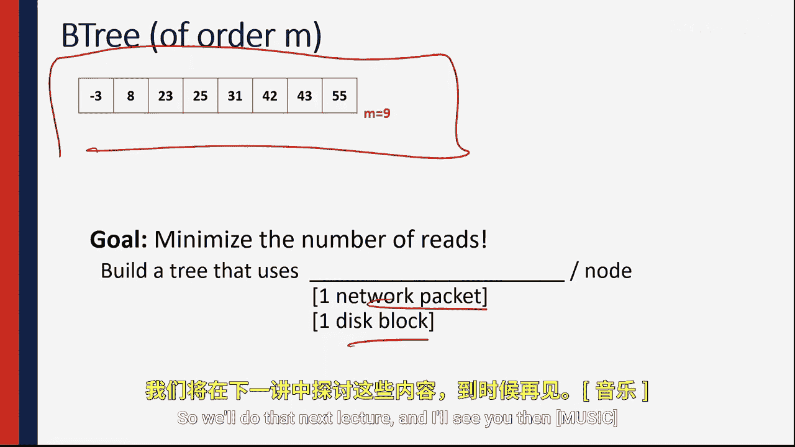

# 014：B树简介

在本节课中，我们将要学习一种名为B树的数据结构。我们将探讨为什么需要B树，理解其基本概念，并了解它如何优化对大量数据的访问，尤其是在数据无法完全放入内存的情况下。

## 课程概述

到目前为止，我们已经讨论了诸如二叉树、AVL树、数组和链表等算法。这些算法在大O表示法下具有出色的运行时性能。

但是，大O表示法并不能解释一切。实际上，大O表示法假设对所有数据的访问时间是均匀的。然而在现实中，对所有数据的访问时间并不总是均匀的。

## 现实世界的数据挑战

让我们来看一个例子。例如，如果我们考虑Facebook上的所有用户资料，保守估计可能有5亿用户。每个用户资料的总数据量至少为5MB。这又是一个保守估计，因为所有照片和信息很可能远超5MB。

计算存储所有这些数据所需的总空间，我们可以将5亿乘以5兆字节。这将得到2500万亿字节，即2.5PB的数据。这是一个巨大的数据量，远超任何系统的主内存容量。

因此，我们必须将部分数据存储在磁盘上。而存储在磁盘上意味着操作会比在主内存中慢一些。

## B树的设计目标

B树的目标是创建一种数据结构，使其在主内存和磁盘上都能表现出色。具体来说，我们希望优化设计，尽可能减少磁盘寻道次数，从而使算法尽可能高效。

实际上，我提到了“磁盘寻道”，但我们真正考虑的是数据存储在任何其他地方的情况，例如云端或其他地方。

## B树的基本结构

接下来，我们看看如何构建这样的数据结构。B树通过包含多个键的节点来构建。我将节点画成一个大矩形，作为节点的一部分，内部会有几个键。键可以是任何值，这里假设开始时是整数。

第一个键的值可能是1，第二个键可能是100，然后是250、400、900和1600。每个键都会有一个指向树内另一个节点的指针。例如，在1和250之间的这个指针，将指向另一个包含另一组键的节点。该节点中的所有内容都将在数字100和250之间。

## B树的阶

我们将定义每个B树都有一个“阶”。B树的阶指的是节点的大小，而不是指键按排序顺序插入这一事实。B树的阶是一个给定节点可以拥有的最大键数加一。

例如，这是一个阶为9的B树示例，该节点中有8个键。每个B树的目标都是最小化访问数据所需的网络数据包、磁盘寻道或其他操作的次数。因此，我们希望最小化到达数据所需的寻道次数。

## 总结与预告

现在我们已经理解了B树的动机，接下来我们想要真正理解如何实现它，以及如何在B树上构建插入和查找等操作。我们将在下一讲中完成这些内容。