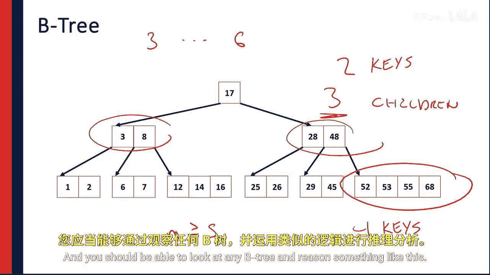

# 015：B树插入算法详解

在本节课中，我们将要学习B树数据结构中的核心操作之一：插入。我们将详细探讨如何在B树中插入一个新键值，并理解这一过程如何维持B树的关键性质，例如所有叶子节点位于同一层以及节点至少半满。

## B树回顾

上一节我们介绍了B树的基本概念，本节中我们来看看具体的插入操作。

一棵阶数为M的B树是一种数据结构，旨在优化算法，以最小化访问数据所需的磁盘寻道或网络寻道次数。

具体来说，一棵阶数为M的B树包含阶数为M的节点。每个节点最多包含 **M - 1** 个键。每个键的左右两侧都可能有一个指针，因此一个节点最多可能有 **M** 个子节点，因为该节点总共有M个指针。

## 插入操作详解

让我们从一个简单的B树开始，想象一棵阶数为5的B树。这意味着每个节点最多可以容纳4个键。

以下是插入键值14、19、47和81的步骤：

1.  **插入14**：根节点为空，直接放入14。
2.  **插入19**：根节点未满，将19按顺序放入。
3.  **插入47**：根节点未满，将47按顺序放入。
4.  **插入81**：根节点未满，将81按顺序放入。

此时，根节点已满（包含4个键）。根据B树的定义，一个节点最多只能有 **M - 1** 个键，因此无法再直接插入新键。

## 节点分裂与中间值提升

当尝试插入下一个键值（例如42）时，由于根节点已满，不能直接插入。B树的插入算法要求我们进行“节点分裂”。

以下是处理插入42的步骤：

1.  **定位插入点**：42应位于19和47之间。
2.  **节点分裂**：由于目标节点（根节点）已满，需要将其分裂。我们取当前节点键值的中位数（此处为42）。
3.  **创建新结构**：
    *   将中位数42提升为新的根节点。
    *   将小于42的键（14和19）放入一个新的左子节点。
    *   将大于42的键（47和81）放入一个新的右子节点。

现在，我们得到了一棵高度为2的B树。根节点包含一个键（42），左子节点包含两个键（14, 19），右子节点包含两个键（47, 81）。

## 递归插入过程

B树的插入是递归的。让我们观察一棵阶数为3的B树，其中所有节点都已满。

假设我们要插入数字30。以下是过程：

1.  **查找插入位置**：从根节点开始，30介于23和42之间，因此进入中间的子树。在该子树中，30介于25和31之间，应插入此节点。
2.  **节点分裂**：目标节点插入30后将拥有3个键（25, 30, 31），超过了阶数3的节点容量（**M - 1 = 2**）。因此，需要分裂该节点。
    *   取中位数30，将其提升到父节点（原包含23和42的节点）。
3.  **父节点处理**：父节点现在包含23、30、42三个键。这导致父节点也满了（因为阶数M=3，最多2个键）。
4.  **再次分裂**：必须分裂这个父节点。取其中位数30，再次提升，使其成为新的根节点。
    *   原父节点中小于30的键（23）及其子树成为新根节点的左子节点。
    *   大于30的键（42）及其子树成为新根节点的右子节点。

通过这个过程，我们可以看到插入算法如何递归地向下一层层查找插入位置，仅在节点已满时才分裂节点并将中位数提升到父节点，直到找到一个未满的节点为止。

## B树的性质

理解了插入算法后，我们可以总结B树的四个关键性质：

以下是B树必须满足的条件：

1.  **键值有序**：每个节点内的键值必须保持排序（升序或降序）。注意，此处的“有序”指键值排序，与“阶数M”中的“阶”含义不同。
2.  **节点容量**：每个节点最多包含 **M - 1** 个键。
3.  **内部节点子节点数**：对于每个内部节点（非叶子节点），其子节点数量正好比键的数量多1。这是因为每个键的左右都有指针，两端的指针还指向额外的子树。因此，一个包含k个键的节点，正好有 **k + 1** 个子节点。
4.  **子节点数范围**：
    *   根节点至少有2个子节点（除非它是叶子节点），最多有M个子节点。
    *   非根节点（包括内部节点和叶子节点）的子节点数（对于叶子节点，子节点数为0）必须在 **⌈M/2⌉** 到 **M** 之间。这意味着每个节点至少是半满的。这很合理，因为节点只有在满的时候才会分裂，分裂后产生的两个新节点正好是半满的。
5.  **叶子层等高**：B树中所有叶子节点都位于同一层级。这是由插入和分裂算法保证的，确保了树的平衡性，无论沿哪条路径向下，高度都相同。

## 实例分析：确定B树的阶数

观察给定的B树示例（图中未标明阶数M），我们可以通过其性质推断阶数。

以下是推理步骤：

1.  图中有一个叶子节点包含4个键。根据性质2，一个节点最多有 **M - 1** 个键，因此 **M - 1 ≥ 4**，推出 **M ≥ 5**。
2.  图中有一个内部节点有3个子节点。根据性质4，非根节点的子节点数至少为 **⌈M/2⌉**，且该节点有3个子节点，因此 **⌈M/2⌉ ≤ 3**。这意味着 **M/2 ≤ 3**（向上取整前），所以 **M ≤ 6**。
3.  综合条件 **M ≥ 5** 和 **M ≤ 6**，可能的阶数是5或6。
4.  考虑到B树通常在节点满时分裂，选择奇数阶数（如5）可以使分裂时中位数更明确，因此该树很可能是阶数为5的B树。

通过这个练习，你应该能够分析任何B树并推断其阶数。

## 总结

本节课中我们一起学习了B树的插入算法。我们看到了如何在B树中查找插入位置，以及当节点满时，如何通过分裂节点并将中位数键提升到父节点来完成插入。这一过程是递归的，确保了B树始终保持平衡和所有叶子在同一层的特性。我们还回顾并运用了B树的关键性质来分析给定的树结构。

接下来，我们将深入分析B树的性能，特别是搜索任意节点所需的代价。