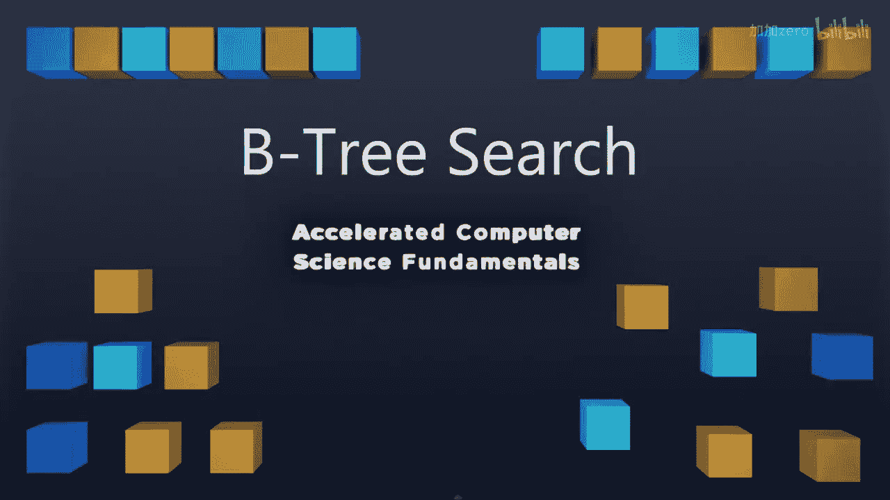
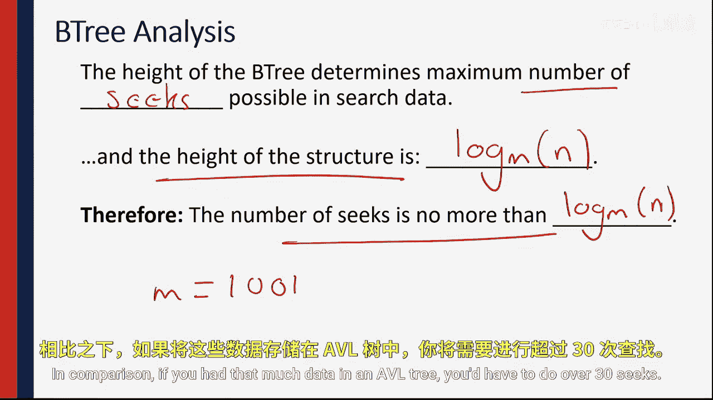

# 016：B树搜索分析




在本节课中，我们将深入分析B树的搜索过程。我们将探讨其代码实现、时间复杂度，并理解为何B树在涉及磁盘访问的场景下如此高效。

## B树搜索概述

上一节我们详细介绍了B树的结构。本节中，我们来看看如何在B树中执行搜索操作，并分析其性能。

## 搜索过程与代码分析

B树的搜索过程从根节点开始，逐层向下比较。搜索所需的时间主要取决于树的高度。

以下是搜索操作的伪代码，它清晰地展示了这一过程：

```python
def b_tree_search(node, key):
    # 在当前节点内进行线性搜索，找到第一个大于或等于目标key的位置
    i = 0
    while i < node.num_keys and key > node.keys[i]:
        i += 1

    # 如果找到了完全匹配的key，则搜索成功
    if i < node.num_keys and key == node.keys[i]:
        return (node, i)

    # 如果是叶子节点且未找到，则搜索失败
    if node.is_leaf:
        return None

    # 否则，获取下一个子节点并递归搜索
    next_child = fetch_child(node, i)
    return b_tree_search(next_child, key)
```

这段代码有两个关键点需要注意：

1.  **节点内搜索**：代码在节点内部使用了线性搜索（`O(n)`），即使节点内的键值是排序好的，本可以使用二分搜索（`O(log n)`）。之所以选择线性搜索，是因为其开销与后续操作相比微不足道。
2.  **获取子节点**：`fetch_child` 操作是性能关键。它通常需要从磁盘（或网络、云存储）中读取数据，这是一个非常缓慢的操作。

## 搜索性能分析

B树的设计核心是**最小化磁盘访问次数**。搜索性能由树的高度决定。

*   **树的高度**：对于一个包含 `N` 个键值、阶数为 `M` 的B树，其最大高度近似为 **`log_M (N)`**。这是因为每一层都将搜索范围缩小了约 `M` 倍。
*   **磁盘访问次数**：因此，在最坏情况下，搜索所需的磁盘访问（`fetch_child` 调用）次数也约为 **`log_M (N)`** 次。

这个特性使得B树在处理海量数据时极其高效。例如，考虑一个阶数为 100 的B树：

*   要搜索 3 万亿（`3e12`）条数据，所需的最大磁盘访问次数约为 `log_100 (3e12) ≈ 5` 次。
*   相比之下，如果使用AVL树等平衡二叉搜索树来存储同样规模的数据，树高约为 `log_2 (3e12) ≈ 42`，这意味着需要多达约 42 次磁盘访问。

## B树的优势总结



本节课中我们一起学习了B树搜索的机制与性能。

B树是一种混合数据结构，它结合了内存中树形结构的搜索效率与面向磁盘的算法的低访问成本。它专门优化了在数据无法全部装入内存时，**最小化缓慢的磁盘访问次数**这一核心问题。

通过将数据组织成宽而矮的树形结构，B树确保了即使面对海量数据集，搜索操作也只需要极少数几次磁盘读取。这解释了为何B树及其变种（如B+树）被广泛应用于数据库和文件系统等需要高效管理磁盘数据的领域。

下一节，我们将探讨基于不同思想构建的其他算法。