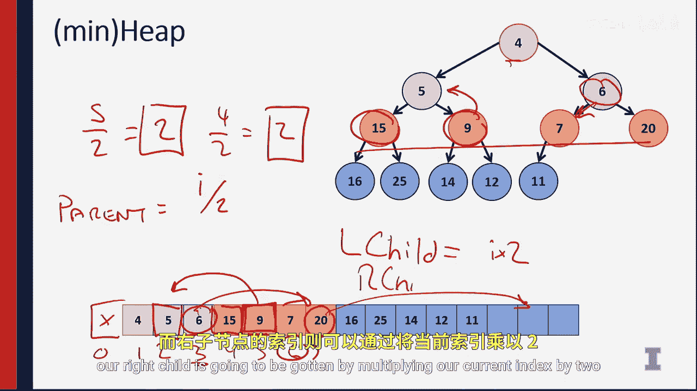

# 017：堆简介

## 概述
在本节课中，我们将要学习一种全新的数据结构——堆。堆结合了多种算法的优点，能够高效地处理数据的插入和删除最小（或最大）元素的操作。我们将了解堆的基本概念、性质，以及它如何通过数组来实现。

## 堆的引入与目标
本周，我们将讨论一种全新的算法，它将结合不同算法的最佳特性。

引入这种算法的最佳方式是思考如何处理大量数据。我们可能有一大堆数字需要插入到算法中。这种神奇的数据结构将接受数字或任何其他可比较类型的数据。

让我们看一个例子。这里可能有数字3、数字-17、数字42、数字-10，甚至数字-π。这些都是数字。我们可以考虑任何可比较类型的数据。

在这个数据结构中，我们不想维护一个完全有序的序列。我们不想要一个已排序的数据集，因为我们知道维护排序数据需要很长时间。

相反，我们在这个数据结构中唯一关心的操作是：我们希望有一个数据结构能够高效地移除最小值。

因此，如果我对这个数据结构执行移除操作，我可以直接说“移除”，它将移除-17。然后如果我再次执行移除，它将移除-10，再次移除，它将移除-π。

请注意，每次移除操作都不带任何参数，它只是简单地取出整个数据结构中的最小值，将其移除并返回给用户。

我们希望为此进行优化，以构建一个称为**优先队列**的东西，其中每个值都可以有一个优先级，我们可以根据具有最高或最低优先级的值进行移除。

## 与传统数据结构的比较
为了确切理解我们为什么要构建这个，我们可以看看已经讨论过的一些经典数据结构。这里有四种。

我们有一个未排序的数组和一个未排序的链表。我们可以看到这些列表具有很好的插入时间，但移除最小元素的时间非常糟糕。我们必须搜索整个列表才能找到最小的元素。

另一方面，已排序的数组和已排序的链表能够以非常慢的方式插入元素以维持排序顺序。但之后我们总是可以在O(1)时间内移除最前面的最小元素。

不幸的是，这两种结构都有一个O(n)的操作，而我们希望避免使用O(n)的操作。

相反，我们将尝试构建一个数据结构，使两种操作都能在小于O(n)的时间内完成。

## 堆的概念与性质
为此，我们将考虑使用类似树的结构。树可以像我们之前讨论的二叉搜索树一样维护，即总是有左孩子和右孩子。

然而，这棵树的排序不会像二叉搜索树那样严格。因为在二叉搜索树中，我们对每一边需要什么有详细的解释，并且我们发现这种结构会导致一些我们无法接受的性能下降。

相反，我们可以利用树的概念并为其附加一个属性来构建一个新的数据结构。

具体来说，我们将这种新型的树称为**堆**。

堆将有几个属性。第一个属性是：一棵二叉树T是一个最小堆，如果要么树是空的（即没有节点），要么树有左右孩子，并且左右孩子节点的值都大于根节点的值。

在堆中，我们只关心当前节点下方的所有内容，即所有后代节点都必须大于当前节点。我们不关心兄弟节点或树中其他部分发生的事情。

堆唯一重要的属性是：从一个节点出发的所有后代节点，在最小堆中必须大于该节点本身，在最大堆中必须小于该节点本身。

这意味着，如果我们看这里的堆，左边的一切都大于4。当我们只看左边时，我们不关心右边的情况。同样，右边的一切也将大于4，不关心左边的情况。当然，这递归地适用。所以5的左子树中的所有节点都将大于5，不关心树中的其他任何部分。

我们只关心这个局部属性：父节点将小于其所有后代节点。

## 堆的数组表示
我们将使用一个巧妙的数据结构来表示这个属性。因为我们理想地喜欢未排序数组的性能，它具有O(1)查找的出色保证，而这在二叉搜索树中绝对没有。

因此，我们将始终确保堆是一棵**完全二叉树**。请记住，完全二叉树是一棵完美的树，直到最后一层之前每个节点都被填满，并且在最后一层，所有节点都向左靠拢。

请注意这里的这棵完全树。一旦我们有了完全树，我们就可以将其完全映射到一个我们非常熟悉的数据结构。

当我们在内存中有这棵树时，我们将把它存储为一个数组。具体来说，让我们看看这个映射。

当我们有这棵树时，我们实际上将在内存中用一个数组来表示这棵树。所以看这个例子，我们看到4是树的根，它将是数组的第一个元素。5和6将是数组的下两个元素。然后这些元素的四个孩子将是接下来的四个元素。请注意颜色的渐变，5和6都大于4。所有这些节点都将大于它们的父节点。

我将暂时不像计算机科学家那样思考，我将从值1开始索引这个结构。为了不让自己混淆，我将在前面放一个第0个索引，并用一个x标记不使用它。所以这里是索引0, 1, 2, 3, 4, 5, 6, 7。

给定任意一个节点。让我们看节点9，它的索引是5。如果我们知道节点的索引，让我们看看它的父节点在哪里。元素9的父节点将是值5。值5在这里的索引是2。我们如何从5得到2？这看起来像整数除法。所以5除以2使用整数除法是2。

让我们看另一个孩子，15是另一个孩子，15的索引是4，4除以2也是2。

因此，在我们的数组中，我们总是可以导航到父节点，不是通过父指针，而是我们知道父节点等于我们的索引除以2。

同样，我们可以通过反转这个方程来导航到我们的孩子。我们知道，给定一个父节点，其左孩子将等于`I * 2`。例如，看值20，我们知道20没有左孩子，因为7乘以2是14。看20上面的值6，6的左孩子是7，所以6，3乘以2是6，因此左孩子可以通过当前索引乘以2得到。右孩子可以通过当前索引乘以2再加1得到。

## 总结
本节课中我们一起学习了堆的基本概念。我们拥有的是整个内存表示，堆将完全是一个数组。我们在内存中只有数组，根本没有树结构。但当我们进行分析时，我们会将其画成一棵树，因为用树来思考要容易得多。请注意，我们拥有与之前完全相同的树结构，这就像你之前学过的二叉树，但现在我们将把这棵二叉树压缩成一个数组。

我们将在这个数组上设置特殊属性，以便我们总能快速找到父节点和孩子节点。我们知道这些操作都有简单的数学公式，可以让我们极其快速地计算它们，因为一切都是2的幂，我们将看到计算机执行这些操作甚至比我们想象的还要快。

这是堆的构建基础。在下一个视频中，我将讨论如何实际向堆中插入数据，并在构建优先队列数据结构时维护这个堆。