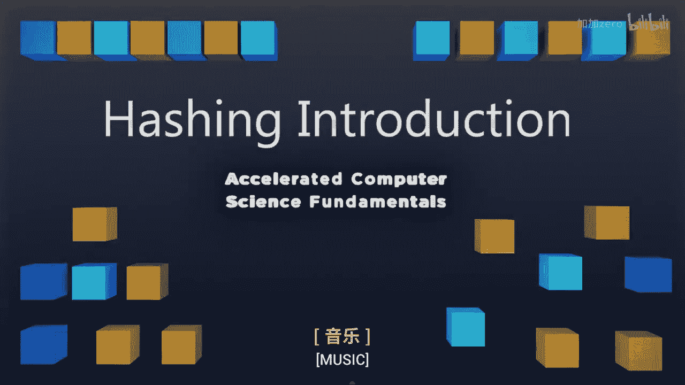

# 022：哈希简介 🔑

在本节课中，我们将要学习一种全新的算法类型——哈希。哈希算法因其能为特定操作提供极佳的运行时间，而常成为计算机科学家最喜爱的算法之一。我们将深入探讨哈希的含义、其核心组成部分以及工作原理。

## 什么是哈希？🔍

从数学上讲，哈希被定义为将一个**键空间**转换为一组不同值的过程。键空间包含了我们字典中所有可能的键。哈希表的目标是能够将每一个键快速高效地映射到其在字典中对应的值。

如果你曾使用过 Python 或 JavaScript 等语言中的字典结构，那么你可能已经对哈希有所了解。这些原生数据类型的核心思想就是哈希。

## 一个直观的例子：学校储物柜 🗄️

为了更好地理解哈希，让我们看一个生活中的例子。回想一下高中时期，学校通常有许多储物柜，每个学生被分配一个唯一的柜子。

*   在这个“哈希表”中，每个储物柜编号（例如 103、92）就是一个唯一的**键**。
*   每个键关联着一些**数据**，即拥有该储物柜的学生的姓名。
*   学校的管理部门保存着学生与储物柜编号之间的映射关系。给定任何一个储物柜编号，你都可以快速查找到对应的学生。

哈希表允许我们做的正是这样的事情。我们输入一个数字（键），通过某个函数，将任何可能的输入映射到一个固定大小的输出范围内。

## 哈希的核心概念与目标 🎯

哈希的整个目标都围绕着下图所示的流程：

1.  **输入**：这可以是一个整数、字符串或其他任何类型的数据。
2.  **哈希函数**：这是一个我们将要定义的函数，它负责将这个输入（整数、字符串等）转换成一个数字。这个数字的范围在 **0** 到我们数组的大小 **n-1** 之间。
3.  **数组**：这个转换后的数字用作数组的索引，数组则用于存储实际的数据。

然而，有时两个不同的输入可能会被哈希函数映射到数组的同一个位置，这种情况称为**冲突**。如何管理这个数组以及如何处理冲突，正是我们讨论哈希时要解决的核心问题。

## 哈希表的三大组成部分 ⚙️

具体来说，当我们定义一个哈希表时，总有三样东西在起作用。接下来我们将深入探讨这三者的含义。

以下是构成一个哈希表的三个关键部分：

1.  **哈希函数**：这是一个将我们的输入空间映射到数组索引的函数。例如，如果我们的输入是字符串，我们需要一个函数将其转换为一个介于 **0** 和 **n-1** 之间的整数。其作用可以表示为：`index = hash_function(key) % array_size`。
2.  **存储数组**：这是一个实际存储数据的数组。数据通过哈希函数计算出的索引被存入或取出。
3.  **冲突处理策略**：我们需要一种方法来决定当哈希函数将两个不同的值映射到数组的同一位置（即发生冲突）时该如何处理。

这三者的结合将是本周视频的主题。我们将深入探讨如何构建一个好的哈希函数、如何有效地使用数组，以及当确实发生冲突时我们该怎么做。

## 总结 📝

本节课中，我们一起学习了哈希的基本概念。我们了解到哈希是一种将键映射到值的快速查找技术，其核心在于哈希函数、存储数组和冲突处理策略三者的协同工作。虽然目前可能还有些困惑，但随着后续课程的学习，一切都会变得清晰。在下一个视频中，我们将从哈希函数开始，正式开启我们的哈希之旅。