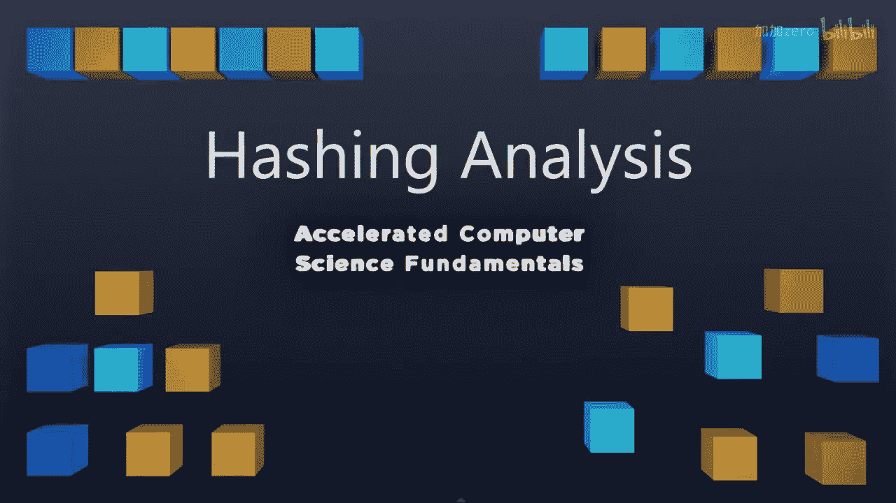

# 027：哈希分析 🔍

在本节课中，我们将要学习哈希表的核心概念，并分析其在不同应用场景下的性能表现和选择策略。我们将对比哈希表与其他数据结构（如二叉搜索树）的优劣，帮助你理解如何根据具体需求选择最合适的工具。

---

上一节我们介绍了哈希表的基本工作原理，本节中我们来看看如何分析哈希表的性能，并探讨它在不同场景下的适用性。

在讨论哈希时，我们需要从宏观角度考虑一些关键问题。其中一个问题是，我们需要确定哪种策略是更好的选择。

以下是两种主要的哈希冲突解决策略：

*   **分离链接法**：在数组的每个槽位使用一个链表来存储冲突的元素。
*   **开放地址法**（如线性探测或双重哈希）：将数据直接存储在数组本身中，通过探测寻找空位。

我们发现，根据具体应用场景，正确的答案是不同的。如果你要存储的数据对象很大，将其复制到数组内部会耗费大量时间，那么你绝对不应该使用数组。你更希望使用指针，即通过链表将数据存储在别处。

因此，当我们考虑存储大型记录时，我们会希望使用像分离链接法这样的策略来处理。

既然分离链接法适用于大型记录，意味着另一种解决方案在某些其他方面可能更好。事实上，双重哈希在结构速度上表现优异。

请记住，数组操作在内存访问上是优化的，因为它们在内存中是连续存储的。所以，如果我们只关心原始的结构速度，并且知道我们的数据本身会比较小，我们可以使用像线性探测或双重哈希这样的开放地址技术，来实现一个真正高效的数据结构。

所以，为了追求结构速度，我们会希望采用像双重哈希这样的方法。

---

接下来我们可能会问，哈希表替代了哪种数据结构？这种结构就是字典。

AVL树也提供了一种字典实现。正如我们讨论过的，AVL树在范围查找和最近邻搜索方面做得非常出色，而哈希表在这方面的表现则非常糟糕。你无法询问“哪个值接近42”，因为42被哈希到数组中的一个特定位置，而数组实际存储中，41和43可能被哈希到与42完全不同的位置。

因此，为我们的应用选择正确的算法至关重要。因为如果我们需要在哈希表上进行最近邻搜索，我们将不得不面对O(n)的时间复杂度。

那么，哈希表替代了哪种结构？它替代了字典。哈希表存在哪些二叉搜索树所没有的限制？正如我们刚刚讨论的，一个主要的限制是二叉搜索树拥有优秀的最近邻搜索能力，而哈希表完全没有这种能力。

因此，当我们考虑使用哪种算法时，如果需要范围查找或最近邻搜索，我们希望使用树形结构。如果我们总是使用确切的键进行查找，哈希表是绝佳的选择。哈希表能以O(1)的时间复杂度完成查找，而哈希表和AVL树的查找时间复杂度是O(log n)。但当我们需要进行附近值搜索时，在AVL树上是O(log n)，而在哈希表上则是O(n)。

---

最后一个问题是，我们为什么还要讨论二叉搜索树？我们讨论BST，既是为了介绍字典结构，也是因为我们将要解决的一些最有趣的问题无法用哈希表来解决。

哈希表是一种出色的通用数据结构，而AVL树将能特别有效地解决某些特定问题。如果你只关心查找，哈希表就是适合你的算法。下周我们将开始使用哈希表来构建更复杂的算法。

我希望你们喜欢学习哈希表，它是我个人最喜欢的算法之一。下周我将带来一系列关于全新数据结构的新视频，到时再见。🎬

---

**本节课总结**：
本节课我们一起学习了如何分析哈希表的性能。我们对比了分离链接法和开放地址法（如双重哈希）的适用场景：**大型记录**适合用分离链接法，而追求**结构速度**和小型数据则适合用双重哈希。我们明确了哈希表的核心作用是实现**字典**，并重点比较了它与AVL树的区别：哈希表在**精确查找（O(1)）** 上效率极高，但在**范围查找和最近邻搜索**上能力很弱，而这正是AVL树（O(log n)）的优势所在。因此，选择数据结构的关键在于根据具体的应用需求（是精确查找还是范围查询）做出权衡。