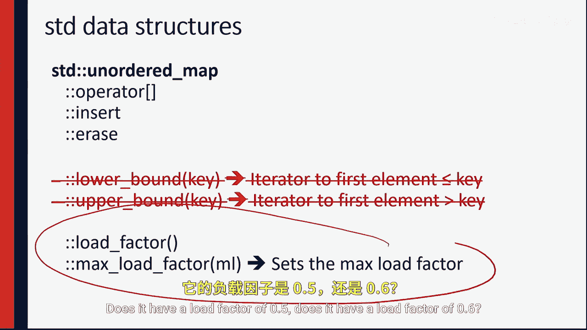

# 028：C++中的哈希表

在本节课中，我们将学习如何在C++标准模板库中使用内置的哈希表数据结构，即 `unordered_map`。我们将了解它与 `map` 的区别，以及如何利用其特性进行高效的数据操作。

---

在C++中，哈希表已经内置于C++标准模板库中。因此，我们可以在C++中以极少的代码量使用哈希表。

人们通常使用 `map` 来实现字典功能。`map` 提供了几个运行效率很高的操作，包括索引操作、插入操作和删除操作。此外，`map` 还提供了 `lower_bound` 和 `upper_bound` 操作。回顾之前的内容，`map` 确实实现了字典，但它并非基于哈希表实现。实际上，`map` 是红黑树的一种实现。因此，这些操作的时间复杂度是 **O(log n)**。

然而，C++提供了另一种数据结构来实现哈希表，这种数据结构被称为 `unordered_map`。

---

`unordered_map` 与基于树的 `map` 不同。在树结构中，我们可以进行 `upper_bound` 和 `lower_bound` 搜索，具备范围查找的能力。正如我们之前讨论的，哈希表内部不具备范围查找的能力。

尽管如此，`unordered_map` 仍然提供了相同的基本操作。我们仍然可以在哈希表中查找、插入和删除项目，但由于它基于哈希函数，因此使用的函数有所不同。

哈希表中的函数包括获取诸如负载因子之类的信息。在C++中，我们可以查询哈希表的负载因子大小，例如负载因子是0.5还是0.6。我们还可以做一件非常有趣的事情：设定我们希望算法达到的目标负载因子。

---

因此，我们可以将目标负载因子设置为一个非常糟糕的值，例如1.0，此时算法的性能将开始急剧下降。如果你想故意让程序表现不佳，可以要求标准模板库设置一个非常、非常、非常糟糕的负载因子。

所有这些功能使我们能够使用 `unordered_map` 编写C++代码来实现哈希表，只要负载因子设置得当，就能获得 **O(1)** 时间复杂度的保证。现在，你永远不需要自己编写哈希表，可以直接使用C++中内置的功能。

我期待看到你们在使用哈希表时编写的一些代码。我们下次再见。