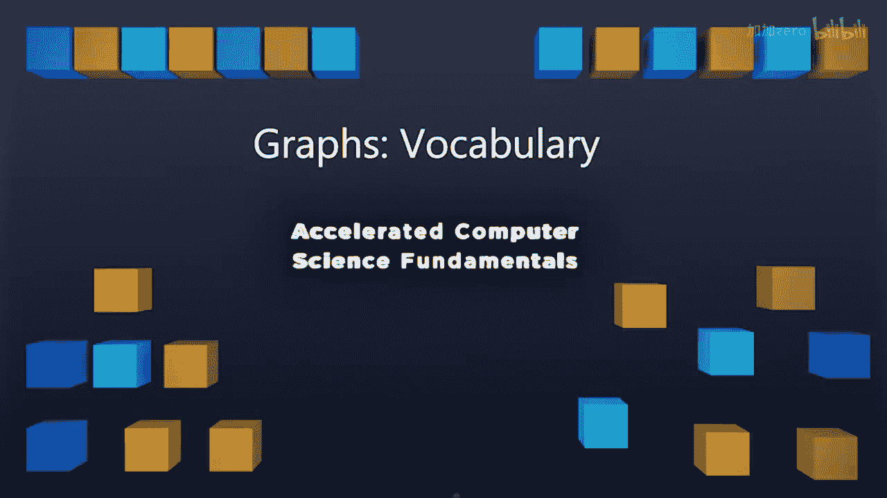

# 036：图论术语 📚

在本节课中，我们将学习图论中的基本术语。理解这些术语是后续学习图算法和数据结构的基础。我们将介绍图的基本组成部分、相关概念，并通过一些简单的数学计算来加深理解。

---

## 图的基本构成

在开始实际实现图之前，我们先来了解一些关于图的词汇，以便我们对讨论的内容有共同的理解。

观察一个示例图，这里有一系列图。我将始终用大写字母 **G** 来指代整个大图。**G** 是顶点（vertices）和边（edges）的集合。

在这个图 **G** 内部，我们有三个子图：**G1**、**G2** 和 **G3**。这些图是**不连通**的，因为 **G1** 和 **G2** 之间没有共享的边。但 **G1** 本身是一个**连通图**，因为 **G1** 内部的每个节点都可以通过各种边连接起来。

我将交替使用术语“节点”和“顶点”。当我说节点或顶点时，你可以将它们视为同一概念。如果你有数学背景，可能更习惯“顶点”一词；如果你有网络背景，可能更习惯“节点”一词。另一方面，“边”这个术语是普遍使用的。所以，每当你听到“边”，它总是指两个节点或两个顶点之间的连接。

我们将定义变量 **n** 等于图中顶点的数量。所以，如果我们计算顶点的数量，它将被定义为 **n**。如果我们计算边的数量，它将被定义为变量 **m**。因此，**n** 和 **m** 是我们将经常讨论的两个术语。

---

## 节点与边的相关概念

以下是关于图中节点和边的一些重要概念。

**邻接边**：如果一条边直接连接到一个节点，那么这条边就是该节点的邻接边。所以，一个节点上的所有边都是它的邻接边。

**节点的度**：节点的度是它拥有的邻接边的数量。例如，观察这个节点有多少条边，如果它有**三条**邻接边，我们就说这个节点的度是**三**。

**邻接顶点**：邻接顶点是指所有通过一条边直接连接到某个节点的顶点。如果我们遍历一个节点的所有邻接边，并查看连接到它的节点，那些就是邻接节点或邻接顶点。

因此，一个节点有一定数量的邻接边，这个数量就是该节点的度，而这些边另一端的节点就是邻接节点列表。

---

## 路径、环与简单图

我们也可以使用一些你可能在树结构中见过的术语。

**路径**：路径是图中一系列顶点的序列。

**环**：环是一条起点和终点是同一个节点的路径。如果我们遍历一系列节点，最终回到起点，这条路径就是一个环，我们称之为图中的环。

在本课程中，我们将主要讨论**简单图**。简单图是指没有自环的图，这意味着没有边连接回节点自身，因为这在遍历图时会导致一些问题。同时，简单图也没有多重边，即连接两个相同顶点的边只有一条。如果顶点 A 和顶点 B 之间有连接，那么恰好只有一条边连接它们。

---

## 子图与其他术语

我们已经讨论过**子图**这个术语，即图的一个子集。任何子图都包含该特定子图中的所有顶点和所有边。正如前面提到的，这里有三个子图。

最后，我们还有一些其他术语，将在后续课程中遇到时介绍。这些术语包括**完全子图**、**连通子图**、**连通分量**、**无环图**以及**生成树**。我们将在讲解图的过程中深入探讨所有这些术语。

这些词汇只是为了确保我们在讨论将要学习的图算法时，能够保持一致的理解。

---

## 图的基本数学性质

为了开始讨论，让我们做一些简单的数学计算，看看仅从已介绍的术语中，我们能了解图的哪些性质。

其中一部分是关于图意味着什么的一些简单问题。

**一个图最多可以有多少条边？**

我们假设在大多数情况下，我们的图总是简单图。这意味着没有自环，也没有多重边。如果我们开始画图，可以看到：
*   当 **n = 1** 时，只有一个节点，边数为 **0**。
*   当 **n = 2** 时，有两个节点，边数为 **1**。
*   当 **n = 3** 时，有三个节点，边数为 **3**。
*   当 **n = 4** 时，有四个节点，边数为 **6**。

这看起来像一个漂亮的序列。我们可以将其定义为：
`n * (n - 1) / 2`
这等于 **O(n²)** 条边。对于每个节点，它都将连接到其他每个节点。所以基本上是 **n** 个节点，每个节点连接到其他 **n-1** 个节点。但我们知道只有一半的边可以存在，因为你不会同时有从 A 到 B 和从 B 到 A 的边（在无向图中，这是一条边）。因此，我们将总数除以 2。这正是我们发现的：`n * (n - 1) / 2` 是一个连通图中的边数。

如果图不是简单图，允许存在多重边，那么在连接完所有顶点之前，我们可以有无限多条边。想象一个只有两个节点的图，如果不是简单图，我们可以有任意多条多重边。因此，在一个包含多重边的非简单图中，可以存在无限多条边。因此，本学期我们将始终将自己限制在简单图中。在未来的课程中，你可以深入研究当我们开始有多重边时的具体含义。

**不连通图的最小边数是多少？**

如果图是不连通的，我们知道根本不需要存在任何边。一个不连通图可以是图 A、B、C，它们都是没有连接的独立子图。因此，不连通图的最小边数是 **0**。

**连通图的最小边数是多少？**

如果我们连接这个图，那么我们可以看到每个节点都必须连接到其他每个节点。因此，最小连通图将是一个图，其中我们有一条从一个节点到图中其他每个节点的路径，并且只有一条路径可以到达那里。这里是一个最小连通图，你会注意到我们需要的边数恰好比节点数少一。因此，连通图中的最小边数是总节点数 **- 1**。

**所有节点的度之和是多少？**

如果我们考虑一个顶点的度，我们知道那是它有多少条边。如果我们把它们全部加起来，我们知道每条出边最终都会有一条入边。因此，所有顶点的度之和将等于 **2m**，即图中边数的两倍。因为在这里我们重复计算了边：一条边在 A 处被计为出边，在 B 处被计为入边。尽管入边和出边实际上是同一条边（即 A 和 B 之间的边），但 A 的度计算了这条出边，B 的度计算了这条入边。

---

## 总结

本节课中，我们一起学习了图论的基本术语。我们定义了**图（G）**、**顶点/节点（n）**、**边（m）**、**邻接边**、**节点的度**、**邻接顶点**、**路径**、**环**以及**简单图**和**子图**等核心概念。我们还通过数学计算探讨了图中边数的上限（`n*(n-1)/2`）、连通图的最小边数（`n-1`）以及所有节点度之和（`2m`）等重要性质。理解这些术语和性质是后续学习图数据结构和算法的基础。在下一讲中，我们将开始用 C++ 实现图，并对图进行一些有趣的操作。