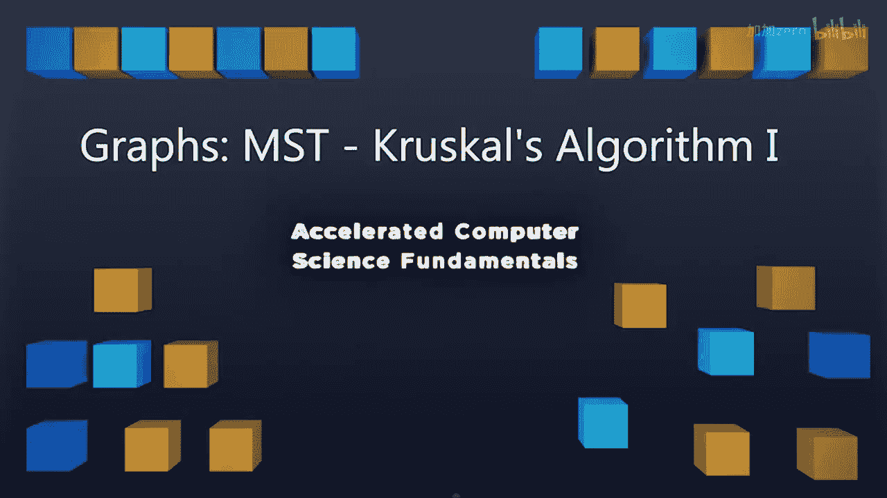
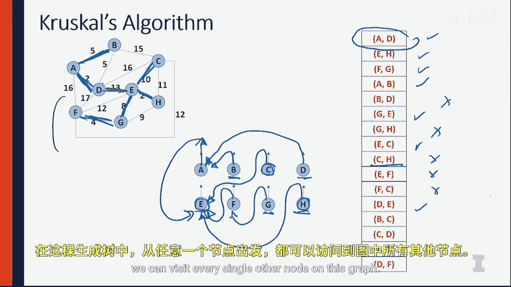

# 044：最小生成树之克鲁斯卡尔算法 I 🧩

在本节课中，我们将要学习寻找图的最小生成树（MST）的两种主要算法之一：**克鲁斯卡尔算法**。我们将了解该算法的工作原理，并通过一个简单的图例来演示它如何逐步构建出最小生成树。

---

## 算法概述与准备

克鲁斯卡尔算法的运行需要依赖两种你已经熟悉的数据结构。让我们先明确运行该算法所需的条件，然后通过一个简单的图例来演示其构建最小生成树的过程。

我提供了一个简单的图，其中包含连接各个节点的边，每条边都附有一个权重，代表通过这条边的“成本”。你可以将其想象成一个道路网络，权重就是每段道路的里程数。整个算法的核心在于找出整个图中成本最低的连接方式。

为此，我们需要维护一个在本课程早期学过的数据结构：**最小堆**。作为算法的一部分，我们将利用最小堆来组织所有边，确保权重最小的边始终位于堆顶。

除了最小堆，我们还需要引入本课程中讨论过的**不相交集合**的概念。在算法开始时，图中的每个顶点都将被视为一个独立的不相交集合。我们使用**向上树**来表示这些不相交集合。

---

## 算法运行步骤

以下是克鲁斯卡尔算法的具体运行步骤。我们将从一个包含所有边的最小堆，以及每个顶点作为独立集合的不相交集合结构开始。

算法的核心流程是：始终从堆中移除权重最小的边，然后检查这条边连接的两个顶点是否已经属于同一个集合。
*   如果它们已经在同一个集合中，则忽略这条边。
*   如果它们属于不同的集合，则将这两个集合合并。

让我们通过图示来一步步执行这个算法。

1.  **处理边 A-D (权重 2)**: A 和 D 目前在不同的集合中，因此合并包含 A 和 D 的集合。
2.  **处理边 E-H (权重 2)**: E 和 H 在不同的集合中，合并它们。
3.  **处理边 F-G (权重 4)**: F 和 G 在不同的集合中，合并它们。
4.  **处理边 A-B (权重 5)**: A 和 B 在不同的集合中，合并它们（此时 A、B、D 在同一集合）。
5.  **处理边 B-D (权重 6)**: B 和 D 现在都在以 A 为根的集合中（通过向上指针查找），因此它们已在同一集合。**忽略此边**，不将其加入最小生成树。
6.  **处理边 G-E (权重 7)**: G 和 E 在不同的集合中，合并包含 G 的集合和包含 E 的集合。
7.  **处理边 G-H (权重 8)**: G 和 H 现在都在以 E 为根的集合中，已在同一集合。**忽略此边**。
8.  **处理边 E-C (权重 9)**: E 和 C 在不同的集合中，合并它们。
9.  **处理边 C-H (权重 10)**: C 和 H 现在都在以 E 为根的集合中，已在同一集合。**忽略此边**。
10. **处理边 E-F (权重 11)**: E 和 F 已在同一集合。**忽略此边**。
11. **处理边 F-C (权重 12)**: F 和 C 已在同一集合。**忽略此边**。
12. **处理边 D-E (权重 15)**: 包含 A、B、D 的集合与包含 C、E、F、G、H 的集合不同，合并这两个大集合。

至此，所有顶点都连通到了同一个不相交集合中，算法结束。

---

## 生成树可视化

现在，让我们将算法选中的边在图上加粗，直观地看到最终的最小生成树。

被加入的边依次是：
*   A-D
*   E-H
*   F-G
*   A-B
*   G-E
*   E-C
*   D-E

请注意，在加入最后一条边 D-E 之前，图被分成了两个连通部分。加入 D-E 后，整个图才完全连通，形成了一棵**生成树**。在这棵树上，从任意一个节点出发，都可以访问到图中的所有其他节点。

这是一个非常棒的特性，**克鲁斯卡尔算法不仅保证我们能得到一棵生成树，而且保证这是整个图所有可能的生成树中总权重最小的那一棵**。你无法找到另一棵总权重比这更小的生成树。这个结果非常强大，它确保了我们获得的是连接所有节点的成本最低的路径方案。

---

## 总结与预告

本节课中，我们一起学习了克鲁斯卡尔算法的基本原理和逐步执行过程。该算法巧妙地结合了**最小堆**和**不相交集合**两种数据结构，通过**始终选取当前未连接部分之间权重最小的边**来构建最小生成树，并有效避免了环路的产生。

在下一个视频中，我们将深入分析实际运行这个算法的时间复杂度，并查看一些用于实现克鲁斯卡尔算法的代码。

