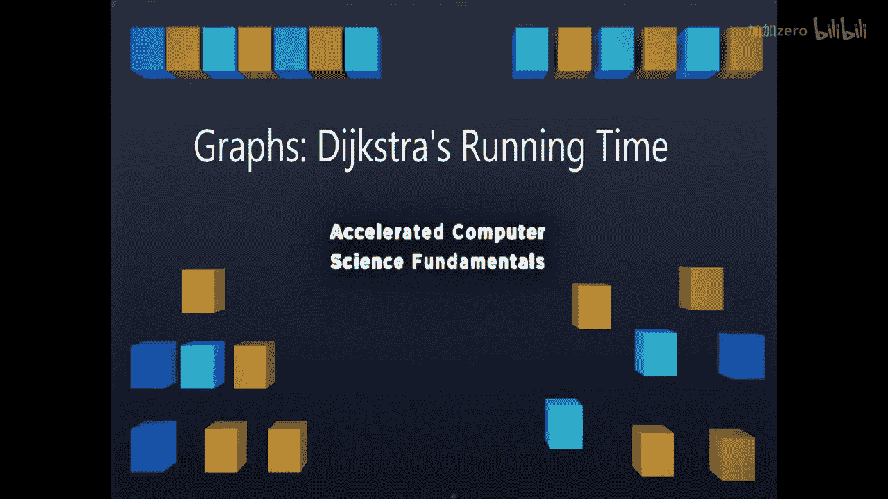
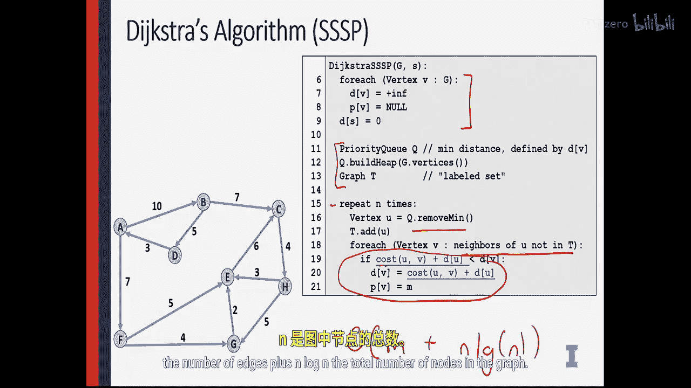

# 049：图论-迪杰斯特拉算法运行时间分析 🚀

在本节课中，我们将要学习迪杰斯特拉算法的运行时间分析。我们已经掌握了如何使用迪杰斯特拉算法及其所有运行细节，现在快速讨论一下该算法的时间复杂度。

## 算法运行时间概述

迪杰斯特拉算法的总运行时间与其基础算法非常相似。让我们做一点分析，看看它与普里姆算法有何不同。

与普里姆算法类似，迪杰斯特拉算法需要构建一个包含图中所有顶点的数据结构。我们将构建一个顶点优先队列，并遍历图中的每一个顶点，这与普里姆算法的过程一致。

## 核心步骤与时间复杂度

在每一个顶点上，我们都会移除优先队列中距离最小的顶点，然后遍历它的所有边。当我们找到一条更短的路径时，就会更新该边的权重。

这里的关键在于，**更新边的代价只在我们需要“减小”某个顶点的距离值时才会发生**。通过使用一种称为**斐波那契堆**的特殊堆结构，我们可以对此进行优化。

经过优化的迪杰斯特拉算法能达到一个非常出色的运行时间，其优化方式与普里姆算法的最佳优化版本完全相同。

因此，算法的总运行时间为 **O(M + N log N)**。

*   **M** 代表图中的边数。
*   **N** 代表图中的节点数。
*   **log N** 是操作优先队列（斐波那契堆）带来的对数因子。

## 算法效率评价

这个运行时间是所有最短路径算法中能达到的最佳时间复杂度之一。虽然它比简单的图遍历（O(M+N)）多了一个 **log N** 的因子，但这个额外的代价使得我们能够在遍历所有边和节点的同时，精确地找到单源最短路径。

这是一个非常优秀的运行时间，是寻找最短路径的一个极佳方法，也是现有算法中最优的选择之一。

## 总结与过渡

上一节我们详细介绍了迪杰斯特拉算法的运行时间，现在你已经对它有了完整的理解。

接下来，让我们看看计算机科学中一个我最喜欢的问题。这将是一个有趣的方式，来展示如何为现实生活中的问题选择合适的算法。

我期待向你展示这一点，我们下一个视频再见。😊