# 计算机科学基础：P1：数组


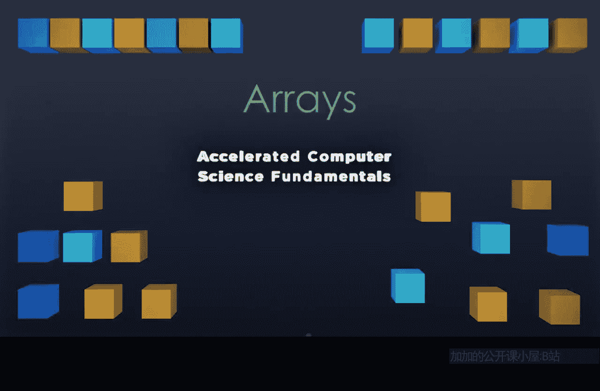

## 概述
在本节课中，我们将要学习数据结构的基础——数组。我们将了解数组如何存储数据、如何访问数据，以及它的一些关键特性和局限性。

---

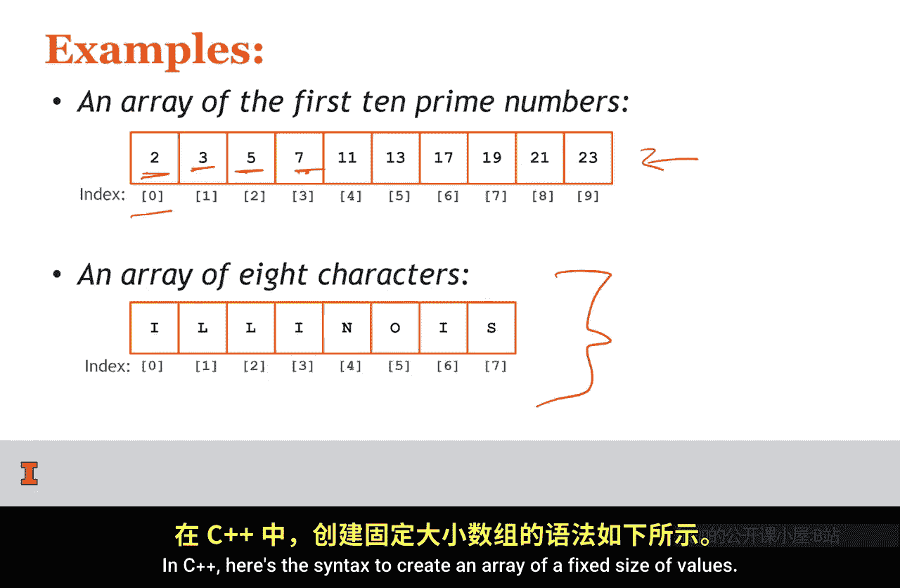

## 数组的存储方式 📦
数组将数据存储在连续的内存块中。我们可以将一个数组可视化为一个大矩形，里面包含许多小矩形。

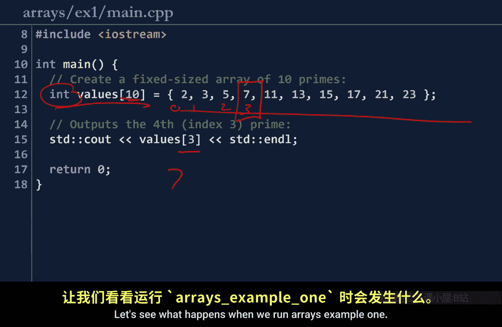

最左侧是索引0，这是数组的第一个元素。随后的每个元素，其索引依次递增1。

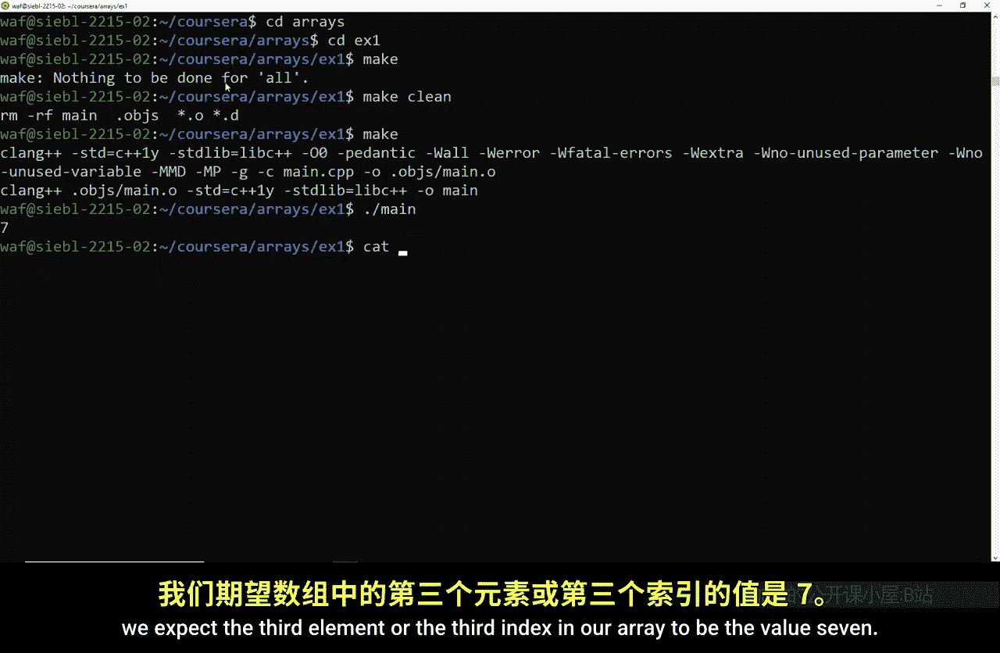

整个数组被放置在一个连续的内存块中，这意味着一个元素结束后，下一个元素紧接着开始。

以下是数组的两个例子：
*   一个包含前10个质数的数组。在索引0处是第一个质数2，紧接着在内存中是下一个质数3，然后是5、7，依此类推。
*   一个包含8个字符的数组。

---

## C++中的数组示例 💻
让我们看一个包含基本数组的C++程序。在C++中，创建固定大小数组的语法如下：
```cpp
int values[10] = {2, 3, 5, 7, 11, 13, 17, 19, 23, 29};
```
这里，数组的类型是`int`，它包含10个整数，即前10个质数。

我们可以使用方括号访问数组的每个元素。例如，`values[3]`将访问数组中的第三个索引。请记住，索引从0开始计数，所以索引0、1、2、3对应的元素分别是2、3、5、7。因此，我们期望`values[3]`输出7。

运行程序后，输出结果确实是7，这与我们的预期一致。

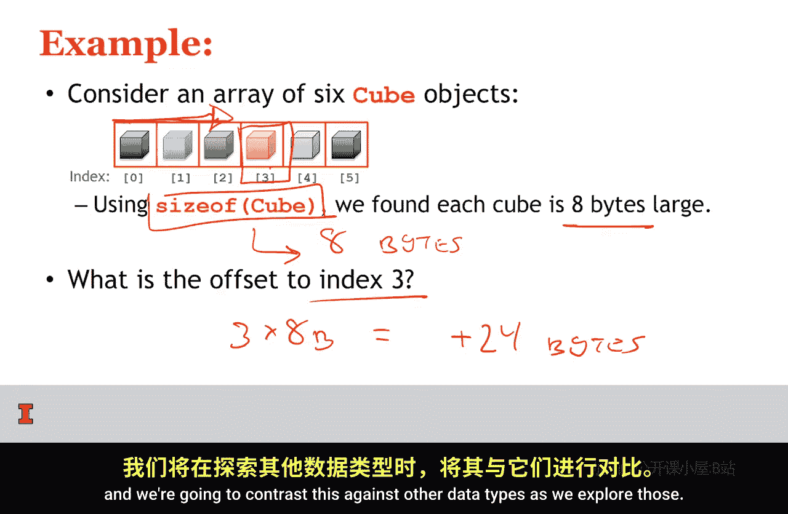

---

## 数组的特性与计算偏移量 🧮
数组有一些局限性。第一个局限是：数组中存储的所有数据必须是相同类型。整数数组只能包含整数，字符数组只能包含字符。

由于我们知道数组的两个事实：所有元素类型相同，并且特定类型的数据在内存中占用的空间大小相同，因此我们可以从数组的固定起始点计算任何元素的偏移量。

例如，对于一个整数数组，如果我们想知道索引5的位置，我们知道它距离数组起始点有5个整数的距离。在C++中，我们可以使用`sizeof`运算符来获取某种类型（如`int`或自定义的`Cube`类）在内存中占用的字节数。

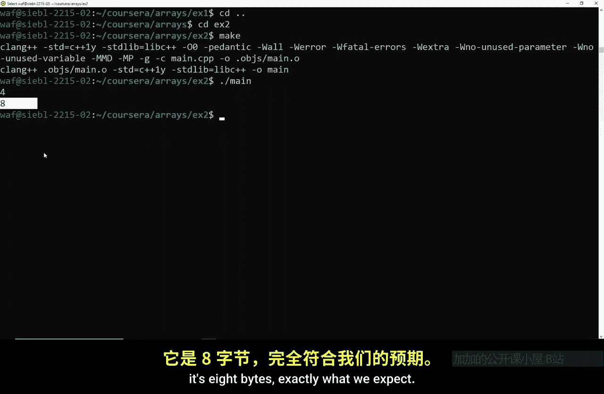

如果我们发现每个`Cube`对象占用8字节，那么要访问索引3，我们可以计算偏移量：`3 * 8字节 = 24字节`。这意味着我们需要从数组起始点前进24字节。

这种计算非常强大，因为它允许我们使用一个简单的公式直接访问所需的内存位置，而无需逐个查看中间的元素。这是一个非常快速的操作。

---

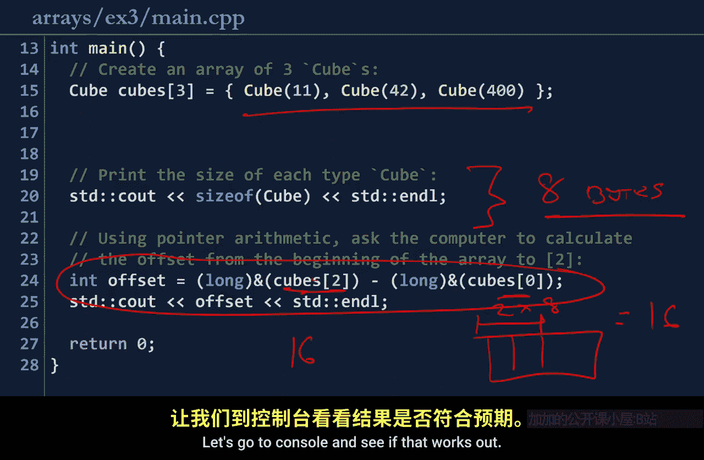

## 验证偏移量计算 🔍
让我们构建一个C++程序来展示`sizeof`运算符以及内存地址的计算。

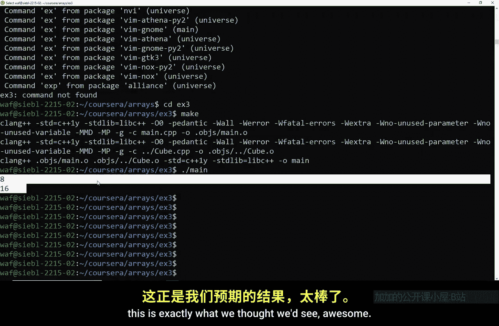

在第一个例子中，我们计算`int`类型的大小以及数组中索引2和索引0之间的内存地址差。如果`int`大小为4字节，那么两个`int`的偏移量应为8字节。运行程序后，我们确实得到了4和8，验证了我们的计算。

在第二个例子中，我们使用一个`Cube`对象数组。运行程序后，我们发现`Cube`的大小是8字节，索引2和索引0之间的偏移量是16字节。这证明了即使访问数组的语法完全相同，但由于数组内容的类型不同，内存偏移量也会不同。

---

## 数组的容量限制与动态调整 📏
数组的第二个局限性是：数组必须具有固定的容量。容量是数组可以存储的最大元素数量，而大小是当前存储的元素数量。

一旦数组中的元素数量超过其容量，我们就必须调整数组的大小以获得更多内存。我们不能简单地拥有无限量的连续内存，因为内存中还有其他数据。

调整大小时，我们需要分配一个新的、更大的内存块，并将所有旧数据复制到新位置。只有这样，我们才能在新数组的末尾添加新元素。

C++标准模板库中的`vector`（向量）就是一个实现了动态增长数组的容器。在`vector`内部，当元素数量达到当前容量时，它必须执行调整大小的操作。

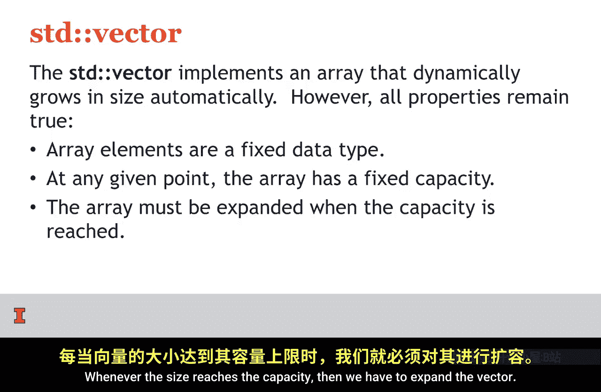

---

## 探索Vector的内部机制 🛠️
让我们看一个深入探讨`vector`工作原理的例子。我们创建一个包含三个`Cube`对象的`vector`。

程序首先输出`vector`的初始容量。然后，我们向`vector`添加一个新元素，并输出添加后的新大小和新容量。通常，`vector`的容量会增长到大约原来的两倍，这是为了预留空间，避免每次添加元素都触发调整大小。

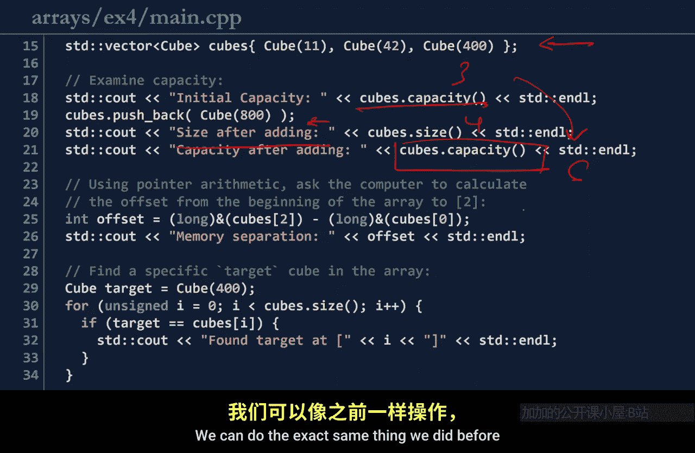

接着，我们计算`vector`中索引2和索引0元素的内存地址差。结果是16字节，这证明`vector`内部的数据确实是连续存储的，就像一个普通数组一样。

最后，我们使用一个`for`循环遍历数组，来查找一个特定的`Cube`对象（例如值为400的对象），这展示了如何在数组中顺序搜索元素。

运行程序后，所有输出都符合我们的预期：容量动态增长，数据连续存储，并且可以成功遍历查找。

---

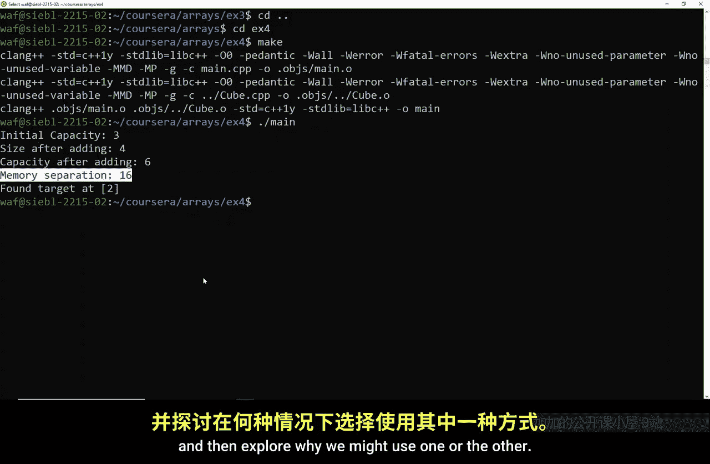


## 总结
本节课中，我们一起学习了数组的基础知识。我们了解到数组在连续内存块中存储相同类型的数据，可以通过索引快速访问元素。我们也探讨了数组的局限性，如固定容量和单一数据类型要求，并看到了C++中`vector`如何封装数组以实现动态扩容。理解数组是学习更复杂数据结构（如下一节课将介绍的链表）的重要基础。