# 伊利诺伊大学【中英⚡计算机科学基础｜Accelerated Computer Science Fundamentals Specialization】 p02 P2 02_1-2-链式内存 -BV1KnLCzXEcQ_p2-

Linked memory stores data together with a link to the next location in memory。

 instead of sooring all of the data sequentially in memory by utilizing the link。

 we can get several advantages over an array。Let's explore how this works。

 and then we'll talk about the advantage and disadvantages of using this。In C plus plus。

 we're going to call each list a sequential list of nodes。

 These list nodes have both the data stored on this left hand side。

 and a pointer that points to the next piece of the list。 So， for example。

 if we look at a list node class。 we're going to see that the list node class will be a templated class。

 because we want to store integers and characters and strings and cubes and anything else。

 So it's going to have a template type T。 The class is list node。

 And in the public section will' have both the data。 So this is the data piece here on the left。

And then we'll have a next pointer that points to the next element in our list。

I went ahead and included a simple constructor。 This constructor is a list node constructor that takes in data。

 and it includes data data and a next to null。 We'll link together 0 or more of these list node elements to form what we call a linked list。

 and we'll have two special properties to this linked list。

 We'll have a head pointer that we're going to store that's going to denote the beginning of our list。

 And this is going to a point to the very first element。 This will point to effectively index 0。

And then we'll have a pointer to the null pointer。😡，That marks the end of the list。

 So as long as your pointer doesn't point to null， we know we have not yet reached the end。

 So looking at the head pointer， if we start the head， we see the index 0 is 2。

 indexd 1 is going to contain 3。 index 2 is going to contain 5 and so forth。

 simply by following the pointers to the next location each time。

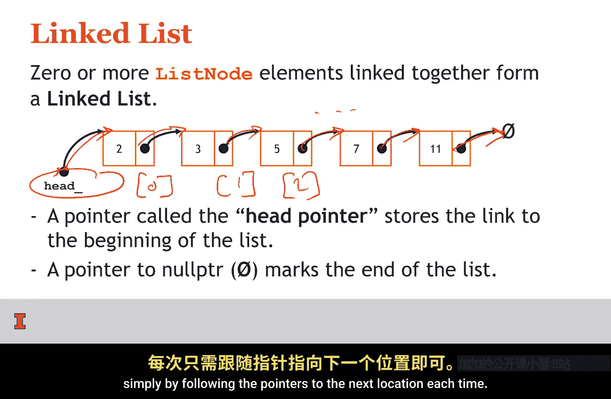

Looking at the implementation of this encode code， we have our list each file here。

 Notice that we have a templated class and this class is class list。In this class。

 we have a public section。That's going to note。A Amberan operator。

 So this operator Amberan is C plus plus syntax to say that we can access a list L。

 So if we have a list of integers。Named L。We can say L at 0， and L at 0 is going to call。

This function。Line 14 is a second member function called insert at front。

 So we need some way to go ahead and insert elements into list in our private area of the class。

 we have a list node class that's part of the list itself。

 So as the list class internally contains list nodes。And this list node contains our data our next。

 as well as our constructor。 And the very last thing that's part of the list class itself。

 So notice this list node pointer head is part of the list class。 So the list class itself has。

The ad operator。Inser at front， a list node class internally to it。

 as well as the pointer of the head。 So all four of these things make up a list itself。

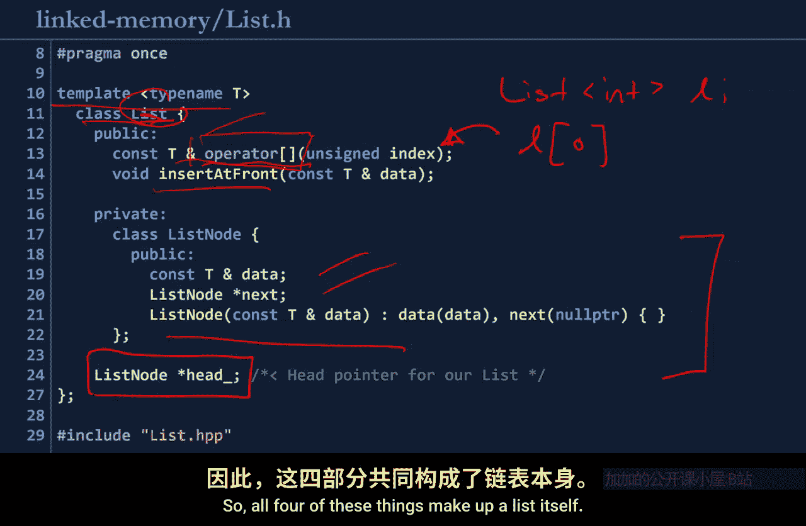

Let's think about how we might implement that Git operation if we want to find out what is at index 4。

Or index K。 I'm going to think about index 4 right now， and then we'll generalize it out to index K。

 So to access index 4， we need to start the head and advance to index 0。

And then continually advance to index 1。To index 2。To index 3。And then， to index 4。

Only once we've reached index 4， can we go ahead and return that value。

Notice that we have to go through every single node in between。

 There's no arrow that directs us directly to in X 4。 This doesn't exist。

 We have to follow the path of next pointers。

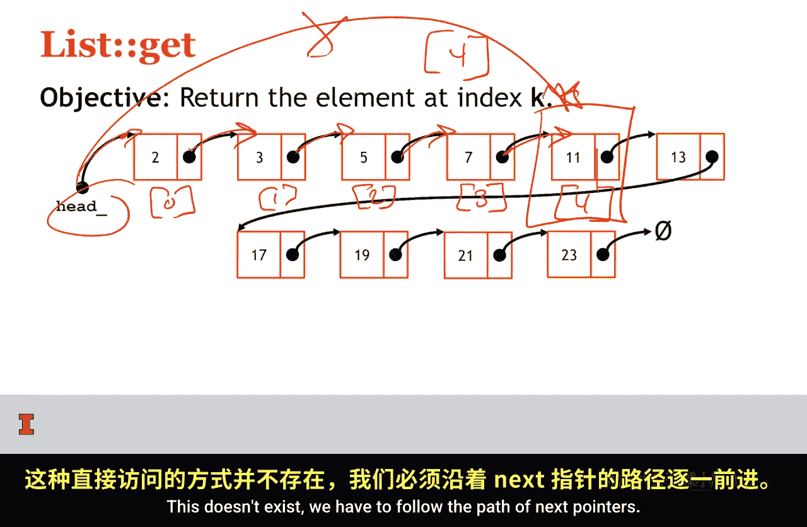

So implementing this， this looks like a simple loop。So， implementing this operator。

Square bracket function， retrieving a particular index into a loop。

We're going to go ahead and define a through pointer。

 This is the thing that's going to allow us to advance through the linked list， starting at the head。

And while our index is greater than 0。 And while we haven't reached into the list。

 we want to continually go through the list。 What does it mean to go through the list。 Well。

 the first thing is it means the through pointer should go to the next element。

 So if we were at this first element。 we want to follow the next pointer and set through to be equal to through it next。

 So this is through next pointer。 So through no longer equals no longer points to this first node。

 But through now points to the second list node。And the second thing we want to do is decrement index。

 So if we start index at4 after we visited one node。

 we want to remove one from that and make it equal to three。

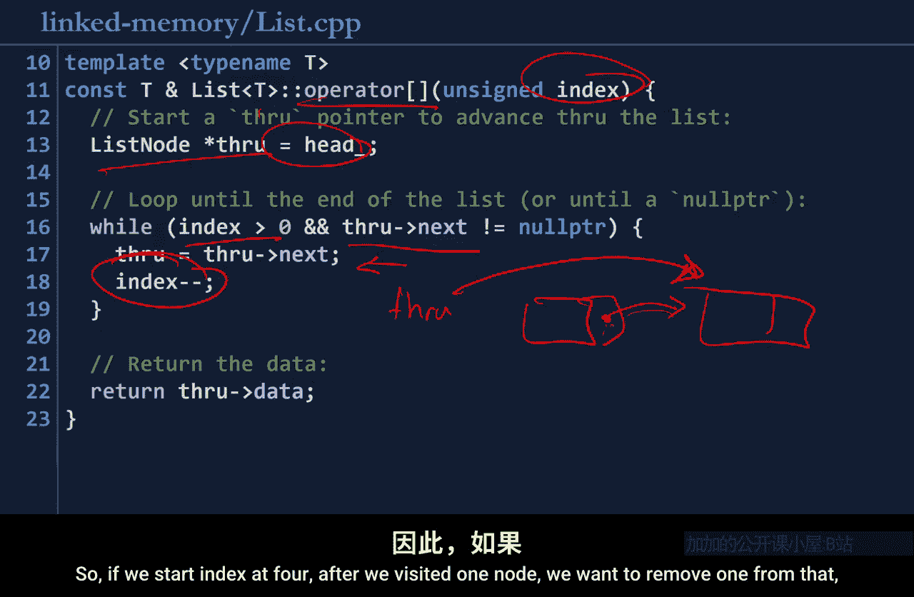

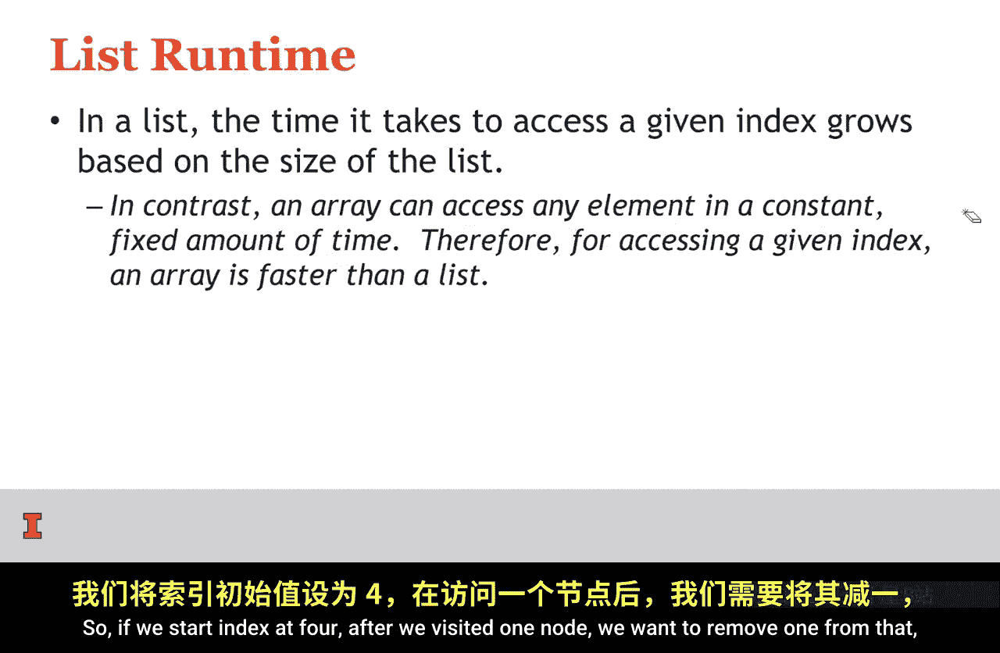

So as we advance through this loop four times， we'll eventually get to。

Through pointing to the actual data that we're interested in。

 and we don't want to return the list node to the user because the user doesn't even care about list nodes。

 The user wants to know what's the data at index for。 So we go ahead and return througharrow data。

 So we are accessing the list nodes data element。

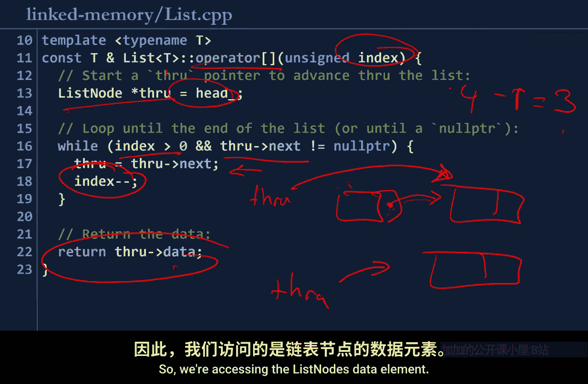

If we think about the runtime of this algorithm， this algorithm is going to take a lot longer。

To run then an array。 So remember an array， we could calculate the exact offset to a given element。

 So if we want to find out what's to element 10000， we would do 10000 times the size of the element。

 For example，4 fs， and we know to just advance 40000 Bs in memory on a list。

 we can't do it in one operation。 If we want to access the 10000 element in the list。

 we have to follow 10000。Next pointers。So as the list grows。

 the time it takes to access a particular element grows with the size of the list。That's scary。

 but that may also provide some advantages。 We'll do some formal analysis in one of the very next videos。

Before we actually run the entire code， we need one other thing we need to know how to insert into the list。

 So now I have another linked to list。 This is just a list of cubes instead of a list of integers。

But because this is a clp to the class， the exact same code for integers works for cubes。So the pose。

 I want to insert a red cube。At the beginning of the list。

So inserting at the beginning of the list is going to be a particularly easy operation。So。

 here at head。I don't want head to point to the orange cube。 Instead。

 I want to just change head to point to my new red cube。

 So the very first element in the list is now the red cube。And all I need to do is whip the red cube。

I need to update its next pointer。To be to the orange cube。And suddenly， just like that。

 I changed where head was located and made sure I reattach the rest of the list。 And by doing that。

 I've created a bigger linked list， and I did that without even looking at any of the elements in the list。

 So let's see how we might do that with code。

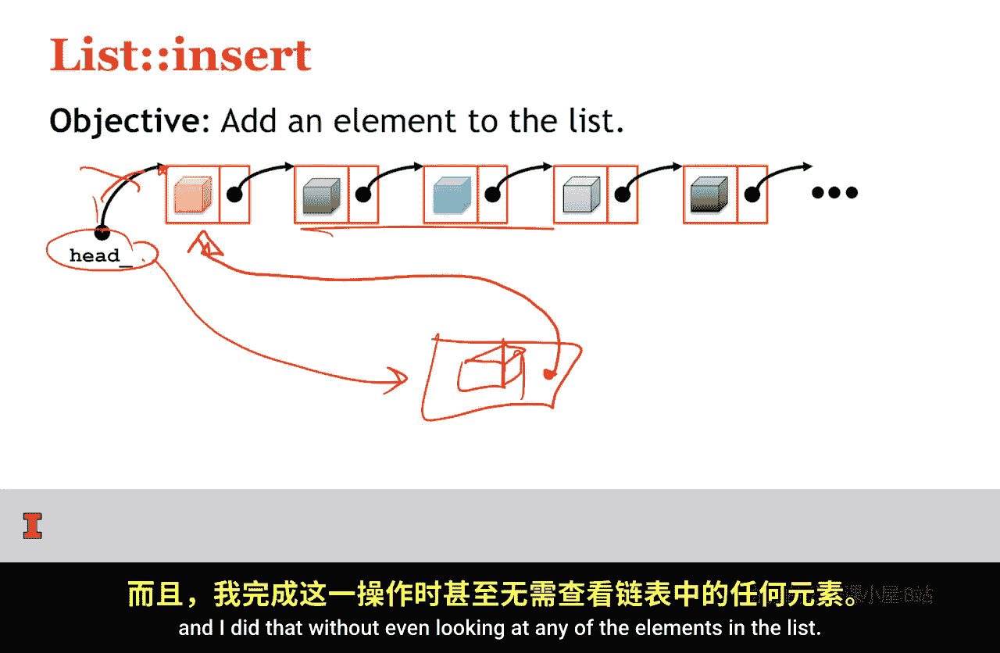

It's as simple as we just described。We're goingt just do three things。

We're going to create a new node。For a linked list in heat memory。

 And we want to do this in heat memory because the linked list may live well beyond this function。

 So we don't want it on the stack because we're going to be using it beyond this scope with this function。

 So we need to do in the heap。Doing this in the heap。

 we see that we're going to create a new list node right here。

And the new list node is going to contain our data。And then we're going to say our new list nodes。

 next pointer。Is going to point to whatever the head was pointing to。

 So our head was pointing to this element right here。

And now our new nodes next pointer points the ahead。 And now we want to update the head。

To point to our new element。And now notice by doing that， our head now points to data。

And our data now points to what head used to point to。 So we've kept the list intact。

 We've just added a new element in the front of the list。

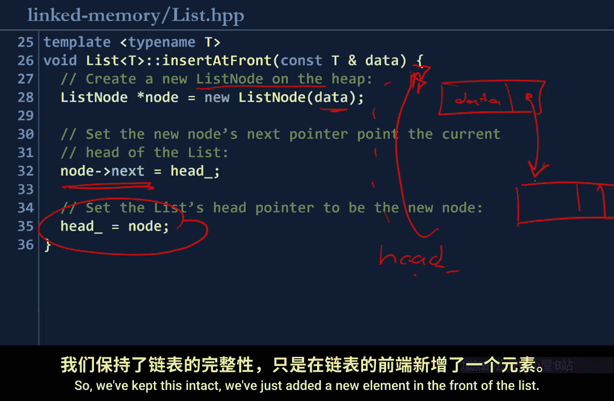

Unlike an array， the capacity of a list is only bounded by the amount of memory you have on your computer。

 In contrast， we saw an array had a fixed capacity。 We saw the array had to be resized。

 Not so with a list。 In fact， with a list， we can just keep adding elements again and again and again to the beginning of the list。

 and it just keeps growing。 It's an awesome ability that we don't have with an array。😊，However。

 similar to an array， a list is going to have。Every element being of the same type。

So an integer list can only contain integers， A string list can only contain strings。

 This is true with an array and a list。 So in both the get in both data structures。

 we're going to be fixed in the way that we store data in the sense that they have to both contain elements of the exact same type。

 So let's look write a main function that actually sees how this list works。

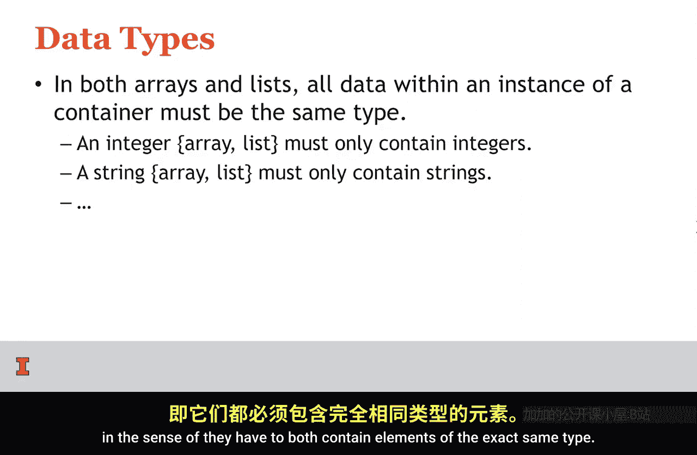

Here on line 9， we create a new list。 This is a list of integers。

And we're going to insert element with data 3 at the front。

So I am going to have a list that's initially empty。And now on line 12， I'm going to insert up front。

 So I'm going to insert a new node that has。value of 3 and our next pointer point to null。

And then we output what's at list of 0。 So list of 0 contains data 3。 So we expect。

List of0 at this point to be equal to 3。The next thing is we're going to insert 30 at the front。

 So by inserting 30 at the front， we're now changing the head pointer to 。230。

Its next point is going to point to where head originally pointed to， which is 3。So here on line 17。

We're going to print out list of 0 at this point。 So list of 0 after this insert is going to be the first element list。

 which is 30。And then， list of one。Is going to be 3。 We expect to insert 3， then print out 3。

 expect to insert 30， then print out 30， then print out 3 again。

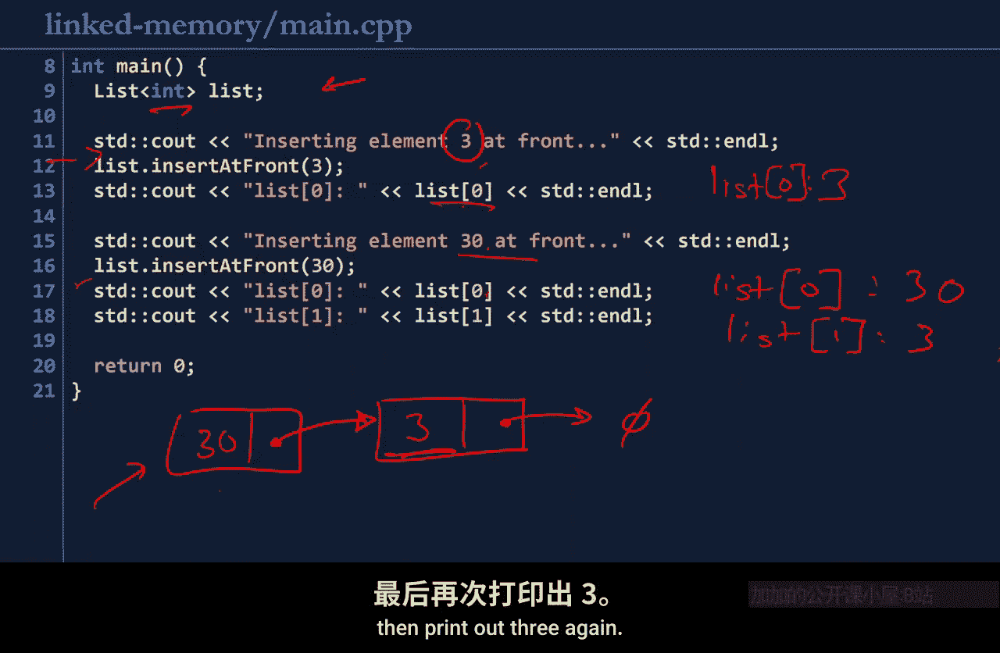

Let's see if this works。Moving into linked memory directory。Going to run make。And dot slash main。

We see we're inserting element 3 at the front。 list of 0 is 3， inserting element 30 at the front。

 list of 0 is 30， and list of 1 is 3。 is is exactly what we expected。 So to summarize。

 linked memory stores data and nodes that are linked together by links or pointers。

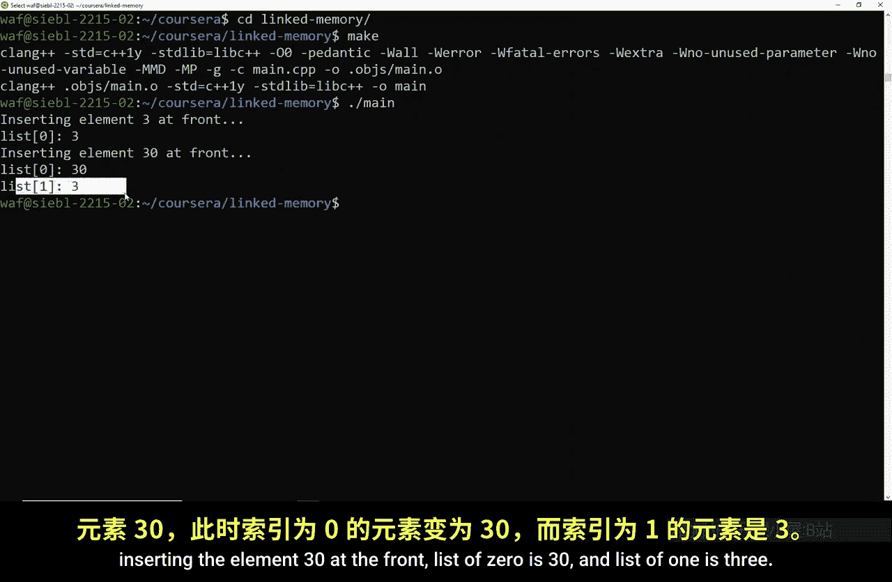

The basic structure that we have in linked memory is a linked list。

 which just consists of zero more linked nodes linked together。

And a linked list provides kind of a more flexible alternative to an array。

 but with some runtime disadvantages。We're going to formally explore what that means coming up。

 I'll see you then。

