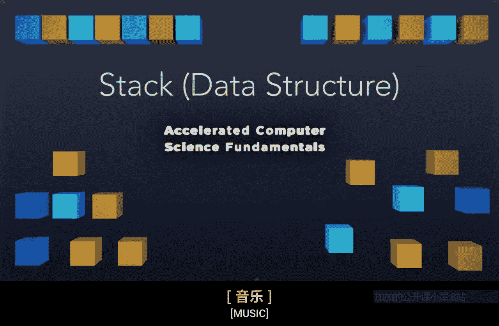
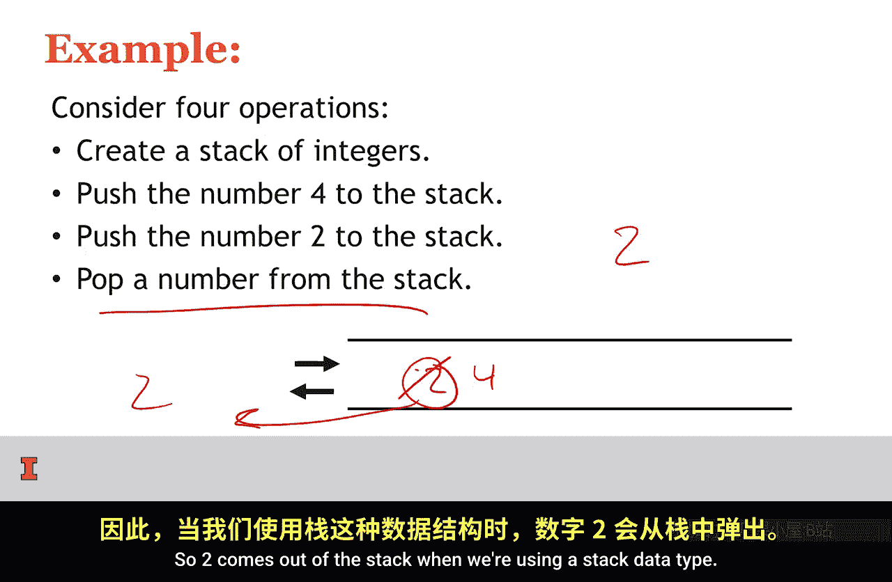
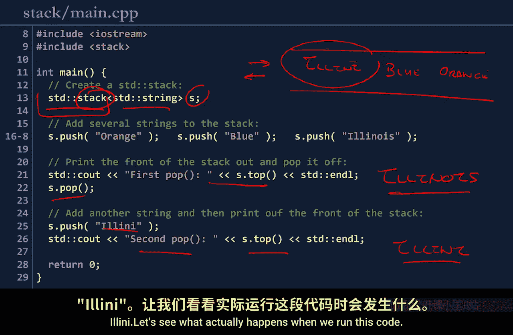
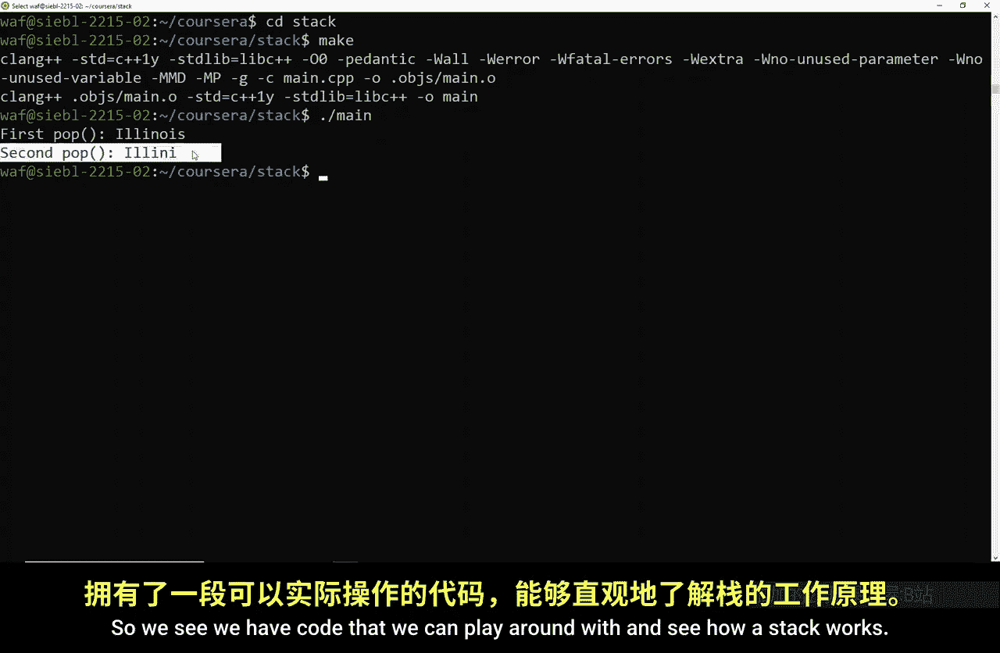

# 伊利诺伊大学【中英⚡计算机科学基础｜Accelerated Computer Science Fundamentals Specialization】 p06 P6 06_1-6-栈数据结构 -BV1KnLCzXEcQ_p6-

A stack is a last in first out data structure that is similar to a pile of papers or a stack of papers on a desk。

So if you imagine a paper that has a number 4， place on your desk。

And then on top of the paper with number 4， you put it paper that has a number 5。

 And on top of number 5， you put the number 8 and on top of number 8， you put the number 3。

As you look at the stack， the paper on top with the number 3。Will be the first paper you grab。

 And in that way， the last paper you put down is the first paper to come out。

Were visually represent the idea of a stack by having the same syntax as the queue of a list that has barriers on both sides。

And then having the input and output arrows right here at the same spot。

Similar to all data structures， we're going to look at the abstract data type first。

 There's four operations on a stack。 a stack can create。Which creates an empty stack。 It can push。

 which adds data to the top of the stack， It can pop， which removes data from the top of the stack。

 or it's empty， which returns whether or not the stack is empty or not。

 Notice that this A0T is identical to the Q80T。We can consider an example with a stack。

 Let's consider a stack of integers。 We're going to place4 on top the stack。

And then we'll place two on top of the stack。Next thing is we'll pop number off top of the stack。

 looking what's on top of the stack。 we move， remove 2。

 So two comes out of the stack when we're using a stack data type。

The CP Post Standard and Template Library provides us a stack as part of the base library。

ST stack initializes a stack。 Here is an ST stack using of standard strings。The variable name is S。

We're going to go ahead and push three things on this stack。

 so I'm going to go ahead and draw out my stack。I'm going to push orange onto the stack。Then。

 push blue。And， finally， push Illinois。I'm now going to go ahead and pop off the element by looking at the top element and then popping off。

 So I'm going to take Illinois。And I'm going to go ahead and out this out。 So Illinois。

Is the first thing that's pop off the stack since I popped it off， I can remove it altogether。

Next thing， I'm going to add a line eye。Goes in， goes to the front of the stack。And then。

 the second pop。I can go ahead， and。Look at that top element。 It is a line eye。

So this code is identical to the code we saw for a Q。

 except for the fact that we use a stack here instead of a queue。

The push and pop operations are the same。But the way they enter and exit from the data structure changed dramatically。

 here we expect the result to be Illinois and Ainai。

 Let's see what actually happens when you were run this code here at the console。

 I'm going to move into the stack directory， Run make。

And dot slash main。Our first pop， indeed got Illinois， and our second pop got Ainai。

So we see we have code that we can play around with and see how a stack works。

 Let's examine how we might build a stack if we wanted to build one ourselvesself。

 A stack can be built with any type of collection。 And here。

 we're going to examine a stack with an array based collection。

Here with an array， as we insert elements into this stack。

 we likely will put the element at the very end of our capacity。

 So we'll put it at the last available index。 So as I insert 4，2，8，7。

Then I will store a counter on exactly which index I'm at。

 So here I've been inserting things at index 5。And the next index will be inserted index 4 when I need to remove。

 I'll remove from index 5。If I run out of space and I've ever reached an index 0。

 I can simply expand the layout this way and give myself more space to insert more elements。

Let's look an example。 I'm going to label the indices of our array。

And after labeling the indices of the array， I'm going to keep track of。The insert location。

 So I'm going to be inserting an index 4。So I'm going to go ahead and push one arm the stack。

I'll update my insert location to 3。Push two under the stack。Upd my insert location to index 2。

Push three onto the stack。And then pop out the element at the front of the stack。Popping up。3。

 removing it from the array。I'm going to go ahead and push 4， which now gets inserted here。Push 5。

Pop out top element in stack。 We're going pop out 5。Remove it from the stack。

Here we're going to need to push6。Push 7。And we're bound to push 8， but we're out of space。

So since we're out of space， we know we're out of space because the next insert location is going to be effectively negative one。

We don't have an index at negative one。So instead， we're going to need to expand this array。

What we'll simply do。Is it double a size， So it'll create an array with 10 indices。

And copy over the data 1，2，4，6，7。 next location to insert it is going to be here at the new index 4。

And we can go ahead and insert 8。Awesome。A linked list is even easier。Thinking about a linked list。

 when the stack is initially empty， we're going to have a linked list that simply points to null。

When we add our first element， wed simply update the front of the list。And add that element。

When we add a second element。We just insert the front of list again。

And now we have a list with two elements。 So here is a stack that has four elements on it already。

 maybe 4，2，8，3。When we want to remove the front element from a list。

 we just remove this front element。And update the head pointer。It's only three lines of code。

 extremely simple。So the implementation of a stack。

In and a list is quite easy and only requires operations。That only take a few lines of code。

These are all also of one operations。We see here is as long as we're intelligent about the data structure we use。

And use optimal implementations。Such as doubling the size of the array When we're pushing and popping from the array。

 we can see that all of our operations on a stack is O of one。Unlike a queue on a stack。

 a singly linked list is sufficient for a stack because we don't have to store a tail pointer。

 All of our operations happen at the front of the list。

 A stack is a last in first out data structure that mimics a stack of papers on your desk。

A stack might be implemented with an array or linked list。

 and all of the operations on a stack runs an O of one time。

 What this means is no matter if we need a stack or a queue for our purpose。

 if we use either of those those data structures， we can ensure that all of those operations are going to take a fixed con amount of time。

 no matter if there's one element of data or 1 million elements of data。

 This is a powerful fact that will allow us to build better and stronger data structures。

We'll keep diving into data structures more， So I'll see you then。

