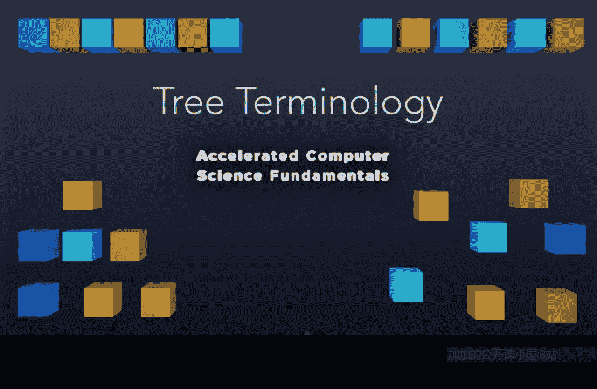

# 计算机科学基础：P7：树结构术语 🌳

在本节课中，我们将要学习一种新的数据结构——树。与之前讨论的线性或扁平数据结构不同，树结构能够表示复杂的数据关系，例如父子关系和兄弟关系。我们将从树的基本术语开始，为后续深入学习特定类型的树结构打下基础。

---

## 节点与边

上一节我们提到了树结构能表示复杂关系，本节中我们来看看构成树的基本元素。

树由**节点**和**边**构成。在计算机科学中，我们通常用一个圆圈来表示一个节点。节点用于存储数据。例如，在一个存储字母的树中，每个节点可以包含一个字母。

边用于连接节点。在树中，边总是有方向的，并且方向总是**远离根节点**。边本身通常不存储数据，我们通过它所连接的两个节点来标识它，例如连接节点K和M的边可以称为边KM。

以下是树的基本构成元素：
*   **节点**：存储数据的基本单位。
*   **边**：连接两个节点的有向连线。

---

## 根节点与叶节点

了解了节点和边后，我们来看看树中两种特殊的节点。

每棵树都必须包含一个**根节点**。根节点位于树的顶端，它**没有入边**（即没有指向它的边），只有出边。树中有且仅有一个根节点。

与根节点相对的是**叶节点**。叶节点位于树的末端，它们**没有出边**（即没有从它出发指向其他节点的边）。叶节点可以出现在树的任何层级。

---

## 节点间的关系

现在我们已经认识了根节点和叶节点，接下来探讨树中节点之间的家族式关系。

除了根节点，每个节点都有一个**父节点**，即其上一层直接连接它的节点。例如，节点B的父节点是A。

反过来，一个节点的**子节点**是指那些将该节点作为父节点的节点。一个节点可以有零个、一个或多个子节点。叶节点没有子节点。

以下是节点间的主要关系：
*   **父节点**：一个节点的直接上层节点。
*   **子节点**：一个节点的直接下层节点。
*   **兄弟节点**：拥有相同父节点的节点。
*   **祖先节点**：从根节点到该节点路径上的所有节点（不包括该节点本身）。
*   **后代节点**：从该节点出发，向下可达的所有节点。

这些关系与家谱中的概念完全一致。

---

## 树的定义

在介绍了各种术语之后，我们最后来明确一下树的正式定义。

一个结构要被称为树，必须满足三个条件：
1.  存在一个唯一的根节点。
2.  所有边都是有向的，且方向远离根节点。
3.  结构中不包含**环**。

“无环”意味着不能从某个节点出发，沿着有向边行走，最终又回到该节点。只要所有边都指向下一层，就不可能形成环。因此，树是一种**有根的、有向的、无环的**结构。

---

本节课中我们一起学习了树结构的基本术语。我们了解到树由节点和边组成，必须具有根节点、有向边且无环。节点间的关系遵循类似家谱的父子、兄弟等模式。掌握这些术语是理解和使用二叉树、搜索树等更复杂树形数据结构的基础。