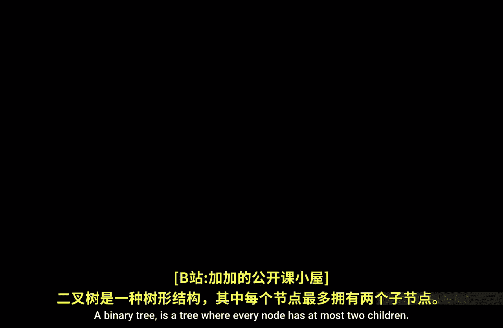
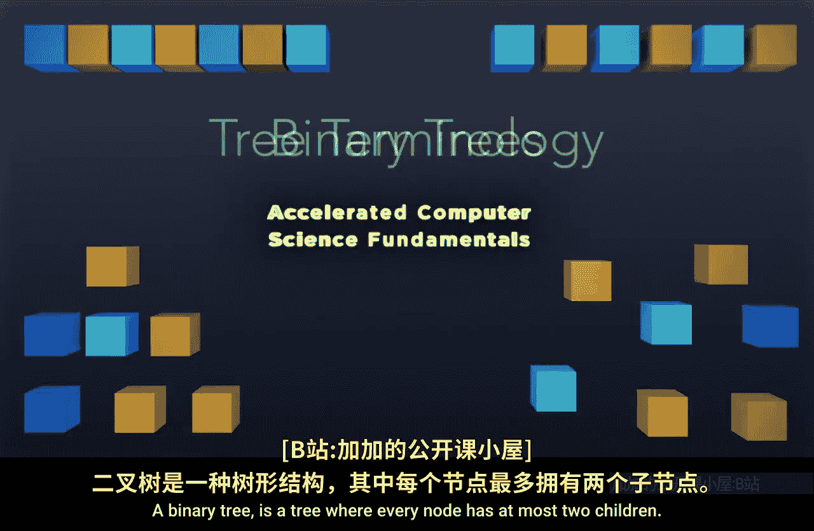
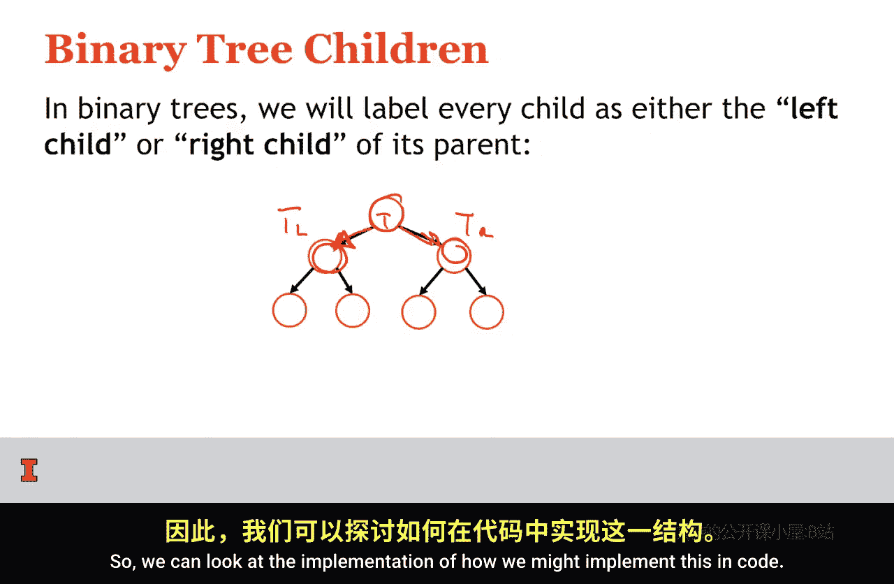
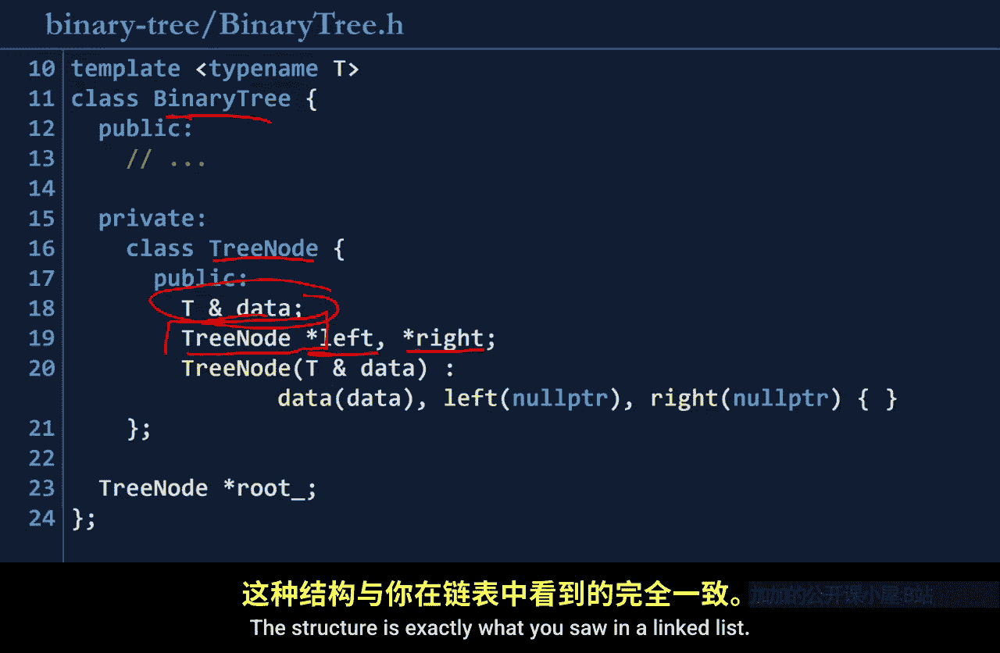

# 伊利诺伊大学【中英⚡计算机科学基础｜Accelerated Computer Science Fundamentals Specialization】 p08 P8 02_2-2-二叉树 -BV1KnLCzXEcQ_p8-

A binary tree is a tree where every node has at most two children。 If we look at some sample trees。

 here's tree 1。Which has。A route right here。And the root has two children。

The right child has two children。This has one child。 This has one child。 Everything looks good。

Herear at tree， too。We have a root。 It has two children。The left child has two children。

 and the right child has two children。 This is also a tree。And is specifically a binary tree。

And finally， this last tree， we see。 Here's the root， tree 3。😊，Has 1，2，3 children at the root。

 because we found a node that has more than two children。 This is not a binary tree。

So when we talk about binary trees， we're going to be specific， as I was earlier。

 about a left child and a right child for every single node。So， here is a left child。

Here's a root node。 and here's the root node's left child。 Here's the root node。 right childil。

 So T sub L， T sub R。For a given note tea。So we can look at the implementation of how we might implement this in code。

This binary tree structure looks nearly identical to our list structure。 So remember in our list。

 we had a list and then a list node。 Here we have a binary tree and a tree node。

In our list data structure， we had T Ampersand data a data by reference here in our tree node。

 we also have data by reference。In our list， we had a list node star， and then we had a next pointer。

Here we have a left and a right pointer。So instead of a linked list where a linked list has just a single pointer to our next piece of data。

 a tree node has a pointer to our left children and a pointer to our right children。

So it's essentially a linked list with two pointers at every node instead of just one。

This structure is exactly what you saw in the linkeds list。 This shouldn't be a surprise。

So one property of a binary tree that we're going to talk about is the height of a binary tree。

 and this really does apply to all trees， but we're going to pay specific attention to the height of binary trees。

The height of the binary tree is the number of edges that exist in the longest path from the root to a leaf。

So looking at this tree right here， the longest path is going to contain one，2 edges。

So because this path contains two edges， we say the height of this tree or H is equal to 2。

Here in the second tree， here is our root node。 If we take the left child。

 we see that theres height's only one。 We only travel  one edge。

 but we need to find the longest path。 So traveling on the longest path， we see one edge here。

 Second edge here， third edge here，4 edge here。 So the height of this tree is 4。

So the height of a tree is defined in terms of the number of edges that we travel from the root down to the leaf。

 One， probably that exists of a binary tree is we can have binary trees which are full。

 And a binary tree is full。 If and only if the nodes have either0 children or two children。

 So if we look at a binary tree and look at every single node。

 We need to check this has two children。 Okay， this node has two children。 All right。

 this node has two children。 All right， this node has zero children， that's fine。0 children， fine。

0 children， that's fine，0 children， that's fine。However。

 you look at this other tree that we've been exploring。 The root node has two children。 That's fine。

 This left child has 0。 That's fine。 This right child also has two。 That's fine。 This node， though。

 it has only one child because it has only one child， We can say that this tree is not a full tree。

Well， the tree here。Isful。In addition to being full， we might want to talk about a perfect tree。

A binary trees consider perfect if and only if all of the interior nodes have two children and all of the leaves are at the same level。

 So looking at our two sample trees。😊，We see that all the interior nodes have two children。

And here at this last level。All of these leaves are the same level。On the other side here。

 we have interiori node has two children。 This is a leaf node，'s got zero children， Interior node。

 two children， awesome。Ou。Here we have a node that's interior to the tree。 It's not a leaf node。

But it doesn't have two children。Because of that， it's not perfect。

Notice that we can also look at a slightly different version of this first tree that we examined。

Suppose I removed this rightmost leaf。Is this tree so perfect。

This tree is no longer perfect because notice an interior node has just one child。

 The last property I want to talk about is a tree being complete。

 So we consider a binary tree to be complete， if and only if。

The tree is perfect up until the last level， and all the leaves on the last level are pushed to the left。

 Well this means we have a perfect tree here。 So this is a Pa of height，2。😊。

So it' is a perfect tree that has height too。 notice that all of the nodes have two children and all the leaves are at the same level。

 so this looks good。Here we have a perfect tree up here。 So we have a P2 right here。

But then underneath the P2， we do have a few extra nodes。 So on our very last level。

We have to ask are all of these nodes pushed to the left。 And， in fact， they are。

 So we have a complete tree。 if and only if the tree is perfect up until the last level and on the last level。

 the few dangling nodes we had are all pushed all the way to the left。😊。

And we're going to see this idea of a complete tree is extremely important once we start talking about heaps。

So with these definitions， we can have some fun puzzles to ask。 So one puzzle is。

Is a full tree complete。 And to answer this， we don't just need yes or no。

 but we actually need to understand and justify either why it's a yes or provide a counter example if it's a no。

 So is a full tree complete。Well， a full tree just needs to have。

All of the nodes having zero or two children。So here's a full tree。

So it's full because it has two children， zero children， two children，0 children， zero children。

Is it complete。Well， a complete tree has to be perfect up until the last level。

So this is a perfect P1。But then all of the nodes on the last level have to be pushed to the left。

 Have these been pushed to the left， They have not been。 So this tree is full， but not complete。

So here's an example。Of a tree that is full but not complete。 So is a full tree complete。No。

 is a complete tree full。 Well， this one， we can look at this example right here。

 We argue that this was a complete tree。 This tree was a perfect tree of height，2。

With a few nodes at the very end。A complete tree requires us to have every node having two children。

 Here's a node that just has one child。Because this node has only one child。

 This complete tree is not full。So is a complete tree full， Not necessarily。

 We spent this lecture talking only about the definitions and particular formalities about trees so we can discuss in detail how these trees work and begin to build complicated data structures with provable runtime by understanding the properties of trees we create。

So in the next lectures， we're going to start to dive in more about binary trees。

 We're going to talk about adding data to binary trees and start to organize data around the idea of a tree to create an awesome data structure that's going to run faster than an array or list in certain circumstances。

😡，I look forward to going through those， and I'll see you there。😊。

