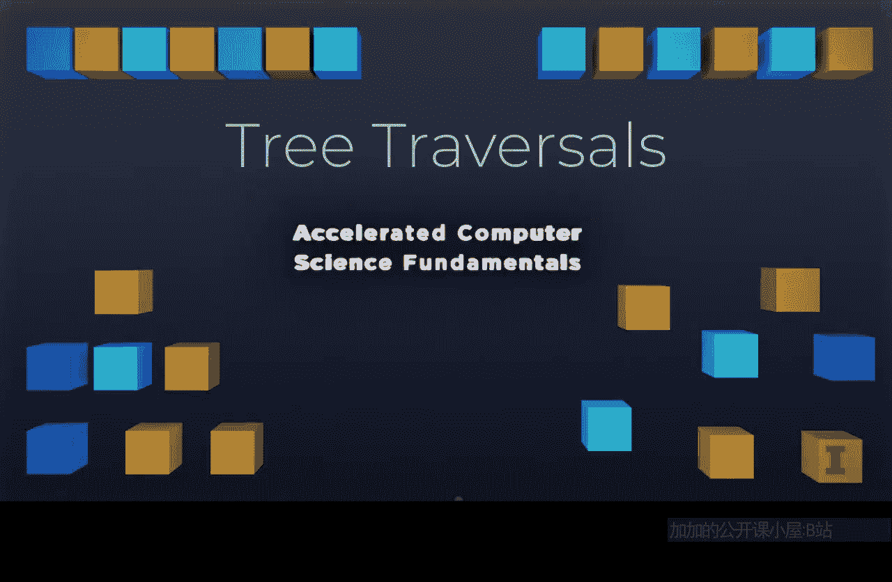

# 计算机科学基础：P9：2-3树的遍历




在本节课中，我们将要学习树结构中的一个核心操作：遍历。我们将探讨如何访问树中的每一个节点，以及访问这些节点的不同顺序。理解遍历是理解树如何存储和检索数据的关键。

## 树的遍历概述

树最重要的方面之一是我们如何从中获取数据。我们如何访问每一个节点？以及以何种顺序访问这些节点？所有这些主题都涵盖在“树遍历”这个概念之下。有几种不同的方式来看待一棵树，也有几种不同的方式来进行树遍历。

让我们来看一棵示例树。这是一棵包含九个节点的树。这九个节点以这里的加号节点为根。在左侧，我们有减号节点；在右侧，我们有乘号节点。我们可以看到，如果我们以一种特定的方式看待这棵树，它可能表示一个数学方程式。让我们看看如何做到这一点，并了解不同类型的遍历。

## 前序遍历

第一种遍历形式是，我们先访问（例如“输出”）当前节点，然后前往左子树，最后前往右子树。让我们看看如果我们在每个节点先“输出”，然后向左走，再向右走会发生什么。

再次观察这棵树，如果我们先在每个节点“输出”，然后向左走，再向右走。在加号节点，我们先输出它。所以我们说的第一件事是“加号”。然后，既然我们已经输出了它，我们就向左走。在这里，我们再次输出节点，输出“减号”。接着我们需要向左和向右走，所以先向左走。在这个节点A，我们输出它，输出“A”。最后，我们需要向左走，左边没有节点，然后我们回到A，意味着需要向右走，右边也没有节点，所以A的访问完全结束。现在我们可以回到减号节点。我们已经完成了左子树，现在可以去右子树。在右子树，我们输出“除号”。然后我们向左走，到达B，输出“B”。然后去B的左边（没有节点），B的右边（没有节点），现在B的访问完成，我们返回到除号节点。我们已经输出了节点，完成了左子树，现在需要去右子树，输出“C”。左边和右边都没有节点，C的访问完成，除号节点的访问完成，减号节点的访问完成，回到根节点加号。现在我们需要去右边，到达乘号节点，输出它。然后向左走，到达D，输出D；向右走，到达E，输出E。

这个过程结束时，我们已经输出了这棵树中的每一个节点。这正是遍历所做的。遍历需要访问树中的每个节点恰好一次，并对该数据执行某些操作（如输出）。

我们刚才做的遍历被称为**前序遍历**。我们所做的是先输出节点，然后去左子树，最后去右子树。之所以称为“前序”，是因为我们是在访问节点的第一时间进行输出。

如果我们思考其源代码，这仅仅意味着我们需要先打印出节点的值，然后递归调用左孩子和右孩子。我们可以快速写出这段代码。

```cpp
void preorderTraversal(TreeNode* cur) {
    if (cur != nullptr) {
        shout(cur); // 访问当前节点，例如打印值
        preorderTraversal(cur->left);
        preorderTraversal(cur->right);
    }
}
```

## 中序遍历

上一节我们介绍了前序遍历，本节中我们来看看中序遍历。中序遍历意味着我们先去左子树，然后输出节点，最后去右子树。

以下是中序遍历的源代码逻辑：

```cpp
void inorderTraversal(TreeNode* cur) {
    if (cur != nullptr) {
        inorderTraversal(cur->left);
        shout(cur); // 访问当前节点
        inorderTraversal(cur->right);
    }
}
```

让我们运行这个逻辑。中序遍历意味着我们执行“左、输出、右”。在根节点，我们先去左子树。到达减号节点，继续向左，到达A节点。A的左孩子为空，所以我们输出A。然后我们回到减号节点，输出减号。现在我们去右子树，到达除号节点。我们先去左子树，到达B节点。B没有左孩子，所以我们输出B。然后回到除号节点，输出除号。接着去右子树，到达C节点，输出C。现在回到根节点加号，输出加号。最后去右子树，对乘号节点执行中序遍历：先去左孩子D，输出D；然后输出乘号；最后去右孩子E，输出E。

最终我们得到输出序列：`A - B / C + D * E`。看，我们得到了一个看起来像数学表达式的东西。中序遍历恰好按照操作数-运算符-操作数的顺序输出，这使得它非常适合表示编码在树中的代数表达式（如果加上括号来明确层次关系的话）。

## 后序遍历

接下来，我们探讨最后一种典型遍历方式：后序遍历。后序遍历遵循相同的递归逻辑，但我们在最后才输出节点。顺序是：先去左子树，然后去右子树，最后输出节点。

以下是后序遍历的源代码：

```cpp
void postorderTraversal(TreeNode* cur) {
    if (cur != nullptr) {
        postorderTraversal(cur->left);
        postorderTraversal(cur->right);
        shout(cur); // 访问当前节点
    }
}
```

让我们快速过一遍示例。顺序是“左、右、输出”。从根节点加号开始，先去左子树。到达减号节点，继续向左到A。A没有孩子，所以输出A。回到减号节点，现在去右子树。到达除号节点，先去左子树B，输出B；然后去右子树C，输出C；最后输出除号。现在回到减号节点，输出减号。根节点的左子树访问完毕，现在去右子树。到达乘号节点，先去左孩子D，输出D；然后去右孩子E，输出E；最后输出乘号。最终回到根节点，输出加号。

后序遍历的输出序列是：`A B C / - D E * +`。这意味着根节点最后被输出，因为它需要先访问完整个左子树和整个右子树。

## 层序遍历

以上我们介绍了三种基于深度优先策略的遍历方式。但你可能不想深入左子树和右子树，而想要一种完全不同的遍历形式。为此，有一种被广泛使用的特殊遍历：**层序遍历**。

层序遍历按层级读取节点，一次读取一层。它先读取根层级，然后是第二层，接着是第三层，依此类推，每层从左到右。

以下是层序遍历访问示例树的顺序：
1.  第一层：`+`
2.  第二层：`-`， `*`
3.  第三层：`A`， `/`， `D`， `E`
4.  第四层：`B`， `C`

这是一种访问同一棵树的完全不同的方式。我们做的每一种遍历都产生了独特的节点顺序，但每一种遍历都恰好访问了每个节点一次。

## 遍历与搜索的区别

在本视频结束前，我想提一下遍历和搜索概念的区别，因为这两个术语经常被互换使用。

进行**遍历**要求访问每一个节点。另一方面，**搜索**允许我们在整个树中发现一个特定的节点。当我们在树中找到目标节点时，我们可能不会访问每一个节点。我们可能会利用遍历中开发的策略来帮助我们快速找到一个节点。但搜索在找到该节点时就结束了，而遍历则要访问到每一个节点。

这是一个关于搜索和遍历含义的概述，以及在整个树中进行遍历的不同形式，这些形式可能会影响我们后续使用的搜索策略。

## 总结

本节课中我们一起学习了树的遍历。我们探讨了四种主要的遍历方式：
1.  **前序遍历**：按照“节点 -> 左子树 -> 右子树”的顺序访问。
2.  **中序遍历**：按照“左子树 -> 节点 -> 右子树”的顺序访问，常用于输出二叉搜索树的有序序列或表示表达式。
3.  **后序遍历**：按照“左子树 -> 右子树 -> 节点”的顺序访问，常用于先处理子节点再处理父节点的场景。
4.  **层序遍历**：按树的层级从上到下、从左到右访问节点。


我们还区分了**遍历**（必须访问所有节点）和**搜索**（找到目标即可能停止）的概念。理解这些遍历方法是有效操作和分析树结构数据的基础。在下一个视频中，我们将更深入地研究树。