# 伊利诺伊大学【中英⚡计算机科学基础｜Accelerated Computer Science Fundamentals Specialization】 p10 P10 04_2-4-二叉搜索树 -BV1KnLCzXEcQ_p10-

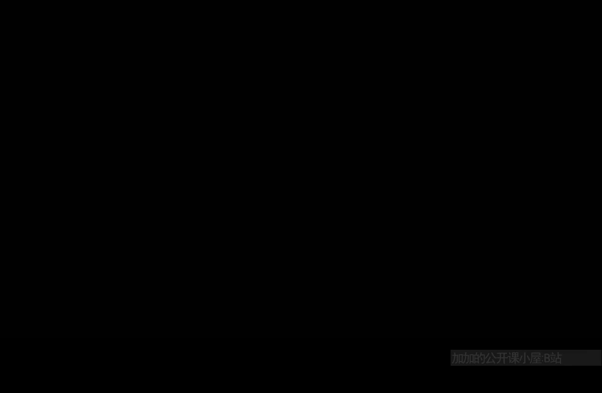

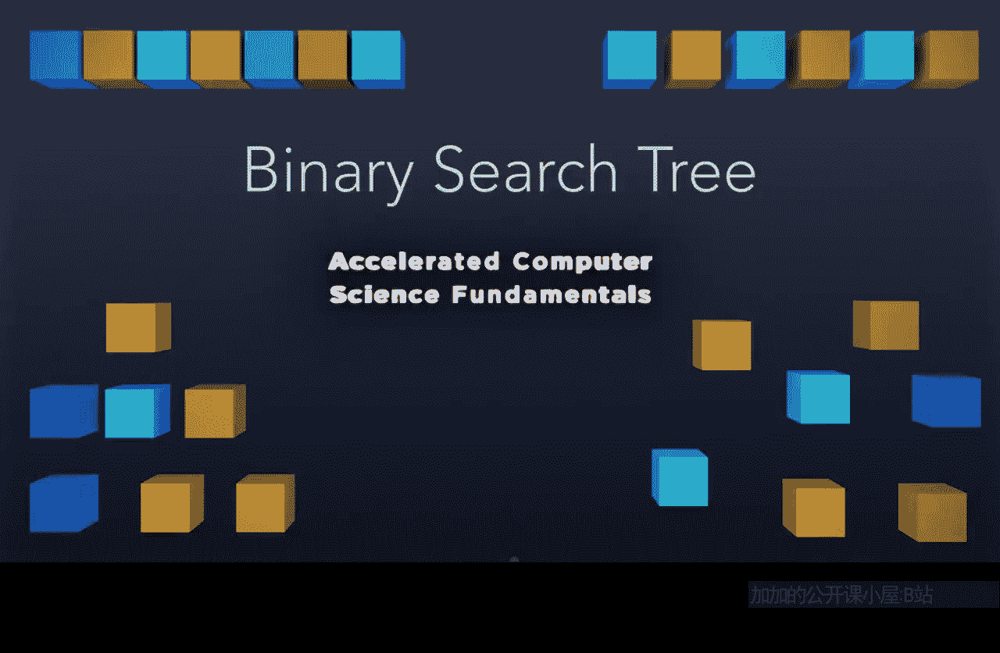

A binary search tree is an ordered binary tree capable of being used as a search structure。

Let's see how this works。An ordered binary tree or a binary search tree is a binary search tree。

 If and only if for every single node， all of the nodes to the left side of a node is going to be less than any given root node and all of the sides to the right of any given node is going to be greater than that node。

 What that means is we have the ability to recursively apply this definition。

 If we look at this node 19 right here。 we know everything on the left side of 19 has to be less than 19。

 you see 42 and 11 or all less than 19。 Everything greater than 19 has to appear here on the right side。

22 and 20 are both greater than 19。😊，We can use this idea of a binary search tree to store a lot of data that we want to look up quickly。

 and often we're going to use a dictionary as our implementation structure of the binary search tree。

 What that means is we're going to implement a dictionary using a binary search tree。😡。

A dictionary is always going associate some key with data。 So， for example。

 your email login is going to be associated with your profile data。 So， for example。

 if you log in with your email， then that email on courseursera is going to know exactly what all courses you're enrolled in and all of that data associate with you。

 Likewise， your phone number will likely go to your phone record at some phone company。

 A website URL is the lookup value。 the unique key that gives you a particular website and your street address is a unique value that tells the world exactly where your house is。

 All of these things takes some unique key value and provides us some data that's associated with the key value。

 So here the thing to remember， are keys need to be unique identifiers。

So keys have to be distinctive and unique， and they can't be the same as anyone else's key。 So。

 for example， a phone number is a unique identifier to your phone。

 No one else in the world shares your exact phone number。When we think about a dictionary。

 there are four key functions we're going to be building out。

 And those key functions are going to be。 We want to be able to find data within this dictionary。

 So if we have your phone number， I want to be able to look up information about you。

 given your phone number。 When you log into Coursera using your email address。

 we want to make sure that that email address is going to be able to be looked up to your profile data and only you have that email address。

 So find is going to take a key in and find the data associated with that key。

The second function is there's going to be new users and new people getting cell phones。

 And that way， we need to be able to insert more data into a dictionary。 So when new data comes。

 we need to insert it。 Likewise， we need to remove data that's no longer being used inside of our dictionary。

 So we need both an insert and a delete。 And finally。

 the last part of the AT is we want to know whether or not this dictionary is empty。

 We want to be able to determine whether or not we've deleted every single note。

So when we draw a binary search tree， we're always going to be drawing just the keys。

 even though every node associates data with that key。

 So what this means is here you look at the node of 37。This node， we're just going to draw as 37。

 But notice there' is data associated with 37。 Every single one of these nodes have data。

 We're never going to draw the data。 It just kind of makes thingsing clunky。

 but we're always going be looking up by key and returning the data。 So remember。

 at every point in time， you always have keys and you always have data。

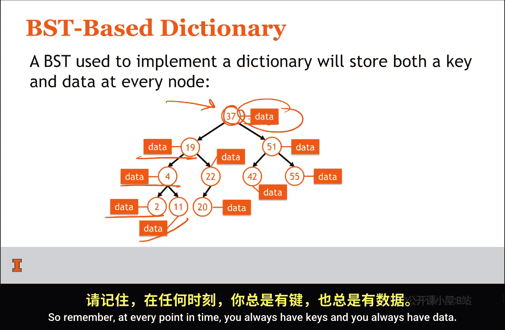

The implementation of the dictionary data structure is going to look very common to code you've seen already。

 In fact， it's going to look just like the trees that we implemented last week。

What this means is that we're going to have some common functions up here in the public section。

 and our private section is going to contain a tree node class insideside the tree node class。

 we're going to have the same left and right cornerers that you've seen before。

 And now we're going to have both a key and a data as part of our values inside of the tree node。

Here we see we have a tree node constructor， and we still have a head pointer that points to the top of this tree。

 So all of these things are just like a tree that we were introduced to earlier。

 But now we're going to do a dictionary class that implements a binary search tree that's going to allow us to make searches efficient。

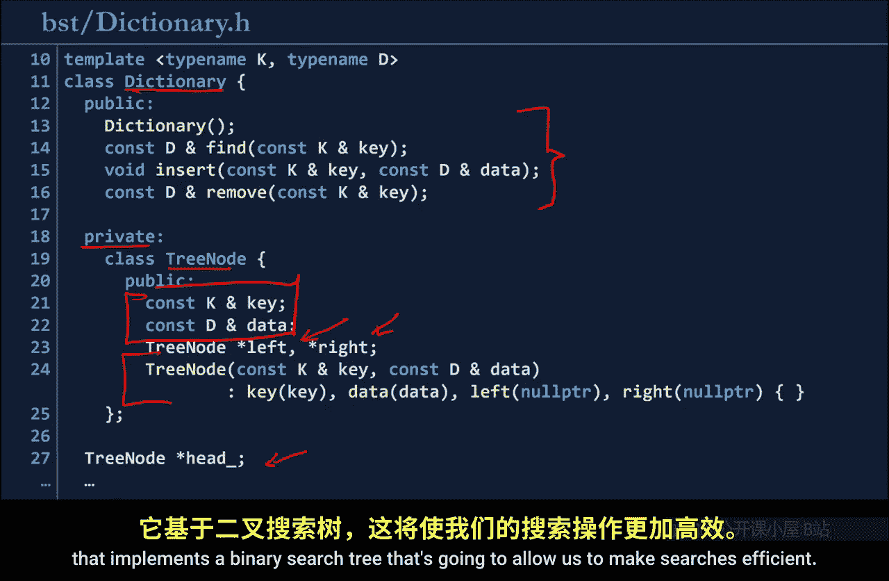

So let's think about how we can code an algorithm to find a particular element in the tree。

 So looking for the element 42， we're always going to start at the root。 So starting at the root。

 we're going to look at the root element and determine whether or not we need to move left or right。

37 is greater than 42。 So we need to move right to find where 42 maybe be located。Looking at 51。

 we find that 51 versus 42，42 is less than 51， so it must appear in its left subre。 And finally。

 we found the node 42。So we started the route at each level。

 we determine if we move left or right until we find the node。Looking at a second example。

 we can run through the same tree， looking for 11， again， starting at 37。

 moving left to 1919 verse 11。 we move left again，4 verse 11。 we move right， and we find the node 11。

Suppose we want to find something that doesn't exist in the tree。 node 17。

 We can start again at the root， go left to 19。 go left again to 4， and then go right again to 11。

 And now，11 verse 17，17 must appear in the right child of 11， because we reached the end of the tree。

 We know that 11 is not in our data set。 We know this because we reached a leaf in the tree。

 and we can't go any further to search deeper。Once we've gone one path through the tree。

 following the rules every step of the way， If we reach the end and we haven't found the data。

 we know for a fact that debt data is not in our data structure。

 even though we haven't searched the entire tree。Let's think about the very worst outcome of find。

 So if we think about a binary search tree， we may not find an element。

 and we may have to travel down the longest path in order to not find this element。

So as we move through this longest path， we're taking a lot of steps。Looking through data。

 But notice we're not looking through all of the data。

 This is not as bad as an array or a linked list where we have to travel over every single piece of data here。

 we only need to take one path through the tree。So the very worst case is going to be visiting the longest path。

Visiting the longest path through the tree means that we are going to be visiting nodes proportional to the height of the tree。

 So using our big O notation， we have big O of H being the height of the tree as the worst case running time。

The very worst case tree we might build might be a tree that looks like a linked list。

 So if we absolutely need this in terms of O of n， we can say O of H is bounded by O of n。

 So the very， very， very worst case is our tree looks like a linked list。

 It's not a very complete tree。 It's a tree that simply has one long chain all the way to the left or all the way to the right。

 This one long chain is going to have a path length that's going to be equal to the number of nodes in the tree。

 and the height is going to be proportional to the number of nodes in the tree。

 So the worst case running time in general terms is going to be the height of the tree。

 The worst case running time in specific terms of data without knowing anything about the structure of the tree is going to be O of n。

Let's look at the code that will actually run this algorithm。

 So here we have two different functions。 The first function we're going to have is a fine function。

 This fine function is simply going to call our helper function。

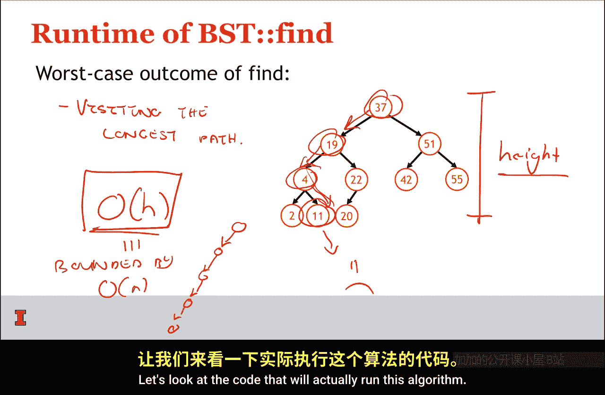

Pass in the key and the head。So we're going to start at the head or the root of our tree。

And then once we've done that， we can look at our helper function find here。

 and we see we have four cases。If the current pointer is null。

 we go ahead and return that current pointer， so we return null pointer。

If our current key is equal to the key we're searching for。

 we can just return the current node because we found it if the key is less than the current key。

 we move left， if the key is not less than the current key， we move right。

So this is all we need to do。 All we have to do is simply start at the root of the tree and traverse through the tree。

 going left or right based on comparison of the value to my key。

 And then once we found our data or found the end of the tree。

 we simply return that node being the data itself or a no pointer。

And you'll notice here that very last two lines of code lines 21 and 22。

 we simply say if we found null， we're going to throw an error。

 otherwise we're going to return that data。So we know how to find a tree。

 let's talk about how we might insert into a binary search tree。😡。

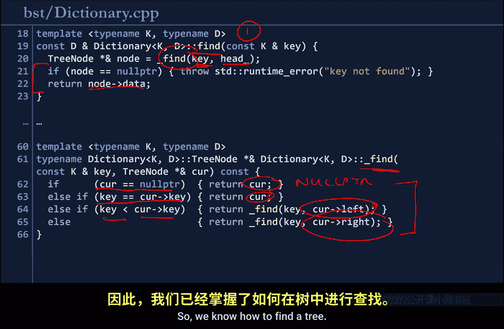

So inserting into a binary search tree should be pretty simple。

 All we need to do is find the exact location it should be inserted at。And insert it there。

So looking for 17， we use the find algorithm we just discussed。 starting at the route，37。

 going left to 19，17s less than 19， going left again to 4，4 versus 17。 we needs。 we need to go right。

11 verses 17 means we need to go right。 And we've actually found the exact location we want to insert into the tree because we've reached a leaf node。

11， we doesn't have any children to the right。 And now we can add 17 right here。

 and we maintain the binary search tree property。 And as soon as we search for 17。

 we're going to find it right where we inserted it。

The insert algorithm is trivial because we're able to use the fact that find algorithm returns a pointer by reference to the exact location where we need to insert that。

😡。

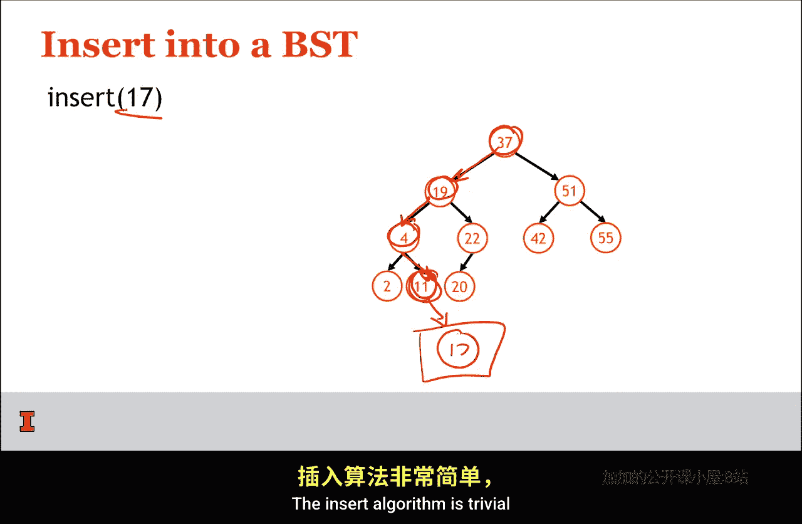

So here the two line implementation is let's use our find function to find the exact position that we should insert into the binary search tree。

 and let's just go ahead and set that position， that node that we're returning equal to a new tree node。

That's it。 That is the most elegant implementation we can do to insert only two lines long。

We're almost done here， but there's one more algorithm we need to talk about。

 And that is the idea of removing。 So we have the ability to find。 We have the ability to insert。

 And now let's make sure we have the ability to remove。 So here we're going remove the element 42。

 Let's see how this would work。

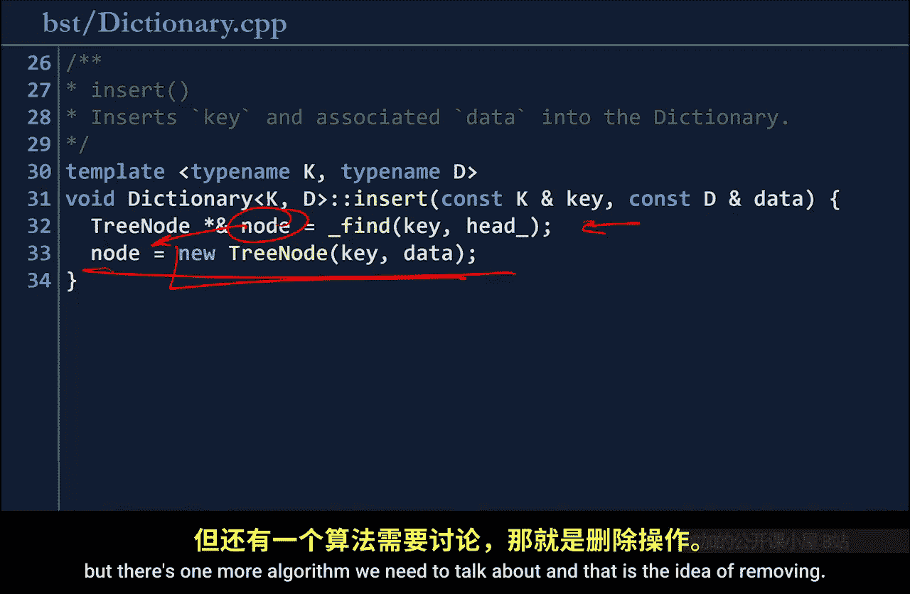

Let's use the same fine function we've used all along。And we go right， left。Right here we found 42。

It's really easy to remove 42 here。 We can simply wipe away this link and node。

 setting this pointer equal to null。 And we have a binary search tree that's still built completely acceptable。

 completely correct。And we've deleted the node。 It's just like removing from a linked list。

So this is a particularly nice case of fine。 Let's see if we remove another element if we get trickier。

So let's remove 22。37， moving left to 19， moving right to 22。Yike。

 so we can't simply remove 22 because we lose track of 20。 But this， again， looks like a linked list。

 If we consider the fact that we just have nodes linked together like this。

 We know exactly how to repair this because we've repaired a linked list instead of simply deleting everything at this pointer and sending equal to null。

 we delete the node and repair it by moving this pointer to the one child。

So in the case of a one child remove。I'm going to argue that this is an easy case because this looks like a linked list。

That we already know how to remove from a linked list。 Now。

 there is a case that you're probably thinking about， what happens if there's a two child remove。

 We can't simply update it like a linked list because we don't know how to deal with both a left and a right child。

Let's see an example that does this。We've removed two elements from this tree。

 and now we need to remove 37。 We again start the root and hear the root。 Oh。

 we found our element already。 We are removing the root node from the tree。

 This is probably the most difficult node to remove。

So removing this node means that we need to go ahead and think about a strategy to remove it。

 If we simply remove it altogether。We would then need to either decide if 19 should be the root or 51 should be the root。

 and then how we repair this tree going to get extremely complicated。

There's going to be lots of edge cases depending on the structure of the tree underneath。

 and it's going to be far more complicated than just thinking about a more generic algorithm that's always going to work。

 So if I think about 37， if I were to remove the root of the tree。

 what is the best candidate to be placed at the root of the tree。Well。

 the best candidate is probably going to be the node that is best suited to be at the root position of the tree that wouldn't disturb anything else about the tree。

So thinking about all of these nodes， the best node to replace 37 is going to be the node that is closest to 37。

 either less than it or greater than it。So，37。And 20。20 is the best node in this left subte。

To replace 37。 So imagine this is 20。And everything else。Remains the same。

Given this element is now 20，194，2 and 11， all sit on left hand side。 This looks good。

51 and 55 all sit on the right hand side。 So this is sane。 This is correct。

We'll actually quantify this into an algorithm。 We'll say that we are going to replace the root of the tree with what we're going to refer to as the in order predecessor of a given node or the I O P。

 So the in order predecessor of a node is going to be an in order traversal of our binary search tree。

Such that we choose the element that appears immediately before the root。 So the root is 37。

 So the in order predecessor is going to be that element 20。 when we do an in order traversal。

 We can also develop a clever way of finding the I O P。

 The I O P is always going to be the rightmost node。In the left subre。

So if we look at our root node that we need to remove and if we go into its left sub tree。

Then we simply need to find the rightmost node in that subt。

 So the rightmost node in left subtree is going to be the greatest value inside of the left subte。

 So we find 20， We swap it with 37。 And by swapping that 20 with 37。

 we are going to find that we can build up a binary search tree that is correct。

 without worrying about any particular edge cases。The last little bit is when we do swap 37 with 20。

 we still need to remove 37 from the tree。 We still have this node right here。

 But when 37 has been swapped with 20， we know that 20 is the rightmost node in the tree。

 So therefore it must not have a right child。 So it must either be a 0 children removed or one child removed。

 given that it's either going to have 0，1 children。

 We can effectively remove it using one of the two cases we discussed earlier。So to summarize。

 when we remove from a binary search tree， we have three different special case we need to consider。

 We need to consider the case where there is0 children to the node。 we want to remove。

 That's going to simple。 And we simply delete the node because there's no children underneath it that we have to worry about keeping track of。

In a one child remove， we have a structure that looks like a linked list。And given a linked list。

 we already know how to remove an element from a linked list。

 so we don't have any concerns about repairing that linked list by simply setting that pointer equal to the next element。

Everything's going to be totally fine if we just have one child。The two children case is interesting。

 We need to find the I O or the in order predecessor。

 We need to swap the node that needs to be removed with the I O。

 and then we need to remove that node in its new position。

 which will either be a case of a one child remove or a0 child remove。

 So we have this algorithm that's somewhat recursively defined in the sense that we're swapping something and then removing it。

Using that same remove algorithm。 But by doing that， we're guaranteeing that the swap。

Is going to be an easier case。

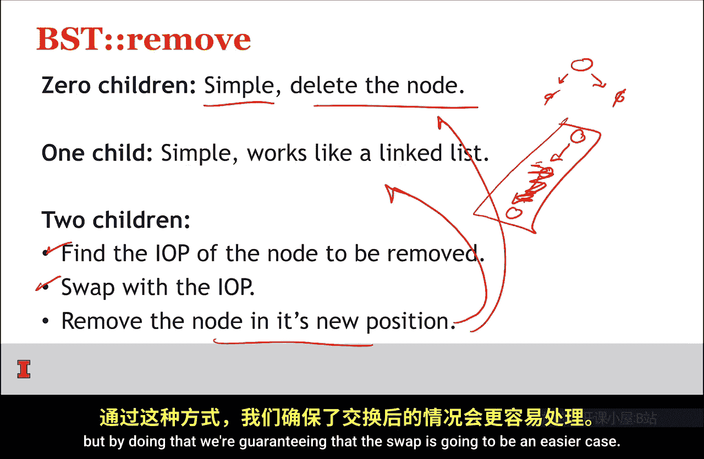

So let's go ahead and look at what the implementation remove looks like。

 Just like all of our functions that are going to run recursively on this tree。

 we have a removed function that's going to be publicly available to client。

 It returns data by reference。And the tri node node is going to use our find algorithm to find exactly what node should be removed。

 and then we'll call remove to remove the node we found。Here in the dictionary。

 we're going to do remove。And we have the zero child remove case。

 which just removes the node directly。We have the one child removed case。

 which I split up into the left child and the right child。And you'll notice the code's identical。

 except for swapping whether or not we go left or right at one given location。

 We're simply looking the data and repairing the linked list based on whether or not there's a left child or a right child。

And then the very final case is going to be straightforward。 We find the IOP。 We swap that node。

 and we call that remove function on the node that we just swapped at its new position。

So I've set up a little program that we can actually run and see how this code works and get some output it。

 and you can dive in and kind of edit it and play around with this code。

 So let's over go over to the console and see how this works。😡。

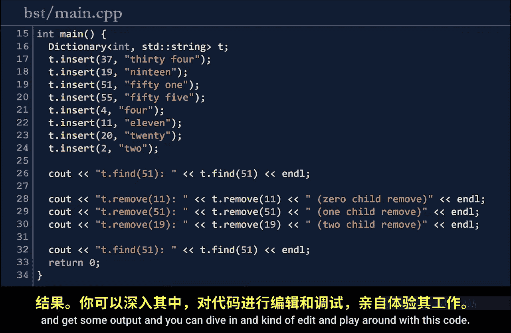

Going to our console， we can move into the binary search tree directory。Andron mink。

After make finishes， we can go ahead and look at the code that we're about ready to run。

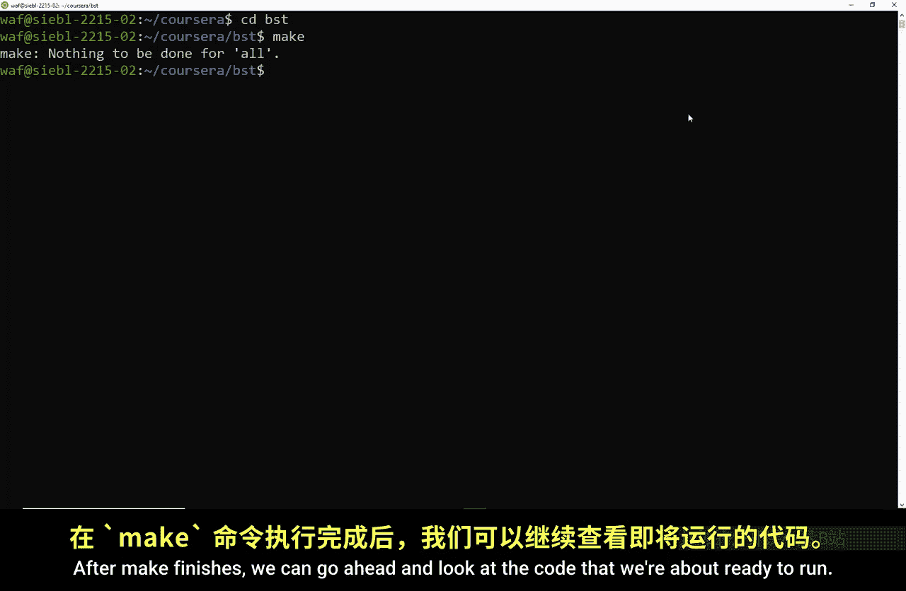

Here in our maindo CPP， we created a dictionary based on what we just discussed。

 and we insert a number of elements in that dictionary，37，1951，55，4，11，20， and 2。

 noticeice that data associated with all of these elements are going to be strings that say the exact value of that element itself。

Then we run several operations。 We find 51。 We remove 11，51 and 19， the 0。

1 and two child removes that we did。 And then finally。

 we're going to try and find 51 again and see what happens after we've just removed 51。😊。

Let's go ahead and run this by running dot slash main。

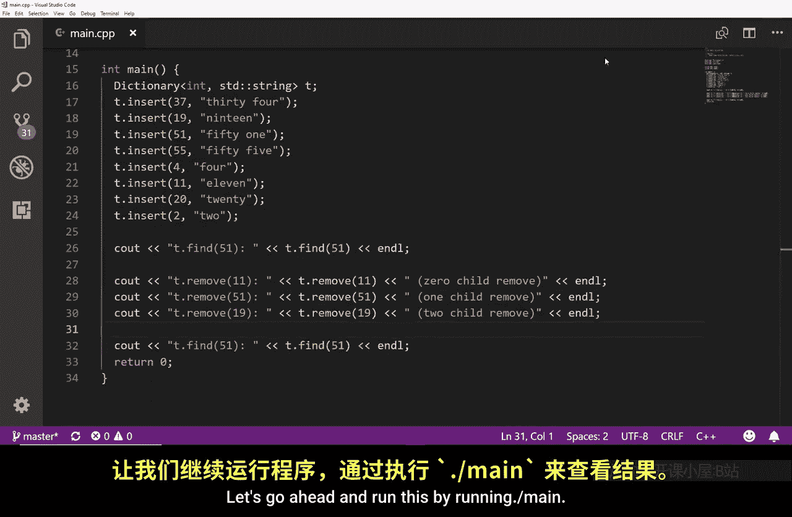

T dot find of 51 finds the element 51。 exactly what we expect。 T dot remove 11。

 remove the the element 11。Remove of 51， remove the element 51，19。 Remove the element 19。

When we find 51 again， notice that we aborted。 We had an exception thrown。

 and it says uncut exception of found runtime error。

 The keys not found because we could not find 51 after it to removed。 We saw an error happen。

 This is exactly what we expected the code do。 And we have a working binary search tree that you can play around with and you can mess with that code。

😊，So I hope you can play around with that code， and then we're going to do some analysis on exactly what's happening in this binary tree in the next video。

 I'll see you then。

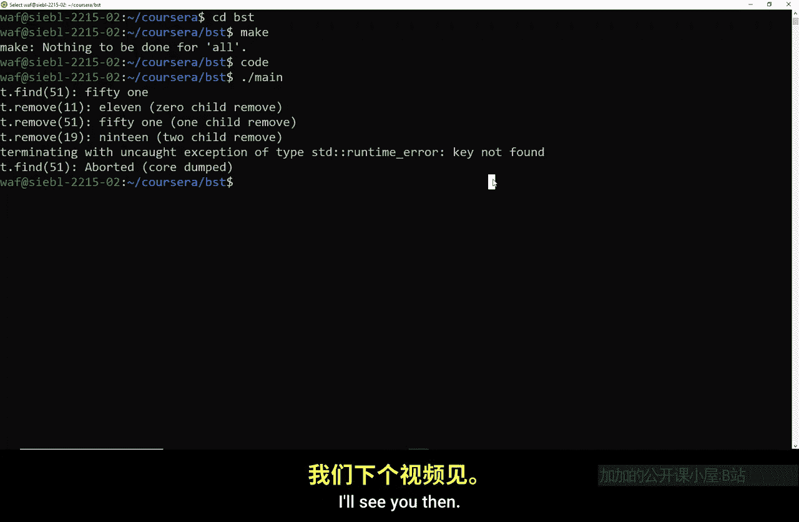