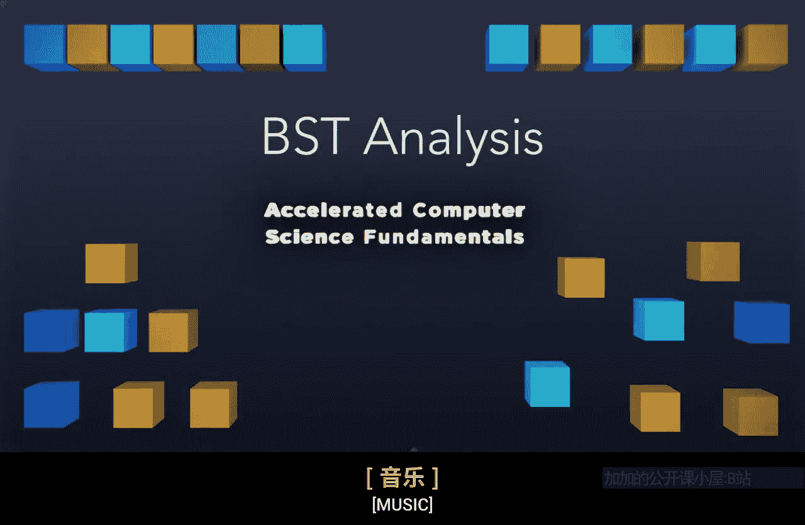

# 伊利诺伊大学【中英⚡计算机科学基础｜Accelerated Computer Science Fundamentals Specialization】 p11 P11 05_2-5-二叉搜索树分析 -BV1KnLCzXEcQ_p11-

Binary search trees can take on many different forms and structures。

 even if they contain the exact same data。 Consider these two binary trees。

 Both of these binary trees are correct。 binary trees in the sense that the left side always contains nodes less than the root。

 and the right side contains nodes only greater than the root。

Both of these contain the numbers 1 through 7。 They're both correct binary trees。

 but they have a very， very different structure。So these two trees， as I mentioned。

 contains all the same values。 And the way we built these trees was by varying the insertion order of the trees here。

 I built a tree by inserting 4， then 2， then 3，6，7，1， and 5。 By doing that。

 we create a tree that is perfectly balanced。 And the number of nodes on left side is equal to the number of nodes on the right side。

😊，On the other hand， I created a tree that we have nodes that are entirely balanced to the right。

 that the root node end up being one。 So everything is going to be greater than one。

 And everything's to me on the right side of the tree。😊。

So we want to think about how can we build trees that are both efficient and what happens when we build a tree that's not so great。

 What is the average case， What is the worst case and what's the very best we can do。

So let's think about how many possible ways there are to insert data into the same binary search tree。

So if we have the numbers 1，2，3，4，5，6， and 7， we can think about how many possible ways we can insert so。

This is a pretty simple puzzle in the sense that we can just choose one of them and say that's going to be the first number we insert。

 So let's say we insert 5 by inserting 5 first， we know that5 is going to become the root。

 At that point， we have the choice of 6 other nodes to insert second。

 and we can make any choice here。 We could choose 2。

Because the first choice we made was a choice of 7。

 the second choice we made was the choice of six nodes。

 Next choice we'd make is the choice of five nodes。 Then we have a choice of four nodes。

 So the number of possible ways we can insert the exact same data is going to be equal to the seven factorial or the number of nodes in our data in factorial。

So there are in factorial different ways to insert the exact same data into a binary search tree。

So what that means is we know that there is a whole slew of different possibilities of how our binary search tree might be structured。

 In the very worst case， we know our binary search tree may just be a linked list with the smallest note of the root。

 and we increase in increasing order。 So if we insert it by 1，2，3，4，5。

 we can see that that tree is going to look like a linked list that's going to move to the right at every single position。

So if we need to find a node in that worst case binary search tree。

 we're going to see it's going to take order in。Searches through that data。

 So every single element of that data is going to be searched。

 This is the exact same thing as searching through a linked list， because in a linked list。

 we can't skip any elements。So we're stuck with this order in runtime。On the other hand。

 asorted array has the ability that we can jump directly to the middle。 So as we discuss an arrays。

 we can access any arbitrary element in as sorted array。

 we can say if all of the elements are in this array and they're in assorted order。

 then we can just simply jump to the middle of the array and say， okay，3， is that data acceptable。

 Is that data the data I want， Maybe if not， I can move left， if it's less than that or right。

 if it's greater than that。 So we see that this is going to be a logarithmic running time。

 So this can be order log n。When we find that the average case of a binary search tree is going to a binary search tree that is pretty well balanced。

 If we think about all of the possible ways we can insert into a binary search tree。

 only one of these ways is going to result in a tree that leans directly right。

 Only one way results in a tree that leans directly left On average。

 half our data is going to be to our left。 half our data is going to be to our right。

 So an average case binary search tree is just like a sorted array。And log in time。

Remember that all of our operations depend upon find。

 So when we're finding an element in a binary search tree。

 we insert it by just adding one more line of code。

 we remove it by just considering four particular cases that in itself only call find。

 So we find for a binary search tree。 the running time of find is going to do the running time of both insert and remove because insert and remove only do constant time operations after finding the element。

😡，On the other the hand， sorted array， we've discussed the idea that in an array。

 it has to be a contiguous memory。 So if we insert and removed from an array。

 this is gonna be O of in time。And from a sorted list， we have to find the element。

 so we have to spend the time to find it， and then we can insert quickly。The best outcome。

The only algorithm that runs in log in time for both fine。

 insert and remove is this average case binary search tree。 We can't do that with an array。

 We can't do that with a sorted list。 Both of these have some run time that's going to run an o of in time。

Because of that， we really would love to be able to get to this average case binary search treat。

 That's going to be the gold standard we're aiming to。

 But this worst case is going to be the very worst case。

 Notice that this O of N is true for every single operation and will never help us outperform an array。

To help us start to quantify what it means to have a balanced binary search tree。

 let's define one new term。 This term is going to be the height balance factor， or B of a node。

This height balance factor is going to be the difference in height between the left subt and the right subre。

So B is going to be equal to the height。Of our right sub tree minus the height of our left subt。

So here， the height of the right subtre is going to be one。 Here's the height of the left。

 Subre is going to be 1。1-1 equals 0。 So we say the balance factor of this root node is 0。

 that this node is perfectly in balance。On the other hand， if we look at this tree。

 we can say the height of our left sub tree is the empty tree。

 So we define that height to be negative one。And the height of the right subte is going to be 1，2，3。

4。So4 minus negative1。Is going to be equal to 5。 So we say the balance factor of this tree is going to be positive 5。

 This means that this tree is heavily swayed to the right。

 that the right has a height difference of 5 compared to the left side。Ideally。

 we want to keep that balance factor small。 And let's think about how we can actually do that。

We're going to define that a balanced binary search tree is going to a binary search tree where every single node in this tree has a balance factor with a magnitude of either 0 or one。

 by having a magnitude of 0，1。 That means a balance factor can be either negative 1，0 or 1。

 Only if these three are the only balance factor that appear in every single node in the tree。

 Do we say this binary tree is balanced。 So here， this left tree。

 every nodes going to have a balance factor of 0。So we're in great shape。Here， this node 6。

 this has a balance factor of 0。Left and right， trees are balanced。

This node 7 is going to have a balance factor of negative  one。

 So this subre right here is in balance。 This subree is fine。

 The subtree becomes out of balance once we get here， when the node 5 has a balance factor of 2。

 Notice that the right side of the tree has a height difference at 2 compared to the left side of tree。

 So here， this tree out of balance， Obviously， it gets more and more out of balance。

 The further we go up。 B factor here is 3 B factor here is also 3。

 and then the balance factor of this root node is 5。😊。

So there's in factorial different ways to create a binary search tree with the same data。

 The worst case， binary search tree will be a binary search tree that mimics a lengthhal list as a long string of nodes。

 The average case， though， will be a tree that's height is proportional to a logarithm of the number of nodes that it's going to be a relatively balanced tree。

 We're able to quantify the idea of balance by defining a balance factor。

 which determines a height difference between the left subt and the right sub tree we define a balanced binary tree to be a binary tree where every single node has a balance factor of either negative 1。

0 or1， or we say that magnitude of the balance factor is no greater than one。In the next video。

 we're going to dive into understanding how we can create an algorithm that maintains the balance of a binary search tree。

 So I'll see then。

