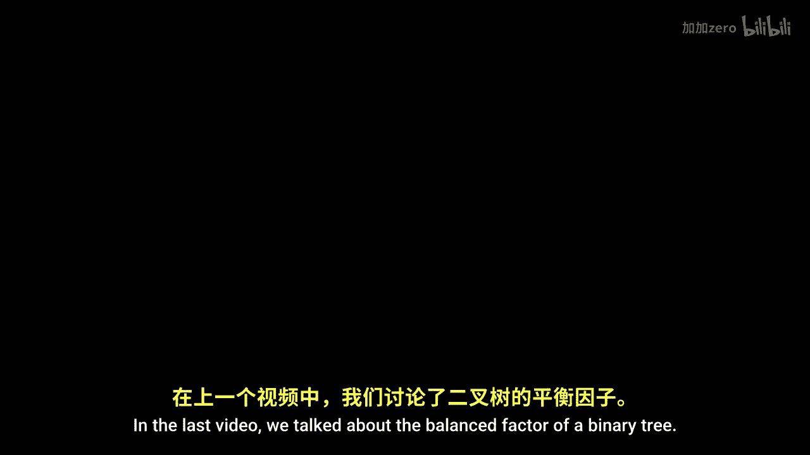

# 计算机科学基础：P12：平衡二叉搜索树 🧮

在本节课中，我们将要学习平衡二叉搜索树。我们将了解什么是平衡因子，如何识别树中的不平衡结构，以及如何使用旋转操作来恢复树的平衡。通过本课的学习，你将掌握保持二叉搜索树高效运行的核心机制。

## 平衡二叉搜索树概述

上一节我们介绍了二叉树的平衡因子。本节中我们来看看平衡二叉搜索树。这种树是高度平衡的，以确保大约一半的数据存在于树的左半部分，另一半数据存在于右半部分。

左侧是一个非常平衡的二叉搜索树。而右侧的这个二叉搜索树则非常不平衡。

## 识别不平衡结构

让我们分析这棵树的结构，并开发一种算法，以确保我们可以将不平衡的二叉搜索树转变为完全平衡的树。

我们将在图中识别两种子结构。我们将识别一种称为“山峰”的子结构，即一个同时拥有左孩子和右孩子的节点。以及一种称为“棍子”的子结构，即一个孩子都在同一方向，而另一方向没有孩子的节点。

“棍子”是我们希望通过转换将其变为“山峰”的结构。通过将“棍子”转换为“山峰”，我们将确保二叉树尽可能保持平衡。

## 平衡因子与失衡检测

让我们考虑一个二叉搜索树的简单例子。

这棵二叉搜索树最初是平衡的。我们知道它是平衡的，因为我们可以检查每个节点的平衡因子，即右子树高度减去左子树高度。

原始树中根节点右子树的高度为1，左子树高度为0，计算1-0，我们看到根节点的平衡因子是1。

通过向这棵树的末端添加一个新节点，现在右子树的高度变为2，2-0等于2。因为平衡因子的绝对值大于1，我们知道这棵树整体上失去了平衡。

当我们观察这棵树时，我们希望找到最深的不平衡节点。这里新添加的节点平衡因子为0，其左右两侧的孩子数量相同。它的父节点平衡因子为1，因为其右侧比左侧高出一层。再上一层的节点平衡因子也是1。只有在根节点处，我们看到平衡因子是2。这是树中最深的失衡点。

## 旋转操作：修复“棍子”结构

一旦我们确定了树中最深的失衡点，我们将识别导致该节点失衡的“棍子”结构。

我们在这里完成了这一步。从U到V再到一个未标记的节点，这三个节点构成了一根“棍子”。这就是这棵树失衡的原因。让我们尝试将其转换为“山峰”。

为此，我将拾取“棍子”中间的节点V，将其提升。通过提升这个中间节点，我们看到这个节点将变成一个“山峰”。然后，我们只需修复所有指针：V的左侧有一个指向U的指针，V的右侧有一个指向Y的指针。原来在Y左侧的节点现在将位于U的右侧，而Y的右侧将保持不变。

我们所做的是创建了一棵保持二叉搜索树性质的树，所有顺序都得以维持。并且我们降低了根节点的平衡因子。现在，平衡因子从2通过一次简单的二叉搜索树旋转，变成了0。

## 通用左旋转

如果我们泛化地考虑这个问题，可以讨论通用的左旋转。

左旋转的思想是，我们将树中最深的失衡点视为节点B。B是我们在树中检测到失衡的最低或最深的点。失衡是指平衡因子的绝对值大于1。

当平衡因子为2时，我们需要查看下一个节点C。给定我们找到了B，我们现在查看C的平衡因子。如果C的平衡因子是1，我们知道B严重向右失衡，C也几乎向右失衡。这意味着我们的树明显向右倾斜。

我们可以执行所谓的左旋转来解决这个问题。进行左旋转，意味着将C提升为“山峰”的顶端，并将所有节点向左旋转，使B下降，并将C连接到B。

我们称此操作为左旋转。当最深失衡点的平衡因子为2，且其后继节点的平衡因子为1时，就会发生这种旋转。任何时候发生这种情况，我们都可以通过左旋转来修复这种失衡。

## 处理“肘部”结构与双旋转

让我们考虑第二个例子。这与第一个例子非常相似，但节点被添加到了右侧。如果我们识别导致问题的子结构，最深的失衡点现在在这里。它不再是根节点，但这个节点的平衡因子是2。右子树的高度是2，左子树的高度是0，2-0等于2。

不幸的是，这不符合我们目前看到的情况。相反，我们识别出一种看起来更像“肘部”而不是“棍子”的结构。这确实是我们的第三种结构。这是“棍子”和“山峰”之间的混合体。

每当我们识别出一个“肘部”时，我们需要做的是修复这个“肘部”，使其变成一根“棍子”。我们通过围绕“肘部”的弯曲处进行旋转来实现。

我们进行一个转换，将黄色节点上移，这个操作将“肘部”转换成了“棍子”。一旦我们有了“棍子”，我们就知道该怎么做。我们将其视为一个右左旋转，因为我们要做的是先围绕D进行右旋转将其放置到位，然后再围绕C进行左旋转来修复“棍子”。

因此，这里当我们在树中识别出失衡点B，且B的平衡因子为2，而后继节点的平衡因子为-1时，就需要进行右左旋转。插入到T2或T3会导致这个失衡点，我们只需要进行两种不同的旋转来修复这种失衡。

完整地看这个过程，我们注意到首先将“肘部”转换为“棍子”。一旦将“肘部”转换为“棍子”，我们就提升“棍子”的中心节点，使其成为“山峰”。这样，我们就从“肘部”到“棍子”，再到“山峰”。最终，我们得到一棵从完全失衡变为完美平衡的二叉搜索树。

## 旋转规则总结

我们可以查看所有这些旋转，并思考如何应用这个理念：当我们进行左旋转时，如果树向完全相反的方向失衡，我们只需要进行右旋转。查看树中最深失衡节点的平衡因子。

如果它是2，我们从左旋转开始。如果它是-2，我们从右旋转开始。只有当我们查看下一个节点时，才能确定是否是单旋转。如果两个符号匹配，我们说只需要一次左旋转（或右旋转），这会将“棍子”转换为“山峰”。

当符号不同时，我们知道遇到了“肘部”情况。当遇到“肘部”情况时，我们需要进行双旋转，即左右旋转或右左旋转。这会将“肘部”拉直，然后进行简单的转换，将“棍子”变成“山峰”。

## AVL树与算法特性

我用非常简单的术语介绍了这些概念，以便我们可以讨论“棍子”、“山峰”和“肘部”。我们直观地看到了代码如何能够在检测到失衡的瞬间，将一个失衡的二叉搜索树恢复平衡。

因此，在插入节点时，我们将确保二叉搜索树保持平衡。每次插入完成后，在将结果返回给用户之前，我们将确保该二叉搜索树是平衡的。

二叉搜索树旋转是恢复平衡的机制。我们知道有四种不同的旋转：左旋转、右旋转、左右旋转和右左旋转。这些旋转都是局部操作，我们所做的只是改变失衡点，重新排列几个指针。因此，我们可以说这些操作在常数时间内运行。我们编写代码来实现这些转换将非常简单，可能只需四行。

最后要提到的是，这个算法实际上有一个名字，它被称为AVL树。我们将在下一讲中深入探讨AVL树的所有细节并进一步讨论它。

本节课中我们一起学习了平衡二叉搜索树的核心概念，包括平衡因子、失衡的识别（“棍子”和“肘部”结构），以及通过单旋转（左旋、右旋）和双旋转（左右旋、右左旋）来恢复平衡。我们还了解到这种高效平衡算法的名称是AVL树，其旋转操作是常数时间的局部调整，是保持二叉搜索树性能的关键。