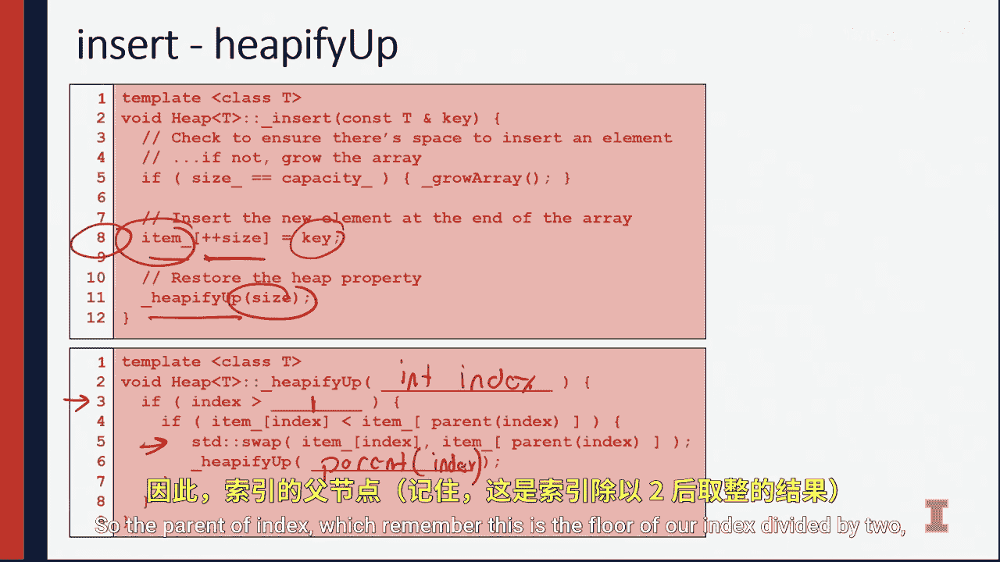

# 伊利诺伊大学【中英⚡计算机科学基础｜Accelerated Computer Science Fundamentals Specialization】 p18 P18 02_4-2-堆插入 -BV1KnLCzXEcQ_p18-

Now that we understand exactly what it means to be a minimum heap。

 let's go ahead and think about how we might build one through a series of insert operations。

We're going to use an existing tree and see how we insert into that tree。

 and then we'll generalize this out to understand how we can start with Nimty array。

 insert into that array and create the tree itself。So in this next example。

 I'm going to do two inserts and you'll notice after every single insert。

 I'm going to go ahead and as part of doing the insert， check。

To make sure that every level of my minimum he is balanced and that the minimum he property maintains true。

Do that， we'll do that after each of the two inserts。

 and we'll see what elements need to be swapamped。Let's look at this example。

So I'm going to go ahead and insert the element8 initially， so to insert8。

 I'm going to go ahead and just put eight down at the very last element inside my array。

So putting this the first empty element or the last element inside of my full list of array。

I know that this is the same as representing this element inside my visual model。

 inside the tree model as putting an eight right here。

What I need to do now is ensure that every single parent has a smaller value than the node edge is inserted。

 So here we look at 8 to 7。 We see that that value is smaller and we're good。

 We know that7 small and 6 and 6 small and4 because of the insert operations that happened previously。

 Now let's insert a second element。 Let's insert the element 3。So entering three， again。

 putting three at the end of the array。And then represent that inner tree model as the left child of 20。

Here we have a problem Now 20 and 3 are out of order，3 is a smaller element of 20。

 which means it needs to be the parent node。 So to fix this， we simply just swap those elements。

 So do that we find the parent node inside our array and swap 3 with 20 Now3 belongs here。

 20 belongs at the end。😡，We can do that again， moving up the tree， looking at three versus 6， again。

 this is out of order， so we go ahead and swap3 and6。We do this in the。

Which would update our visual structure with three being here and six being here。

Next thing is we swap three and four。Three now goes at top， four goes here， in the visual structure。

 three is at the root and four is on the right child of the root。At this point。

 we successfully inserted elements into array， we maintained the heat property in the tree that we make from this array。

 and we see we do this through repeated checks on whether or not the parent node is smaller than the node that we just inserted。

Let's look at the source code to see how this was done。

The first thing we need to do every time we insert an element is check whether or not the array is large enough to accept this element。

 So here on line 5， you're going to see that we're going to check the size the array versus the actual capacity of the array If they're the same we don't have room to insert and therefore we need to grow the array。

😡，So the array is an unordered array in a data structure sense。 so being an unordered array。

 that means that we need to think about how we need to expand it going back a couple of weeks。

 we know that to get the O of one amortize runtime performanceant。

 we absolutely have to double the array every single time in doubling the array every single time that means that we are going to have to。

😡，Ensure that we。Add a whole new level to our keep tree。

So what this looks like is the slide that I have next。When we double the array。

 notice that our old array is going to contain all of the elements in the blue and orange layers here when Ive filled up this last blue layer。

 I need to expand the array to add an entire another layer of the tree。

 this is equivalent to doubling the size of the array。

By making a left and right child at every single node。

By adding those 16 elements to the tree that RB has 15 elements plus a node right here at the beginning to denote a zeroth index。

 we have an array that grows from 16 to 32， then 32 to 64 and 64 to 128。

 we're doubling the size every time so we know that this is an amortized o of one operation as we're running this insert algorithm。

So we know how to grow the array。 We know it's amortized O of1。

 Let's look at the next chunk of the code。The next line you're going to see is line 8。

 we have the item is going to be， this is our array， we're going to insert at the end of our array。

 the size of our array added by 1， we're going to insert the key at that location。😡。

Only then do we go ahead and heap a fi up。 This is the name of the function that we're using to ensure the he property is maintained。

Notice the input into hepa Phi up。 It is size。 It is an index into the array。

 So we know it's integer index。 that's what we're going to heap a p up upon。 It's not a value。

 It's actually an index。 So we can call this parameter an int index。

And this parameter is going to then be checked to make sure On line three are base case that we're not at the root node。

 So remember the root node is going to be the index1。Because we've skipped the index 0。

 So if index is greater than one， we're not a root node。

 And then if our value is smaller than a parent value， we go ahead and swap those values。

 and then we heap aify up on the parent node to continue this recursive operation。

 So the parent of index， which remember， this is the floor of our index divided by 2。

Is going to be called to continue our hePA fiup process。At the end of our Hpafi up。

 we've either reached the root node and swapped the node we just inserted all the way up to the root。

 or we've swapped the correct location， and we can stop running the algorithm。😡，In both cases。

 we ensure that the heat property is maintained by the time we finish this algorithm。So now。

 you know， one of the two basic operations of the heap， you know exactly how to insert it。

 In the next video， we'll dive into how we can actually remove from our heap by removing the minimum element。

 So'll see there。

