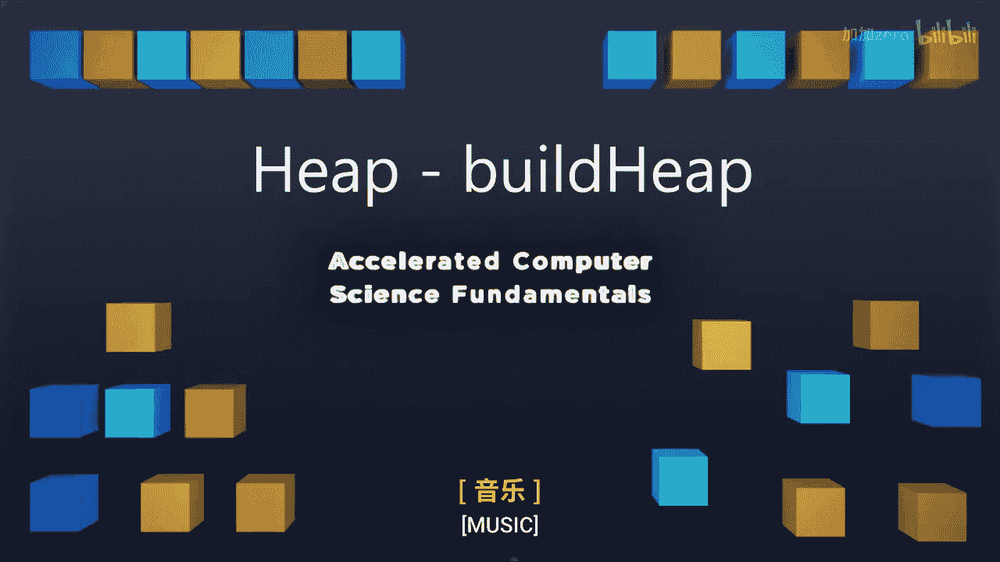
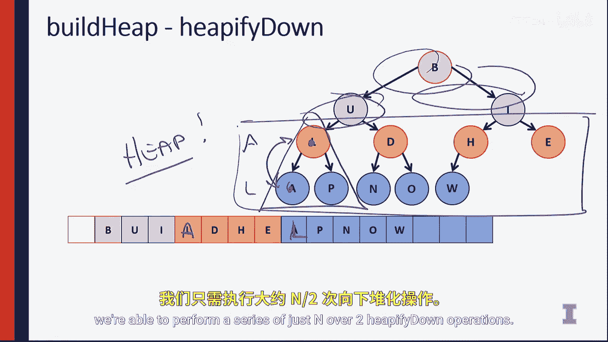

# 伊利诺伊大学【中英⚡计算机科学基础｜Accelerated Computer Science Fundamentals Specialization】 p20 P20 04_4-4-堆构建堆 -BV1KnLCzXEcQ_p20-

Now that we understand the basic operations of a heap。

 let's understand why we want to use a heap over other data structures。

 even though this looks remarkably similar to a binary tree。

The main reason we want to use a heap is the idea that we can be really。

 really efficient about actually building a heap from the heap operations we have。

 So let's consider an example where we want to build a heap out of a string。

So if we look at this example， I have the string build Heap now。😡。

And this string is simply an unordered array， just like we've seen before。

And this build Heap now operation is just some characters that are not ordered whatsoever。

And I have this build heap now also listed out in our tree format right here。So in all of this。

 we can think of the three different ways that we might be able to do an insert The first way we might be able to do an insert into our heap is we could simply sort the array。

 so if we have a sorted array where the smallest elements at the top and the largest elements at the end of our array。

 then we have a heap by definition， if the smallest elements at index1。

 then it's going to be smaller than everything else later in the array。😡，So this is good。

 but it runs an in log in time， We don't have time to do a search if we really want to make an efficient algorithm。

😡，The second operation we can think about is what if we just called insert a number of times。

 So if we call insert every single time， we're going to have to perform a whole bunch of heap of fiop operations。

 In fact， we're going to do in operation they each take login time to do the tree operation。

 So this again multiple calls to insert is going to cause an in login run time again and algorithm we just don't have time for。

😡，The last thing we can do is we can think of， can we do better with an O of an operation？

So thinking about these things， we can think about a third approach that involves combining two different ideas。

To create a heap out of a string or out of any unsorted list that were brought in。

So if we take a look at this example， we can see that the first thing is we can sort it。

 second thing we can do is do a build heap by using HeAPA P up。😡，The third example is really。

 really clever， let's think about only using the he P down operation。

So by only using the hepophy down operation。 What we're doing is we're saying that it doesn't actually matter what's in our very last level of the tree。

Because the very last level of the tree means that everything here is already balanced。And in。

And it has the minimum heat property。And in fact it's not just the very last level。

 but it's the very last level and any nodes that don't have children。

 so this includes the node E here in the tree as well。

 so this is everything up to the parent of the very last node so only the first half of the nodes in the array so only things in the first half the array needs to actually have their heat property restored because remember what hepaphy down does Heappophy down takes a node and make sure that that node is placed down inside of our tree in the proper location。

In doing so， the first node we have to look at is H。

 because looking at the node H means that we need to ensure that H and the subte that's rooted at H is a heap。

😡，In this case， it is indeed a he already。 Then we can simply look at D at D。

 we say is D smaller than both N and O and only if D is both smaller than n and O。😡。

Is the heat property maintained Here it is also maintained。

 We can go back to the previous slide and kind of keep looking at this。

 We can compare L with A and P。 Here， we can go ahead and swap A with L。

Notice now we've maintained the heat property doing this in the array as well， we swap A here。

 L goes down here， and at this point we know that everything on the bottom two levels。

 everything here is a correct heap。So what we were able to do is we were able to just do three operations。

 three heap of fi down operations to ensure at this point in time in the tree that we have a correct heap。

Next， we only need to go and finish up the very last three elements。

 and then finish out those last three elements， we're able to perform。

A series of just in over2 heap of fi down operations。And we know that after heap ofifyingy down。

That everything underneath our current node is actually already balanced。

 So because we're doing just in over two operations。

 we know that if we're doing in over two operations and the amount of work that we're doing per operation is capped so that we're not doing any more than about constant time work at each operations。

 We know that we can actually build a heap in O of in time。

So the key reason that we actually care about building heaps and we care about the HeAP algorithm is the fact that given any sort of data structure。

 any array representation， we can build a heap notation of that。In just O of in time。

 far shorter than sorting the array， far shorter than inserting into binary tree。

 So that means as we're thinking about algorithms， if we need to know the minimum series of elements in the list。

 we can do so with just an O of in operation。So we'll dive into the analysis of this and how each of these operations perform and why we care about the heat in the next video。

 so I'll see there。

