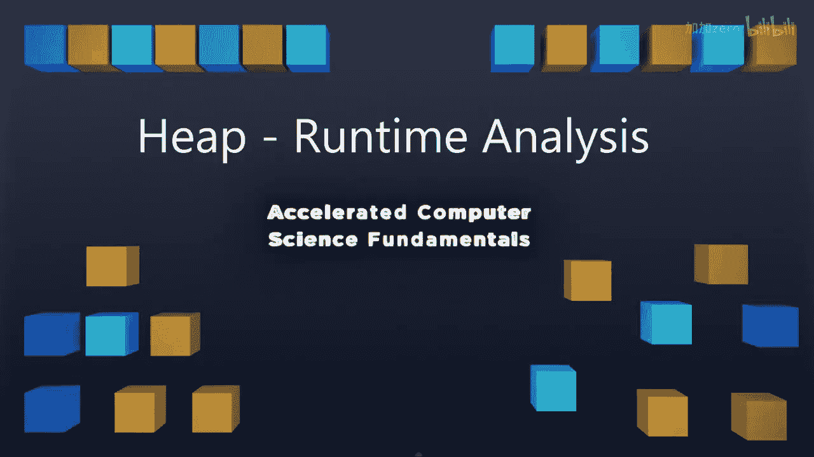

# 计算机科学基础：P21：堆的运行时间分析与堆排序

在本节课中，我们将深入探讨堆的运行时间分析，并学习一个基于堆的强大算法——堆排序。我们将了解堆排序的步骤、时间复杂度，以及它在内存使用上的优势。

## 堆的运行时间回顾

上一节我们介绍了堆的基本操作。现在我们来回顾一下堆操作的时间复杂度。

我们知道，对于堆的插入和删除操作，由于堆是一棵完全二叉树，这些操作的时间复杂度是 **O(log n)**。

此外，我们还可以在 **O(n)** 的线性时间内构建一个堆。这是一个非常出色的结果，它使得我们可以利用堆来做一些有趣的事情。

## 堆排序算法

基于堆的特性，我们可以实现一种高效的排序算法，即堆排序。以下是堆排序的三个主要步骤。

### 第一步：构建堆
首先，我们需要从一个无序的列表中构建一个堆。正如之前提到的，这个操作可以在 **O(n)** 的时间内完成。

### 第二步：反复移除最小元素
堆构建完成后，为了得到一个有序列表，我们需要反复调用 `removeMin` 操作。每次 `removeMin` 操作的时间复杂度是 **O(log n)**。

### 第三步：调整顺序（可选）
如果需要，我们可以交换元素，以确保最终列表是按升序或降序排列的。

通过持续从堆中移除最小元素，我们将得到一个有序序列。例如，最小元素是4，然后是5、6、7、9，依此类推。

## 堆排序的时间复杂度分析

现在我们来分析堆排序的整体时间复杂度。

*   **构建堆**：时间复杂度为 **O(n)**。
*   **n 次移除操作**：每次移除操作的时间复杂度为 **O(log n)**，因此总时间为 **n * O(log n) = O(n log n)**。

在最坏情况下，**O(n log n)** 的移除操作时间将主导整个排序过程，因此堆排序的最坏情况时间复杂度是 **O(n log n)**。

尽管我们能在 **O(n)** 时间内构建堆，但堆排序的最优时间复杂度依然是 **O(n log n)**，这与许多高效的比较排序算法相同。

## 堆排序的优势

我们关注堆排序，是因为它在某些情况下非常方便。

如果你巧妙地利用我们留空的数组第0个索引，堆排序可以完全在内存中进行，**不需要使用任何额外的存储空间**。这意味着，只要我们的数据以数组形式存储，堆排序就是一种理想的原地排序算法。

它在内存中操作的优势，以及在数据结构已经部分有序时可能带来的好处，使其在某些应用场景中具有优势。

## 总结与展望

本节课中，我们一起学习了：
1.  回顾了最小堆的定义及其插入、删除操作的时间复杂度 **O(log n)**。
2.  深入分析了堆排序算法的三个步骤。
3.  推导出堆排序的时间复杂度为 **O(n log n)**。
4.  了解了堆排序作为原地排序算法的优势。

我们已经掌握了堆的基本概念、操作、运行时间分析以及一个实际应用（堆排序）。接下来，我们将运用这些概念来构建更强大的工具。

在下节课中，我们将开始学习另一个重要的算法——并查集。然后，我们将以深入讲解图这一数据结构来结束本学期的内容。图是一种非常强大的数据结构，它将为我们解锁解决大量有趣问题的潜力。

敬请期待。😊