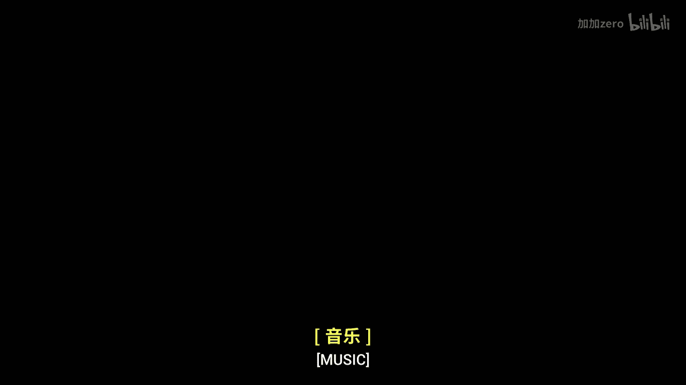
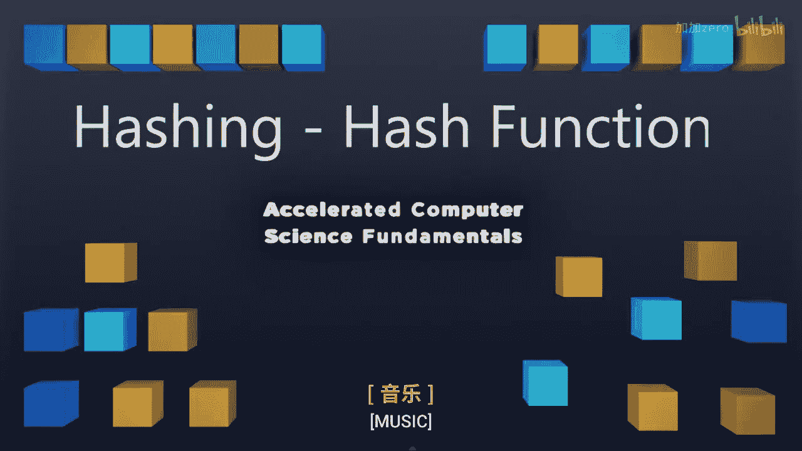
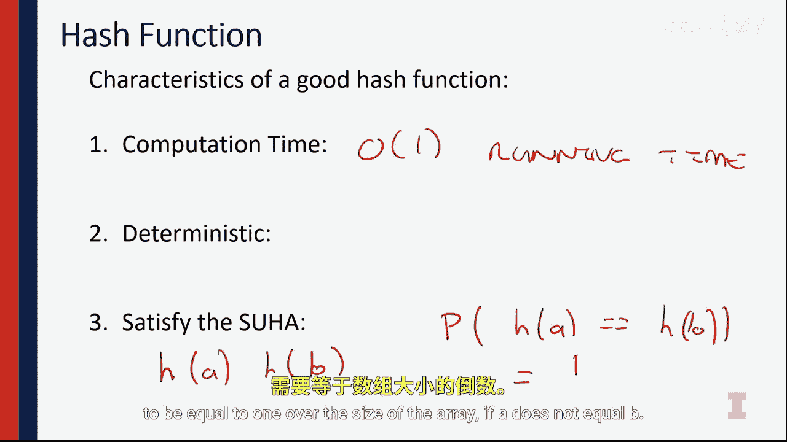

# 计算机科学基础：1-1-2：哈希函数





在本节课中，我们将要学习哈希函数的核心概念。哈希函数是数据结构中用于将任意大小的数据映射到固定大小值（通常是数组索引）的关键工具。我们将通过具体例子来理解它的工作原理、特性以及设计一个优秀哈希函数所需考虑的因素。

## 哈希函数示例分析

为了真正理解哈希函数的作用，我们通过几个将数据放入哈希表的例子来观察不同的哈希函数。

### 示例一：教授姓名映射

第一个例子是关于伊利诺伊大学教授及其所授课程的映射。我们有一系列教授，如教授 Lawrence Engrave 教授 241 课程，教授 Beckman 教授 421 课程等。我们需要找到一个函数，将这些教授姓名映射到数组索引。

我特意选择了一组独特的教授并按特定顺序排列，以便展示一个理想的函数。请注意，名单中恰好包含了字母表中的每一个首字母。

我们设计的哈希函数是：查看键（姓名）字符串的第一个字符，并减去字符 `‘A’` 的值。

用公式表示即：
`hash(key) = int(key[0]) - int(‘A’)`

*   **Engrave**：`‘E’ - ‘A’ = 4`，因此映射到索引 4，其值为 241。
*   **Beckman**：`‘B’ - ‘A’ = 1`，因此映射到索引 1，其值为 421。

以此类推，C 映射到索引 2，D、E、F、G、H 也各自有唯一的映射。最终，数组中的每个位置都被填满，并且每个数据元素都有唯一的映射。

这个理想的哈希函数，我们称之为**完美哈希函数**，在数学上被称为**满射函数**。数组的每个元素都被占用，并且我们可以将数据中的每个元素映射到该数组上。这是我们追求的理想目标。

但是，这里存在一个问题。如果新来了一位名字首字母与现有教授相同的教员，例如另一位姓 Cunningham 的教授，他将试图映射到已被占用的索引位置。这就产生了**冲突**。我们需要处理这个问题，稍后会再次讨论。

### 示例二：骰子游戏“花瓣环绕”

第二个例子是我最喜欢的骰子游戏。我展示一组骰子的点数，然后给出一个映射数字。例如，对于点数为 [1, 2, 3, 4, 1] 的骰子组，我给出的映射数字是 2。

我使用的哈希函数叫做“花瓣环绕”。规则是：只计算那些中心点被激活的骰子（即点数为 1, 3, 5 的骰子），并统计围绕该中心点的“花瓣”数量。

用代码逻辑描述即：
```python
def petals_around_the_rolls(dice_list):
    count = 0
    for dice in dice_list:
        if dice == 3:
            count += 2  # 3点骰子有2个花瓣
        elif dice == 5:
            count += 4  # 5点骰子有4个花瓣
        # 点数为1的骰子中心点激活，但无花瓣，不计入
        # 点数为2,4,6的骰子中心点未激活，不计入
    return count
```

因此，对于骰子组 [1, 2, 3, 4, 1]，只有骰子 3 被计数，贡献 2 个花瓣，所以哈希值为 2。这意味着在哈希表中，键 `2` 对应着这组骰子数据。

现在，让我们分析这个哈希函数的问题：

1.  **未充分利用空间**：哈希结果只能是 2 或 4（因为只有3和5点骰子贡献花瓣）。因此，哈希表中索引为 1、3、5 等奇数位置永远不会被映射到，造成空间浪费。
2.  **冲突频繁**：所有只包含一个5点骰子的不同骰子组合（如 [5], [1,5], [2,5]）都会被映射到值 4，导致大量冲突。

这两个问题都是我们在设计优秀哈希函数时需要解决的。

## 优秀哈希函数的特性

为了确保我们拥有一个优秀的哈希函数，需要考虑三个关键特性来分析它。

首先，我们需要将哈希函数分为两个部分来看待：
1.  **转换函数**：将任意输入转换为一个整数。`hash(input) -> integer`。在这个阶段，我们通常不关心整数的范围。
2.  **压缩函数**：确保哈希值落在数组边界内。这可以通过取模运算轻松完成，例如：`final_index = hash_value % array_size`。

在思考哈希函数时，我建议你先不要急于自己创建新的哈希函数。设计一个好的哈希函数非常困难，市面上已经存在一些优秀的哈希函数实现。我们更应先学会如何分析一个哈希函数。

以下是构建哈希函数时我们必须关注的三个特性：

### 特性一：恒定时间复杂度

哈希函数的计算必须在常数时间内完成。我们希望计算哈希值的时间复杂度是 **O(1)**。这一点至关重要，因为每次我们访问数据时都需要计算哈希值。如果哈希计算耗时很长，整个算法的效率就会很低。因此，优秀哈希函数的第一个要求是**必须在 O(1) 时间内运行**。

### 特性二：确定性

哈希函数必须是**确定性**的。这意味着，如果你对同一个字符串进行哈希计算两次，两次的结果必须完全相同。我们不能在哈希过程中引入随机数。虽然引入随机数可能有助于分散数据，但一旦引入，哈希函数就不再是确定性的。每次你哈希数字 103 或字符串 “weiade” 时，都必须确保输出相同的数组索引。

### 特性三：简单均匀散列假设

第三个要求是最难保证的，称为**简单均匀散列假设**。

该假设指出，我们的哈希算法结果在整个键值空间上必须是均匀分布的。



用公式化的语言描述：对于两个不同的值 A 和 B，在 SUHA 下，`hash(A)` 等于 `hash(B)` 的概率应等于 `1 / 数组大小`。

`P(hash(A) == hash(B)) = 1 / M`，当 `A != B` 时（M 为数组大小）。

这意味着，任意两个不同的键被哈希到数组中同一位置的概率是均等的，且仅取决于数组大小。如果出现数据聚集现象，就像“花瓣环绕”例子中那样，大量数据哈希到值 2 或 4，而有些值（如 1）永远无法被哈希到，那么我们就违反了简单均匀散列假设，因为哈希到 1 的概率是 0，而哈希到 2 或 4 的概率却很高。

## 总结

本节课中，我们一起学习了哈希函数的核心概念。我们通过教授姓名映射和骰子游戏两个例子，直观地理解了哈希函数如何工作以及可能遇到的问题（如冲突和分布不均）。我们深入探讨了优秀哈希函数必须具备的三大特性：**恒定时间复杂度 (O(1))**、**确定性** 以及满足 **简单均匀散列假设**。具备这些特性的哈希函数能为高效的数据存储和检索奠定坚实基础。由于保证均匀分布非常困难，在实践中我们通常会使用经过验证的现有哈希函数。在下一讲中，我们将进一步探讨哈希函数的分析，并研究更多示例。