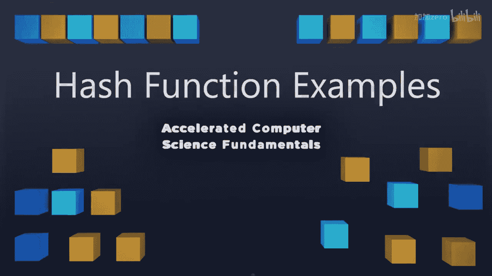
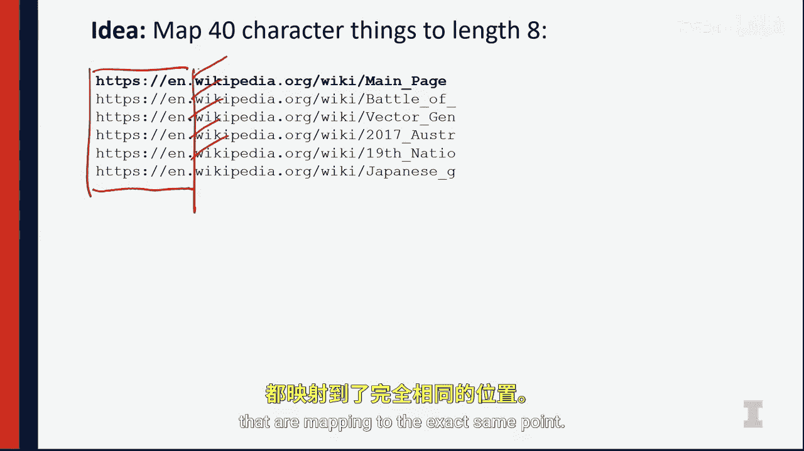

# 伊利诺伊大学【中英⚡计算机科学基础｜Accelerated Computer Science Fundamentals Specialization】 p24 P24 03_第一课1-1-3：哈希函数示例 -BV1KnLCzXEcQ_p24-

So as we talk about building hash functions， it may seem initially to be very。

 very easy to build a hash function。 We can think about all of the data that we might consider as part of our hash function。

 We can think of a pretty easy mapping to it。 And in fact， for small values of input。

 this is going be extremely easy。 I can think about what my data is。

 I can think about what I expect my user to input。 and I can map it in a relatively uniform way。

And it's not going to be hard。But what often happens is when you actually see a code move into production and not simply be something you're thinking about in your office。

 you're going to find that the actual amount of key space is going to be much larger than you imagine。

And we need to have a hash function that considers all of this key space and not just what the user expects。

So here， instead of just mapping to a small key space。

 we have to consider the fact that a circle may be here or maybe way out here。 And in doing so。

 we have different parts of the key space we need to consider And all of these parts subspaces of the key space needs to be uniform。

 This is incredibly difficult to do。So one of my examples that I ran into when I personally tried to create a new hash function was that I wanted to map strings。

That were of some arbitrary length。And I went ahead and I created a hash function。

That mapped a string of arbitrary link by mapping a string of only eight characters。 And I figured。

 you know what， a string of eight characters is really easy a hash function around all sum of their values。

 do some mod and some multiplication on them。 And I will have a really great system to make sure that every string is uniformly different。

😊，So here I have the text of Allson Wonderland。 This text has。A lot of different sentences。

 And if I look at the first eight characters of every single line。

 I can see the first eight characters of every single line is quite different。

 There's no two lines that are the same。 And if I look at the first eight characters and do some clever math on them。

 I can come with numbers that are gonna be different every single point of time。

 I think I am really confident in my ability to actually create a hash function that's going map each line of Alice and Wonderland to a particular unique value。

 or at least in a uniform way。Awesome， so creating this hash function， did a great job。

 it worked great on some text corpes。😊，But then as soon as I went and plug this into a different application I building。

Some weird things happened。So the next thing I built was a web scraper。

 and I was scraping Wikipedia articles to do some research on the text in the Wikipedia articles。

In doing that， the keys to my hash table， the data point that describes what data I have。

 the key value was a URL。So using the exact same hash function， I looked at every single URL。

 and let's look at the first eight characters of those URLs。In Wikipedia。

 the first eight characters of all the URLs。Are exactly the same value。 So here。

 every single point in this。Data set。Has a number of values that are mapping to the exact same point。

What that means is every single point I have a collision。

 and I have a number of different collisions happening。

 and I have to resolve all of these collisions， and I absolutely do not have a uniform set of functions。

😡，Because of this， I actually developed a hash function that worked really。

 really well in one piece of data。 And then as soon as they used another application。

 I found this hash function fell apart。😡，So these are some of the problems that we're going to deal with when we deal with hash functions。

 It's incredibly hard to think of all the use of the user is going to use。

 So whenever we think about a hash function， we want to be very， very careful。

 And if at all possible， we're going to use some of the established hash functions that have already existed for many years because the best way to test whether or not hash function is good is to use it for a really long time。

 So we've talked a lot about the hash function。 And now we're going to talk more about diving into the next aspect of this。

About the array and how we deal with collisions。 so I'll see you then。

