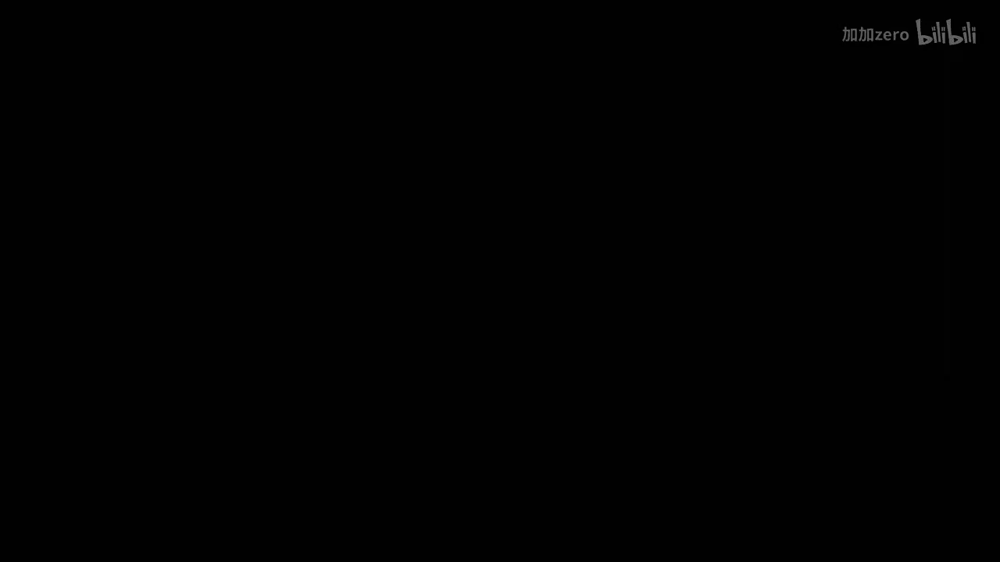

# 伊利诺伊大学【中英⚡计算机科学基础｜Accelerated Computer Science Fundamentals Specialization】 p25 P25 04_第一课1-1-4：冲突处理之一——分离链接法 -BV1KnLCzXEcQ_p25-

Up until now， we've talked a lot about hashing functions。

The hashing functions is going to sometimes result in o collision where two different inputs are hash the exact same value under Suha。

 this should be rare。But it may happen quite often if we don't have a strong hash algorithm。

Let's look at some strategies to deal with this。The first strategy， the idea of separate chaining。

 is going to be a strategy where we're going to dive into the array。

 but to treat it more like a linked list。Every time we run into a collision。

 we'll simply add the element to the linked list。 Let's look at how this might work。

Here I have a number of values in my set S that I'm be inputting into our hash table。

 Our hash function is K mod 7。So here we're going to take the value 16。

Mod it by  seven and we get a remainder of two， so we know we need to hash in next2 and add the value 16。

To value 2 here are array。 instead of just being an array of values。

 it's an array of linked lists where each list is initially empty。Next value，8，8 mod 7 is one。

 so we go ahead and add eight to a next one。Next value is4，4 mod 7 is 4。

Go ahead and add that right here。Next value is 13， 13 mod 7 is6， so we can add 13 off of6。

Now we have 29，29 mod 7 is 28 remainder 1。 So here we have。A value of one。 Now we have a collision。

 when we have a collision in separate chaining。We can simply look at this。And say。

 how can we insert into a linked list as quickly as possible。And from earlier in this semester。

 you learned that inserting into a linked list can be done in O of one time if I insert at the beginning。

So in separate training， whenever we have a collision。

 we're just going to simply insert at the beginning of the linked list， let's do that here。

Here we're going to go ahead and move8 out of the way to put 29 at the front and then link to8 afterwards。

Next element is 11， 11 mod 7 is 4， we have another collision， so we put 11 in the front。

 moving four back。And finally， 22 mod 7 is another collision and it maps the value 1。

 so here at the front of one， we have 22 that then points to 29 and then points to 8。

So using separate chaining， we have an ability to deal with collisions by simply adding to the linked list。

You can imagine the very， very worst case of this algorithm would be quite bad。

If we had a hash function that always kept returning to the same value。

 what we have is we have a link list that grows in size equal to exactly the value of the number of data in our hash table。

That means our algorithm is going to run an O of in time。

 if we ever have to find something inside that hash table。 This is going to be really， really bad。

 And down here on the right hand side。We see the worst case for an insert is O of1。

 but the worst case to find it is O of n。If we have a simple uniform hashing assumption to be true。

 we know that the insert time still O1。 We can always insert the front of the linked list。

But the remove find， we're gonna express in a new variable， a variable that I'm going to call alpha。

This alpha is going to be the load factor of the table。

So load factor of the table is alpha is going to be defined as the number of elements inside of the table divided by the size of the table itself。

 So little n divided by big n。This term determines how full the table is， a load factor of 1。

0 means that you have exactly as much data in the table as there is space in the array。

A load factor 。5 means on average， they raise half full。

 or we have linked lists that would fill up half the array or half the table if we put them in there。

A load factor 2 means on an average， every single node has two items in the linked list。

 So you can see as the load factor grows。The amount of time it takes to run this algorithm is also going to grow。

Here we have just one strategy of doing separate chaining。 And in the next video。

 I'm going to discuss another strategy that's going to take a completely different approach to doing this。

 I'll see you then。🎼。

