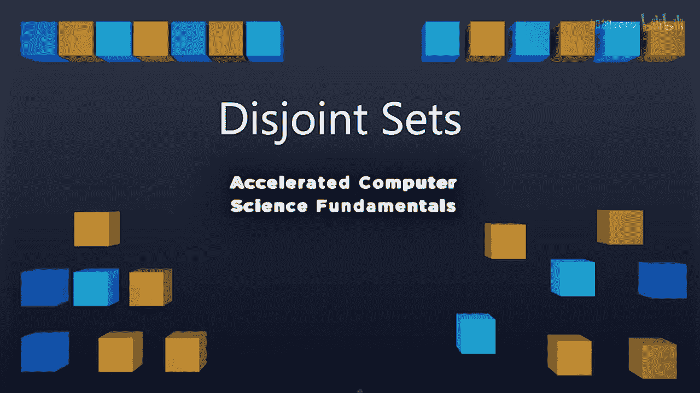

# 伊利诺伊大学【中英⚡计算机科学基础｜Accelerated Computer Science Fundamentals Specialization】 p29 P29 01_2-1-1-不相交集合简介 -BV1KnLCzXEcQ_p29-

This week， we're going to talk about something entirely different。

Instead of talking about a data structure that seems really， really useful for common sets of data。

 we're going to talk about data structure that's somewhat specialized。

 but it's going to have huge applications when we begin starting talking about graphs。 specifically。

 we're going to talk about the idea of disjoint sets。A disjoint set is going to be a series of sets。

 which are disjoint from one another， but every single element within a set is considered to be equivalent within that set。

😡，Let's take a look at an example to see what that means。So here are four disjoint sets。

 We have one set that contains the element 2，5，9， another set that contains the element 7。

 another set with the element，0，1，4， and8， and a final set with the element 3 and 6。

When we consider each of these sets， we consider every element inside of a set to be absolutely equivalent。

 if you're familiar with mathematics， this is something saying that these two elements are in an equivalent relationship with one another。

😡，As far as we're concerned， two， five and nine are completely indistinguishable。

We can do operations on the disjot set like the find operation。

 The find of four operation is going to find the set identity for the set that contains the element for。

😡，So we can choose any single element to be the set identity or call it something completely different。

😡，Just to be really， really clear， I'm just going to always use the first element as my list to be the identity element for that set。

 So what this means is if we look at this set right here of 2，5 and 9。

 the identity element for this set is2。😡，The identity element for this set here is7。

 the identities element for the set0，1，4， and 8 is0。

 and the identity element for the set three and6 is three。

The big idea is we need to make sure that identity element for every single set is unique。😡。

So that we can differentiate a set from in one another。

 But we can now know that the identity of every single element in within a given set is going to be the exact same thing。

 So when we find the element for， what we're going to return is we're going return the set identity for that element。

 So here， finding4， we say the set identity of that element is 0。Likewise。

 one operation that we need to ensure is consistent is we need to ensure that find a 4 has the exact same value as find of 8 because find and4 and find of 8 both need to return the same set identity because both4 and 8 are in the same set In this example。

 we have zero is a set identity， so both find to 4 and find of 8 are both going return 0。

 zero is equal to0。😡，So we see that by choosing a set identity， we can ensure when we do a find。

 that we can find whether or not two elements are in the same set。

 The other operation that we're going to okay about is not only do we need to find。

 but we may need to actually union two sets together。😡，Once we add an element to a set。

 we can never separate it again。 So by unioning two sets together。

 what we're doing is we are unioning the set that contains one element with the union of the set that contains another element。

 and the end result is a larger set that contains both elements。😡。

Look at an example here we're gonna to union the set that contains two and the set that contains seven。

 so the set that contains two is going to be this top left set and this set that contains7 is going to be the top right set when we union the set that contains two and the set that contains7。

 the new set is a single set that contains all of these elements。

 Now7 has a different set identity because7 is in the same set as2。

5 and9 We know that the set identity for7 now must be two mathematicalmatically we can talk about a set as being a collection of different sets。

 So a disjoint set is going to be a collection of set where each set has a unique identity in it as part of this set we know that each set has a representative member and that's going to be element that uniquely identifies that set and the only operations that we're gonna to need to program on this data structure is we need to go ahead and make a set out of a single element。

We need to find the identity of a given element set。 And the final thing is。

 we need to be able to union two sets together。 We're going to dive into how we create a really。

 really incredibly efficient algorithm to solve this particular problem。All this week。

 So we'll start by looking at what we can do to build the structure in the very next lecture。

 I'll see you there。

