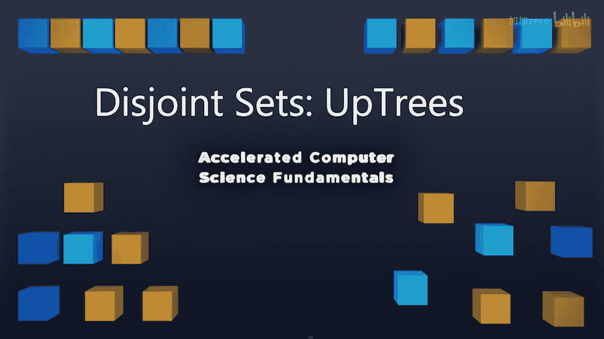
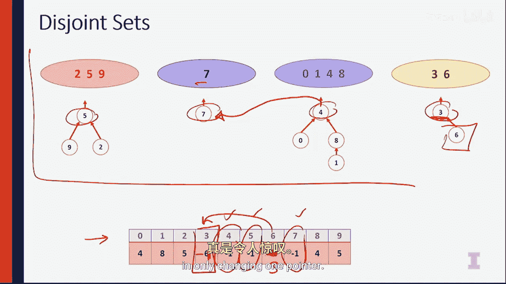

# 伊利诺伊大学【中英⚡计算机科学基础｜Accelerated Computer Science Fundamentals Specialization】 p31 P31 04_2-1-3-不相交集合的优化实现——树结构 -BV1KnLCzXEcQ_p31-

In the past video， we talked about a naive implementation of disjoint sets that allowed us to do a really。

 really efficient fine， but we found that Union had to traverse an entire array。

There are a lot of elements of this implementation that worked really， really well。😡。

But there is going to be some elements that didn't work so well that we need to change。

 So let's keep the thing that's a very base of it。 Let's keep the array as a thing we're going to be looking up。

 So in this new implementation， we have an array。 But the array。

 let's not just store the root identity element。Itself， let's store some additional information。

That allows us to create a structure that's going to be way more easy to union together。

Let's look at what this is。So what we're going to do is we're going to continue to use the array where the index is the key。

The value in the array is going to be negative one when we actually found the representative element。

 otherwise， the representative element is going to be the index of the parent itself。

If we haven't found the representative element， and what this means is we're going to call this an up treee and this upte is going to look just like this。

Here， when we originally have four elements， 0，1，2， and3， which are all in their own sets。

 the upre is going to have negative one as all of the values inside the array to note the fact that we found the identity element。

And we can visually represent this up tree as the element 0，1，2。

 and 3 in their own little trees pointing up。But what we can do is we can start unioning these things together to see how this uptree actually works。

😡，So suppose I want to union the element 0 and3 together， so to do that。

 I'm going to connect0 to the three tree or3 to the0 tree， so I'm going to go ahead and keep0 on top。

😡，And then I'm going to move the three element to 0。20。

So what this means is zero is the identity element and3 points to0。

 so we look at index0 to see what's happening next。One and two are still in its own trees。

So they have the value of negative one。Next， we're going to go ahead and union1 and two together。😡。

So keeping0 and 3 unchanged， it's going to be negative1 in index 0 and0 and next 3 to say that three needs to look at index 0 to find out what the identity element is。

 Now one being unioned with two means that two should look at one to find out its identity element and the identity element itself is negative1 here in index 1。

 So the up treee itself looks like a same up treee at index 0。But then here at index1。

 it is the identity element， so it just points up， but two points to one itself。

So now it get to really interesting now we can actually union together。0 and one。

 So these are two elements in two different trees， and we want to union them together faster than we were able to do。

In this simple implementation we did earlier， We don't want to traverse the entire array。

 So let's look at this tree and see what we can do。Here we have the tree，0 and three。

 and the tree one and2。To update the identity element to one and 2 to be 0。

 we simply need to point every single element in this tree to0。😡。

But because two points to1 and we can follow along， we simply need to 01 to 0。Instead of  point1 up。

 and now we have created a setup where we've updated a single pointer。

And yet update the identity element for everything in the tree， So let's see how this array works。

So 0 and 3 remains unchanged， negative 1 and0。As well as the element 2 remains unchanged。

 so that points to one。And now element1 simply points directly to zero。

So now both element 1 and element 3 point to0， so we know that both these elements point to whatever the identity element of the element 0 is since the value element 0 is negative1。

 we know zero is the identity of element itself， so our entire uptreat says that zero is the identity element for everything。

😡，1 points to0 as well as three pointing to zero and finally two points to1 so notice that we're building up this tree where we have pointers that are all pointing up to the identity element itself inside of this up tree and notice how the union operation required us to only update a single pointer。

So looking at an entire disjoint set， here is an example that has a whole bunch of stuff inside of several different sets。

 just like the example we started with when we talked about talking about disjoint sets。

 And here I make one purposeful mistake so that we can actually identify what it is and go in depth about what it means to build an up treee。

 Let's take a look。So here we see the upree has the array implementation down here。

 and I have the visual implementation of the uptree up here。Looking at this uptreat。

 we see that the root nodes are 5，7，4 and 3， so we expect5 index 5 has negative 1。

 This works out well index7 also has negative one， denoting it's a root node。

Index 4 has negative  one denoting a to node and here index 3， oh， index 3 is pointing to6。

That's not what this error is actually indicating。 the identity element of this set is three。

 So one of the errors is three should be pointing to negative one。Let's look at3's child6 index6。

 index6 here we say index6， the identity element。 instead the correct implementation of this array is here 3。

 because we need to look at three to find out what the identity element of this tree is and it is three。

 Now when we union two roots together we can simply update the root node and by updating the root node。

 we are able to。Union two trees together by adding a single pointer。 So now let's look at this。

 Consider that we up just update4 and pointing to 7。 Now。

 the tree and everything underneath 4 has identified the element of 7。 That's awesome。😊。

This is amazing ability to update the union as quickly as possible and only changing one pointer。

 What we have is we have an algorithm that allows us to quickly and efficiently update a data structure that maintains disjoint sets。

😊。

We'll find that the running time of this is strong。😡。

But we can do even better because what's the very worst case？

The worst case might be a tree that looks like a linked list where we're linking one node at a time all the way up to the root。

 So we're going to think about how we can improve this and how we can make an ideal tree。

 the very best case up tree。In the very next video， I'll see you there。

