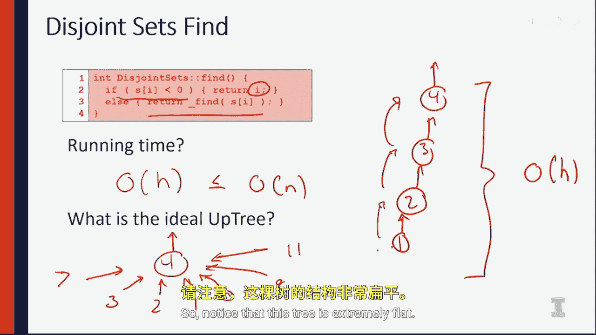

# 伊利诺伊大学【中英⚡计算机科学基础｜Accelerated Computer Science Fundamentals Specialization】 p32 P32 05_2-1-4-树结构的简单时间复杂度分析 -BV1KnLCzXEcQ_p32-

So in the previous video， you learned about an uptree and we talked about how you would implement the upte。

 and we talked about kind of the worst case running time。

Let's actually dive a little bit deeper into the analysis and find out some more。 So to do that。

 I provided the code for us to actually look at the find algorithm。 Let's look at that。

The fine algorithm is simply going to say if the root node of the tree is less than zero。

 so if it's negative one， we know we found the identity element。

 otherwise we need to recurarsly call the fine algorithm to look at the element that's denoted inside the array itself。

So that means if we have an uptree that has four at the root， then three underneath that。

 two underneath that， and one underneath that。The running time of this algorithm is going to be proportional to the height of our up tree。

 because notice if we find a one， finding one means we have to look at two and looking at two requires to look at3。

 looking at3 is going to require us to look at 4。 So the deepest node in the tree dominates the amount of time it's going to take us to look at the tree itself。

 So we're going to say the running time of this up treee is going to be O of H。😡。

And in the worst case， H is going to be equal to n。 So all of data may be a single linked list。

And if our worst case so in， then we've done no better than our naive implementation。

What we hope is we hope to build an upte。That allows us to create a tree with an ideal structure。

 So think about what we would love for an ideal structure to be。

 we know that every node may not be an identity node。

 so we can't have everything with a value of negative one。

But what we could have is we could have a single identity node as a root node。

 and every single child could be right underneath that root node。

So let's look at what this might look like。😡，So if we have the element 4 as our identity element。

 our ideal up tree has the element 3，2，1，0， and anything else all pointing to for itself。

So notice that this tree is extremely flat。

There's only a height of one in this entire tree。This is fantastic。

Because that means even if we find any node that's not an identity node。

 the worst it has to do is look up one node， find that that value of that node is negative。

 And because that value is negative， we found that identity node。

This is absolutely fantastic and ensures that we have a constant running time。

So what we want to do is we want to build trees that as as close as possible with that ideal tree。

 so we don't end up in this worst case， O of in type situation。

So we're gonna study a few different techniques that we can do that when we actually do a union。

 we can be smart about the union。 when we do a fine。

 we can be smart about making sure that every other find after us runs a lot quicker。

 So we're gonna look at how to do a smart union and path compression in the next few videos。

 I'll see there。😊。