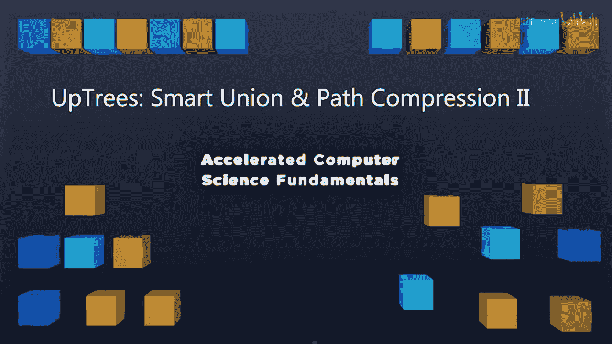
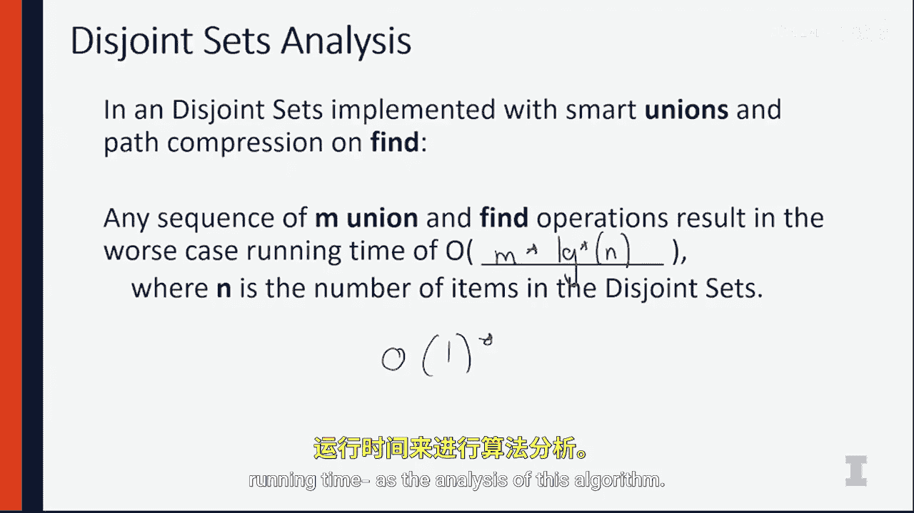

# 伊利诺伊大学【中英⚡计算机科学基础｜Accelerated Computer Science Fundamentals Specialization】 p34 P34 07_2-1-5b-上树-智能合并-路径压缩-II -BV1KnLCzXEcQ_p34-

One of the most beautiful things about this whole upte algorithm is the fact that running time becomes fantastic。

 Remember， as we're uniting two sets together， once we find the root node。

 we need to update only a single pointer。We can find the root node as quickly as possible。

 because every time we do a fine algorithm， we are compressing the path to be smaller and smaller and smaller。

 And we're nearly getting to that constant time runtime。 I really。

 really wish I can tell you that disjoint sets run in constant time。

 but that would be a little bit of a lie。Instead， the running time of a dis set is one of the best running times we ever see in computer science。

 The running time of this algorithm is something called the iterated log。😡。

Let's see what it means to be an iterated log。 The iterated log function is denoted as a log star of n。

 So this is saying this is an itated log of n。 and the itererate log function says it is0 of n is less than equal to 1 and one plus iterated log of the log of the number for every value greater than one。

What this means is an inter rate log is how many times you can take the log。Of a number。

 So let's do the iterate log of base  two of2 the 6500th power。 So an absolute gigantic number。😡。

To 65，000 power， the log of that is going to be the iterated log of 65，000。

Itated log of 65000 is going to become the iterated log of。16。

 the iterated log of 16 is going to be the iterated log of4。

 the iterated log of4 is going to be the iterated log of 2。

 which is then going to become the iterated log of1， which is one itself。

So what this means is we have this fantastic algorithm。That only requires us to go one， two， three。

 four， five， six times。Through the iterated log。😡，When we have an absolute ginormous number。

 so the running time， the growth of this algorithm grows proportional to the number of times you can take the log of a given number。

So 2 to 65000 is an absolute gigantic number。 The itererate log of that is 6。 This is so， so。

 so close to constant time。 We can't say it's quite all of one because it does grow based on the size of the input。

 but the growth based on the size of the input is extremely small， so small that the input is nearly。

 nearly constant。😊，What we actually are going to say to actually denote the entire running time is we know that some operations take longer than other operations。

 So what we actually know is we know the total number of operations after a series of M。😊。

Find and union operations is going to be equal to the value of M。Times the iterated log。Of in。

 So M operations take M times iterated log of n time。Because this number is so small。😡。

Because M operations time iterated log of M is so close to M。

 we're going to consider that the amortized average running time of our algorithm for all practical purposes is O of one amortized time。

So when we see any of this used inside of a for loop， even though we know this is not constant time。

 what we're going to do is we're going to say that we're going to just use a constant time running time as the analysis of this algorithm because this constant time running time is so。

 so close to reality， the iterated log is so small that what we have is an algorithm that runs effectively constant time。

😡。

We know a few operations are going take longer。 So that's why we're going to say it's amortize constant time。

 And we know that that's a slight lie。 But as we build algorithms that have more and more complex data structure around it。

 we can just assume that this algorithm is a constant time or algorithm。

 This is going to help us really understand exactly a power of how we can use disjo sets to build really amazing algorithms in the future。

 So we'll start using this on graphs， which is one of the last topics we're going to talk about in class。

 So I look forward to introducing to graphs and doing some amazing things with graphs。

 So I'll see then。😊。