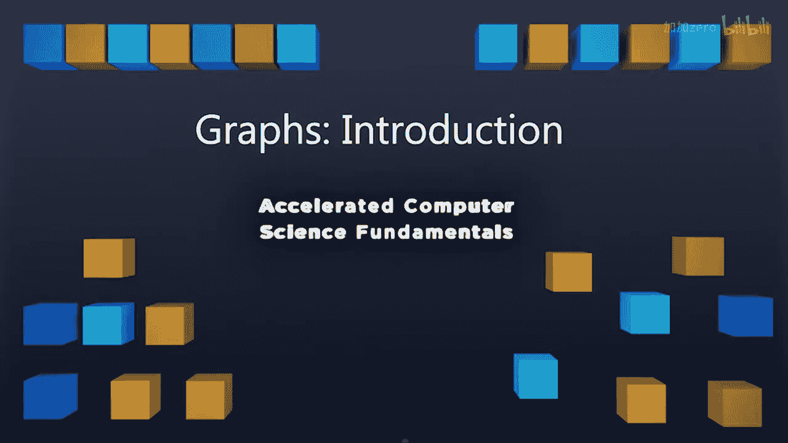
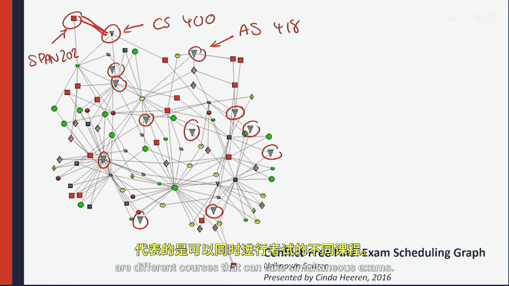

# 计算机科学基础：3.1.1：图论简介 📊

在本节课中，我们将要学习一种极其强大的数据结构——图。我们将了解图的基本概念，并通过几个生动的例子来展示图如何被用来解决现实世界中的复杂问题。

## 什么是图？

到目前为止，我们已经学习了多种数据结构，如二叉搜索树、AVL树、数组、栈和队列，以及在这些结构上运行的各种算法。现在，我们将迎来一个终极数据结构，我们将在接下来的四周里深入探讨它。

在深入细节之前，我们先通过几个例子来感受一下图这种数据结构能做什么。

## 图的实例与应用

以下是几个图在现实世界中的具体应用，它们展示了图如何将复杂的关系网络化。

### 互联网结构图 🌐

第一个例子是我最喜欢的图之一：2003年的互联网结构图。虽然年代有些久远，但它清晰地展示了图的基本要素。

*   **节点**：图中的每一个点代表一台计算机。
*   **聚类**：这些计算机根据其物理位置聚集在一起。图中大块的白色集群通常被认为是大学或大型公司。
*   **边与颜色**：连接节点的线称为“边”。边的颜色表示其所属区域：绿色代表美洲，蓝色代表欧洲，红色代表亚洲。

所有这些边共同定义了图的**连通性**，而这个图的连通性正是当时互联网的连通性。虽然如今的互联网规模已庞大到难以用如此简洁的方式可视化，但这个例子完美地展示了图如何描绘一个庞大系统的连接关系。

### 课程先修关系图 📚

第二个可视化图表是我几年前与学生共同创建的，它描绘了伊利诺伊大学所有课程的先修关系。这种图有时被称为“星座图”。

*   **节点**：每个节点代表一门课程。
*   **节点大小**：圆圈的大小表示有多少门课程是它的先修课。
*   **边**：如果一门课程是另一门课程的先修课，它们之间就有一条边。
*   **结构与颜色**：你会看到，科学、技术、工程和数学领域的课程形成了一个密集的核心集群，课程间有很长的依赖链。外围则是一些小型的“星座”，它们是仅内部相互依赖的课程序列。每个学科通常用独特的颜色标识。

例如，西班牙语102是西班牙语202的先修课，而西班牙语202又是西班牙语302的先修课。这种“先入门，再中级，后高级”的结构，通过节点和边清晰地展现出来，创造了富有意义的美丽图案。

### 无冲突考试安排图 🗓️

图最有趣的应用之一是解决影响日常生活的实际问题。在伊利诺伊大学，一个重大难题是如何安排期末考试时间，确保没有学生的时间冲突。

这个图解决了无冲突考试安排问题。它的工作原理如下：

*   **节点**：每个节点代表伊利诺伊大学的一门课程（例如CS400或西班牙语202）。
*   **边**：如果至少有一名学生同时选修了课程A和课程B，那么节点A和节点B之间就存在一条边。

这意味着，如果两门课程之间有边相连，我们就知道有学生同时选修了这两门课，它们的考试时间不能冲突。反之，如果两门课程之间没有边（例如CS400和农业科学418），则意味着本学期没有学生同时选修这两门课，它们的考试可以安排在同一时间。

这个问题的解决方案是**图着色问题**：为图中的每个节点分配一种颜色（或形状），确保任何有边相连的两个节点颜色不同。这样，所有颜色相同的节点就可以被安排在同一时间考试，而不会产生冲突。

在上图中，我们使用了大约12种不同的形状来标记节点。这12种形状代表了安排考试所需的12个不同时间段。由于图中任何两个相同形状的节点之间都没有边相连，因此确保了整个大学的考试安排没有任何冲突。

## 总结

本节课中，我们一起学习了图论的基本介绍。我们看到了图如何通过**节点**和**边**来建模复杂的关系网络，并探讨了它在描绘互联网结构、分析课程依赖关系以及解决无冲突考试安排等实际问题中的强大应用。图着色问题是一个经典的难题，它展示了图论在优化和调度领域的价值。在接下来的课程中，我们将开始学习如何具体实现和操作图这一数据结构。