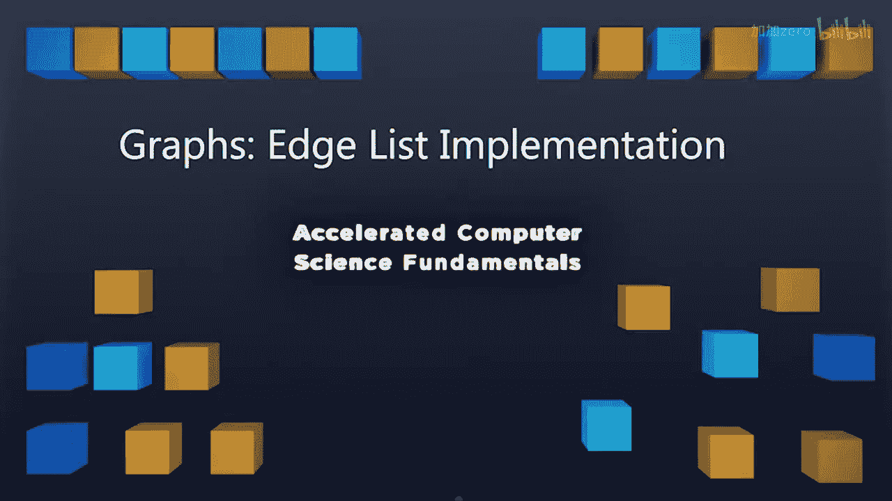
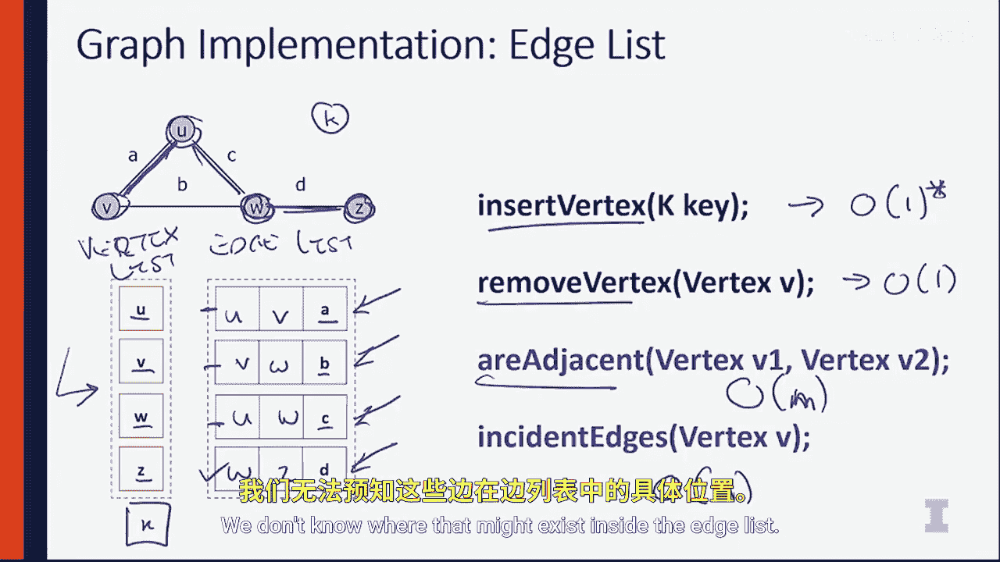

# 伊利诺伊大学【中英⚡计算机科学基础｜Accelerated Computer Science Fundamentals Specialization】 p37 P37 03_3-1-3-图论-边表实现 -BV1KnLCzXEcQ_p37-

As we begin to implement a graph， we first need to talk about the abstract data type of a graph and understand what functionality we need to be building against so we can actually make a useful class。

Let's look at this。So inside of our graph， we're going to have a sequence of vectors that we're going to store。

A sequence of edges and some data structure that maintains the relationship between these vertices。

And these edges。In doing that， we're going to define at least eight different functions on our graph。

😡，The first one is we need to be able to insert a vertex given some key。😡。

The second thing is we need to insert an edge between two vertices。

And given some data that we might associate with that edge。We， of course。

 need to remove the vertex we inserted earlier， and we need to remove the edge。

We also need to be able to ask our graph， what are the instant edges given a vertex。

We need to see if two vertices are adjacent， so whether or not there's instant edge between these two vertices。

And then if our graph has directional edges where A may point to B， but B doesn't point to A。

 we need to know the origin and the destination of an edge。If the edge is directional。

 this is the basic ADT that we're going to be looking at as we look at different implicationss of a graph。

The first implementation we're going to look at is what is referred to as the edge list implementation。

 this is sort of naive implementation that allows us to just get a graph going very quickly and we'll discuss improvements on this implementation after understanding how it works。

😡，In the Eless implementation， we are simply going to have a list of vertices and a list of edges maintained in a vector or a hash table like data structure。

So here we have on this simple graph U VW and Z， and you can see in our vertex list。

 we have that edge U or that vertex U V W and Z。And in our edge list。

We are simply going to maintain a list of edges。And have the vertices that they connect as elements as part of the edgelist。

 So U and V are connected through edge A。EdgeB connects V and W。Edge C connects U and W。

And ED connects WN Z。Now we understand what it means to be an edge list。

 Now we can look at operations that we might perform on this edge list。

The first thing we might want to look at is how to insert a vertex to insert a vertex is really quite simple。

 If I want to add a new vertex called K。That vertex K can simply be added to the end of my array or hash table here。

So this is an o of one operation because I simply am adding it to the hash table or adding it to a vector because we might need to expand the vector。

 we can say this is actually O of one amortized time。

The remove vector operation is going to remove a vector from this list。Again。

 thinking about this in terms of a hash table， we can make a hash table implementation of this in0 of one time。

Checking if two nodes are adjacent gets a little trickier。So if we have vertex1 and vertex 2。

Checking if they're adjacent requires us to go through an entire edge list。

 so we need to look at every single element in our list and say are these two vertices adjacent？

And to do that， we say is W and Z adjacent。 Well， they're not adjacent on edge A or E B or E2。

 Only E D is it done that way。 So here we have an O M algorithm。

Because we have to go through and look at every single edge before we can find out whether or not two vertices are adjacent。

 So this is going to run in order of how many edges there are in the graph。Likewise。

 when we to calculate the number of instant edges， we also need to go through the entire edge list。

 So this is also going to be an O of M operation to check whether or not。

Or you get the collection of all of the edges that are incident to a given vertex？

Because we don't know where that mind exists inside the edge list。

So these are the four key operations that you're going to see on a graph and here the inserting removal runs in constant time。

 but you actually find things about the property of the graph and how connected they are。

 It's going to run in orders of the entirety number of edges in the graph。 so this could become very。

 very large and very large graphs and may not be a desirable outcome。In some cases。

 the edge list is the right implementation to use。 and we're going to evaluate this implementation with other implementations as we dive into more implementations of graph。

 and we'll do that next。 So I'll see there。