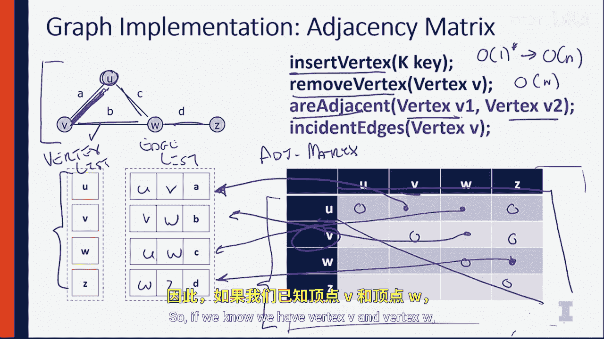

# 伊利诺伊大学【中英⚡计算机科学基础｜Accelerated Computer Science Fundamentals Specialization】 p38 P38 04_3-1-4-图论-邻接矩阵实现 -BV1KnLCzXEcQ_p38-

In the last video， we talked about an edgeless implementation of a graph here we're going to do an entirely different implementation of a graph using an adjacency matrix。

 Let's look at how this works。Using the same simple graph we saw in last video here we're going to maintain the same type of data structure。

 We're going to maintain a vertex。List。And this vertex list is going to maintain all of the vertices inside of our data structure。

 UVW and Z， just the same， we'll maintain this as a hash table to get that O of1 access time。

The other thing we're going to maintain is we're going to still maintain。Our edge list。

But that's not going to be it。In addition to maintaining the edge list。

We're also going to be maintaining an adjacency matrix。Let's fill out the adjacency matrix first。

 the adjacency matrix is going to store a false value if there does not exist an edge between two vertices。

 So between you and you， there does not exist an edge because there are no self edges。

 so we know that this is a false value or 0。Between U and V。

 we know that that edge does exist so we can say that's a true value or one。Between U and W。

 we know that edge exists as well。 between U and Z。 we know that edge does not exist。 So it's 0。

 We can continue this。 V and V does not exist in edge。 V and W does contain an edge。

V and Z does not contain an edge。And finally， Z and W。Does contain the edge D。

And we can just do the upper triangle part of this matrix because we know that the graph here is undirected。

 so we could just replicate all of this down to the bottom triangle。

 but we won't worry about doing that since all we need to do is represent it once here in the upper triangle for a non directionional graph。

So while we represented everything with zeros and ones。

 I think we can do better than that in our adjacency matrix。

So0 happens to be the exact same value as null， but one， we could not just say one。

 but we could link directly to the actual edge in our edgeless structure。

 So let's see how this works。For vertex U V， we know U and V is connected by the edge A。

 So instead of having a one here， we're gonna have a pointer that points directly to my edge list。

 which contains U， which is the edge between U and V。Likewise， UW is the edge。😡，Xi。

That connects U and W。Finally， V and W is the edge B。 I'll have a pointer to there that contains。

The connections between the vertices， V and W。 And finally。

 Z W is this edge is going to be edge D connecting W and Z。

So here we have a adjacency matrix that doesn't just include whether or not those two edges are that edge is connected to those between those two vertices。

 but we have。A data structure that actually links us into the edge list ourselvesse。

So what we can do is we can see that these operations are going to become much， much faster。

T some of the operations beforehand， because we can find out what all the in edges are。

Far faster than we could have by just going through the entire edge list。

 Let's talk about those running times。To insert a vertex into this still requires us to insert a vertex into our list。

 so that's going to be our O of one insert， but it also requires us to add another row and column to the matrix。

Because of that， we need know that we need to write out a bunch of data corresponding to the number of vertices in the graph。

So now this becomes an O of n algorithm because we have to have a row and a column to correspond the new vertex with every other existing vertex center table。

 So now adding a new vertex depends on the total number of vertices that are already in our graph。

The same argument in reverse can be made for remove vertex where we need to remove an element from this graph and shrink the table if necessary。

Now checking if2 vertic here adjacent， V1 and V2 can simply look up into this table extremely quickly。

 so if we know we have vertex v and vertex W to index into this table is extremely fast operation。

In fact， it's just looking at data and array。 So to find out whether or not two nodes are adjacent。

 We can do that in constant time now by the data structure that we maintain。

 So our adjacent now runs an O of one time。Finally。

 the very last thing to mention is instant edges is going to be the set of all edges instant to a particular vertex。

Here， we can simply look at an entire row and an entire column in our data structure。

 Let's take a look here， the entire row for V。With the entire column for V。

Is going to know every presence there Every time there's a true value。

 we know about an incident vertex。 So here we know that V and U are instant。As well as V and W。

So looking at the two true values， we were able to get the number of incident edges。

And doing that requires just looking at the set of all of the vertices。Twice。So again。

 this is two times in checks， which is equal to order N。

So what we have with an adjacency matrix implementation is we have an implementation of this matrix。

Such that were able to optimize whether or not we can check if two vertices are adjacent or not。😡。

And we can do that check in O of one time。This is an amazing result if the algorithm we care about is going to care about whether or not two nodes are connected。

The cost of this is an additional runtime when we insert a vertex and remove a vertex。

 So we see that we have our first tradeoff between the different algorithms that we have。

 We can see different applications are going to want different implementations of the graph。

In the next video， we'll talk about a third and final implementation of a graph that has another set of trade offs。

 Then we'll explore an analysis of all three of these algorithms at once。 So I'll see then。

