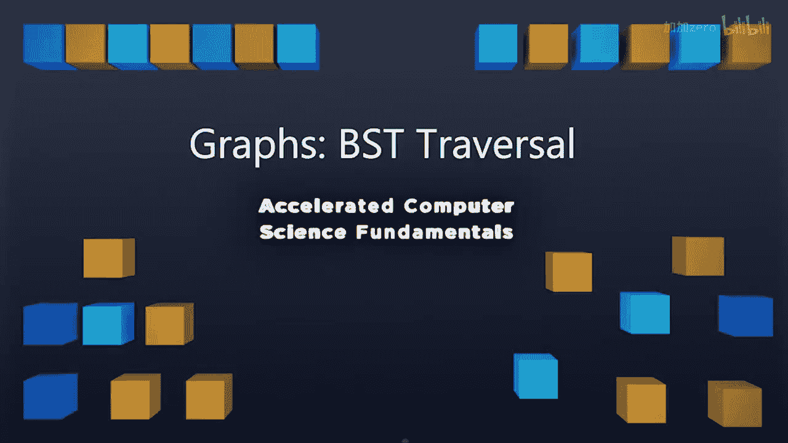

# 伊利诺伊大学【中英⚡计算机科学基础｜Accelerated Computer Science Fundamentals Specialization】 p40 P40 01_4-1-1-图论-广度优先搜索遍历 -BV1KnLCzXEcQ_p40-

Now that you have an understanding of how to actually implement a graph inside of C++。

 let's talk about doing things with that graph。One of the first things we're going to want to do is we're going to want to do a traversal of this graph。

And traversals are something we've already talked about。

 You've traversed trees and talked about many different algorithms for traversing a tree。

Now we want to apply the same idea of a traversal to a graph。

 and we're going to see it's somewhat similar， but also very different。Just like a tree。

 a traversal is going to visit every single node exactly once。

But what's different about a traversal is that we absolutely。

Have some problems that we need to deal with when we have a graph as opposed to a tree。

Let's look at some of those。So a traversal is going to help us find interesting substructures inside of a tree。

 We know that the tree is ordered。 We know that there's a root note and we can go down from the left and the right child。

 There's an obvious start。To the tree traversal。 And then in addition to that。

 there's a notion of completeness。We know when a。Tree is finally finished because we going to say we visit every leaf node。

 We've talked about how you can do in order traversal， and you know exactly when you're done。

A graph has a lot of weird properties that trees don't necessarily have。So here in a graph。

 we don't know a national ordering of all these nodes， so they're not ordered。

A second thing is there's no obvious start。Where would you start on this graph right here。

 would you start at the middle node， would you start at the top， would you start at the left。

 all of these could have valid arguments on where to start， there's no obvious place to start。

And there's no notion。Of completeness。Built into a graph。That is。

 a graph's not necessarily going to be entirely complete that that graph is going to be。

Possibly looping around a whole bunch。 it's going to have to。

 we're going have to maintain some sort of data structure to ensure that we're not stepping on a node for a second time。

Because remember， traversely you need to visit every single node exactly once。

One of the first travers we want to talk about is the breadth first search traversal。

This traversal is going to do the exact same thing as when we did a birth first search traversal in a tree。

 specifically we're going to visit all of our children nodes before we visit any grandchild。

 so that means we're going to visit all of our adjacent nodes before we visit any of their adjacent nodes。

So to do that， we're going to use the same data structure we used before。

 We're going to maintain a queue， and this queue is going to help us organize our traversal through a graph。

 Let's take a look。So here。At vertex A。I'm going to go ahead and start by maintaining a data structure that's going to help us with this traversal。

 So at A， we have A， B， C， D。EFG and H as all of our different nodes。And A has nodes， B， C， and D。

 in to it。B has nodes。A， C， and E。C has nodes A， B， D， E， and F。D has。Notdes， A C， F， H。E has nodes。

B， C， and G。F has nodes C D G， G has nodes E FH。And H finally has nodes DG。

This is a list different of all of the instant vertices off of every single vertex。

 This is something that's maintained as part of our graph data structure itself。

Now we can think about BFS traversal， I'm going to start with A， but I could start anywhere。

I'm going add H myQ。And then A is going to also be the first thing that's then removed from my cu。

 when I remove A from my cu， I can mark it as visited。

So A has been visited and we can queue up all of its incident edges or instant node， B， C， and D。

So now here in my queue， I can go ahead and now that I visit A。

 look at my next node in the top of my queue， it's B。Mark B is being visited。

And now in all of the vertices and B that haven't been。Already visited。

 So a or already added A's already been visited。 B's already been visited。C has already been added。

E has not been added， so we now add it to the end of the Q。Again， next visit we notice is C。

 C we market as visited， mark C is visited， go through all of C's instant edges。

 A and B's already been added， D is added， E is added。

 F gets added to the Q now as the next node get visited， we repeat this process， D now gets visited。

 D gets visited the new nodes on D is F's already here， H gets added。Then we after visiting D。

 we visit E。And this process continues as we notice the path that we're making。

 This is the first node we visit， then all of our children， then all of their children。

 And only then are we visiting H。 And then the very last node to visit is G， because it's the。

It's going to be a distance of three away from any single route。

This process of doing breadth first search traversal using a queue is a key idea of going through a graph and diving into those structures。

 So here's a finished version of this。 You'll notice that I did a slightly different breadth first search traversal here based on how I did the ordering of my instant nodes Here。

 I ordered the vert incident edges。😊，Adjacent edges or instant nodes off of A as CBDD instead of B CD。

 because of that， our structure looks slightly different。 The C gets visited first， than B。Vdi。

In both cases， you see that all of our children are visited。

 all of the instant nodes are visited before any of their instant nodes or the grandchildren of by root node are visited。

This property is going to hold for all implementations binary of a breadth first search， jveral。

I've provided you guys the code for this so that you can actually dive in and kind of see this traversal really happen。

 I'm going to spend just a second talk about a few of these elements。

The first thing is is in a breathth first search traersal， we have our input graph。

And then we're going to go ahead and label these。As two different types of edges。

 I'm going to label these as a cross edge and discovery edge so we can talk about interesting properties of this traversal。

So what we're doing here is when we have an edge that's between a node that already exists。

Or a node that's never been seen before and a node that already exists。 So when A first sees B。

 C And D， we're going to say that that edge， when we first see that particular node is known as discovery edge。

 that discover something new， we're going make that edge bold and darkened in our graph。

 so we can map all of these discovery edges when we first discover that new node。

If we've already discovered that node because it's been discovered by a previous time。

 we'll call this a cross edge and I'll just represent this cross edge with dots。

So what we have at the end of a BFS is we have the traversal that visits every single node。

 and we have this interesting structure of how these nodes were discovered。

 So as part of this algorithm， I'm not just going to give you a traversal。

 I'm going to also give you this interesting substructure that we'll talk more about。

We have this idea of the labeling of nodes is discovered in cross edges。😡，And。

We initially visit every mark every node is unexplored and every edge is unexplored。

 we go through our graph， looking at every single one。

 we either mark every single one as a discovery edge or a cross edge。

 You have access to this code through the Gi repository surgery with this course so you can dive into that and see how this code actually works。

In the next video， we're going to talk about what this substructure that we just created using a BFS traversal does。

 what it means to have a bunch of discovery edges and what the substructure of our graph can tell us about the structure of the graph as a whole。

 So I'll see then。

