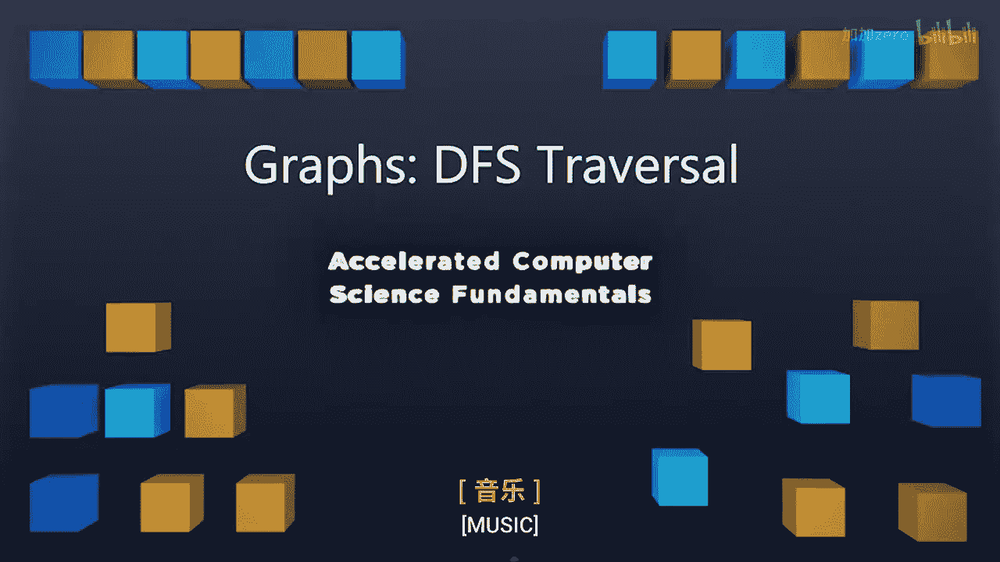

# 计算机科学基础：P42：图论-深度优先搜索遍历

## 概述
在本节课中，我们将要学习图论中的另一种重要遍历算法——深度优先搜索。我们将了解其工作原理、与广度优先搜索的区别，并分析其时间复杂度。

## 从广度优先到深度优先
上一节我们介绍了广度优先搜索遍历。本节中，我们来看看深度优先搜索遍历。在广度优先遍历中，我们首先访问所有相邻节点，然后再访问它们相邻的节点。而在深度优先搜索遍历中，我们希望尽可能快地深入到图的深处。

在BFS中，我们使用**队列**结构来管理待访问节点。在DFS中，我们将使用**栈**结构。由于C++代码调用时会使用调用栈，我们可以利用递归轻松实现DFS，而无需显式地管理栈结构。因此，这个算法会非常容易理解。

## 深度优先搜索遍历过程
让我们从节点A开始，像之前一样遍历这个图。

1.  从节点A开始。我们打算访问A周围的所有节点。当我们穿过一条边时，需要判断：我之前见过这条边吗？我访问过D吗？没有。所以这是一条**发现边**。现在我们从A移动到了D。
2.  在D节点，我们做同样的事情。从D开始，寻找新的边。我们发现了一条新边，它通向新的节点，所以我们继续深入，进行深度优先遍历。我们移动到H。
3.  在H节点，重复此过程。H通向G，我们在G发现了一个新的顶点。我们继续做同样的事情，然后前进到J。
4.  在J节点，我们进行同样的操作。查看J的所有可能访问的边，我们发现有一条从J到K的边，这让我们发现了一个新节点K。
5.  最后在K节点，我们重复这个过程。在K，我们查看其边。这里有一条边通向A。但A已经被发现了。所以我们不将其标记为新的发现边，而是将K到A的边标记为**后向边**。它指向了我们遍历过程中更早的节点。就像BFS中的交叉边一样，在DFS中，后向边是非发现边。我们用点来标记它。
6.  继续查看K的其他边，我们发现K到E是一条发现边，我们发现了关于E的新信息。
7.  现在在E节点，我们继续。E到D是一条后向边，因为我们已经见过节点D了，所以这不是一条新的发现边。
8.  完成E的所有边访问后，我们回溯到K。完成K后，回溯到J，然后回溯到G。
9.  回到G后，我们需要继续我们的遍历。我们发现一条新边通向C。C是一条发现边。C有一条后向边指向D（D已被发现），以及一条发现边指向B。
10. 最后，当访问G时，F被发现，并且F有一条后向边指向D。

注意，我们在整个算法中从未考虑过显式的栈数据结构。递归算法中的调用栈形成了一个隐式栈。通过非常简单的代码，我们就能构建出整个遍历过程。你可以看到，这个算法与BFS算法有相同的根源，只是访问节点的顺序不同。

## 代码实现：从BFS到DFS
以下是BFS的代码框架。要将其转换为DFS，我只需要移除所有与队列相关的部分，就能得到一个完美的调用栈实现。

具体修改如下：
*   移除所有与队列 `Q` 相关的代码行。
*   将处理交叉边的逻辑改为处理发现边。
*   确保不再将节点入队，而是递归调用深度优先搜索函数来处理新节点。

通过进行这些全局修改，我可以通过简单地移除几行与队列相关的代码、改为调用DFS、并将边标记为后向边，就将BFS算法修改为DFS算法。

现在我们有了进行DFS遍历的代码。其方式与BFS遍历完全相同，但我们在过程中非常早地访问了深处的节点。

## 时间复杂度分析
之前我们通过分析代码来理解其工作原理。这里，我想用一种不同的分析形式来看看BFS和DFS算法的运行时间。你会发现这种分析对两种算法都适用，并且是计算相同运行时间的另一种方式。

我们知道，在此类数据结构上执行的唯一操作将涉及标记我们的节点。每当我们执行任何操作时，总是会进行标记。因此，让我们计算在标记所有顶点以及查询它们以找出下一个顶点时，进行了多少次标记。

1.  **标记顶点**：每个顶点最初都是“未发现”状态，然后在某个时间点被标记为“已发现”。因此，我们总共进行 `2n` 次标记，即 `O(n)`。
2.  **标记边**：每条边最初也是“未发现”状态，然后要么被标记为“发现边”，要么被标记为“后向边”。因此，我们进行 `2m` 次标记，即 `O(m)`。
3.  **查询操作（访问顶点）**：我们知道会访问每个顶点恰好一次，所以这是 `O(n)`。
4.  **查询操作（检查边）**：查看单个顶点时，我们会访问连接到它的所有边。对于一个顶点 `v`，这最多是 `degree(v)` 次。由于我们会访问每个顶点，所以总次数是 `sum(degree(v))`。所有顶点度数之和等于 `2m`，即 `O(m)`。

综上所述，总运行时间为 `O(n) + O(m) + O(n) + O(m) = O(n + m)`。

这与进行BFS遍历的运行时间完全相同。通过两种不同的分析，我们得到了两种不同的遍历形式（BFS和DFS），它们都将在 `O(n + m)` 时间内运行。你会注意到，这是运行此算法的最优时间，因为我们必须恰好访问每个节点一次，也必须恰好访问每条边一次。所以，我们不可能做得比 `O(n + m)` 更好。因此，BFS和DFS遍历都是图的最优遍历算法。

## 总结
本节课中，我们一起学习了深度优先搜索遍历。我们了解了DFS如何通过递归（隐式栈）深入探索图，区分了**发现边**和**后向边**，并看到了如何轻松地将BFS代码修改为DFS代码。最重要的是，我们分析了DFS的时间复杂度为 `O(n + m)`，这与BFS相同，并且都是图遍历的最优时间复杂度。DFS和BFS都能为我们提供关于图子结构（如BFS中讨论的生成树）的有趣信息。

接下来，我们将深入探讨如何利用这些遍历进行更有趣的数据结构操作，例如找出图中的生成树和环。我们将在下一个视频中详细讨论生成树。