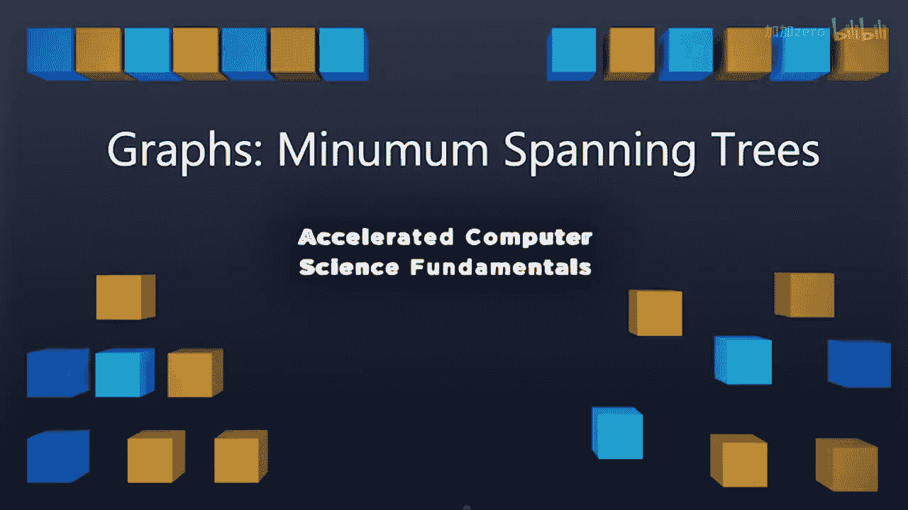

# 计算机科学基础：4.2.1：最小生成树（MST）简介 🌲

在本节课中，我们将要学习**最小生成树**的基本概念。我们将了解什么是生成树，以及为什么需要寻找“最小”的那一棵。这是图论中一个非常实用的主题，常用于网络设计、电路连接等场景。

---

在过去的几周里，我们介绍了图的概念，并深入探讨了如何使用广度优先搜索或深度优先搜索遍历来对图进行简单的遍历。

在BFS遍历中，你可能会注意到我们创建了一棵**生成树**，它能够覆盖图中的所有顶点。

本周，我们将重点讨论如何创建一棵**最小生成树**。

我们希望找到一棵能够覆盖图中所有顶点的树，并且这棵树所有边的**总权重**在所有可能的生成树中是最小的。

让我们具体看看这意味着什么。

---

## 问题定义

输入通常是一个**无向图 G**，图中的边带有权重。这些权重可以是任意值，但必须能够相加。我们通常使用整数，但在某些应用中，权重可能是更复杂的、但同样可以相加的数值。

给定这个带权重的图 G，我们希望创建一个新的图 G‘，它需要满足以下条件：
1.  G’ 必须是原图 G 的一棵**生成树**。
2.  G‘ 必须是一棵**树**，这意味着它不能包含环，并且需要恰好访问每个节点一次。
3.  G’ 在所有可能的生成树中，其**总边权之和必须最小**。

你可以想象，连接所有节点的路径有很多种画法，但我们想知道如何以**总代价最小**的方式画出一棵连接所有节点的树。

---

## 算法简介

有多种算法可以用来解决这个问题。在本课程中，我们将讨论其中两种经典算法：
*   **Kruskal算法**
*   **Prim算法**

这两种算法将采用不同的策略，在给定一系列边权重的情况下，构建出能够覆盖整个图的最小可能树。

---

## 应用场景

最小生成树是一个非常重要的应用。每当我们需要了解一个系统的连通性，或者寻找在两个不同地点之间进行连接或旅行的**最低成本方案**时，都会用到它。例如：
*   设计通信网络（如电话线、光纤）
*   规划交通路线
*   电路板布线

---

在下一节视频中，我们将开始深入探讨第一种算法——**Kruskal算法**，并学习它如何在任意给定的图上构建最小生成树。

---

本节课中，我们一起学习了**最小生成树**的基本定义和目标。我们了解到，最小生成树是一棵连接图中所有顶点且总权重最小的树，它在网络设计和路径规划中有着广泛的应用。接下来，我们将学习具体的构建算法。