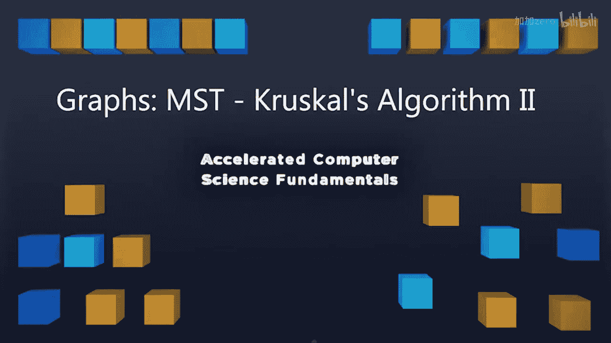
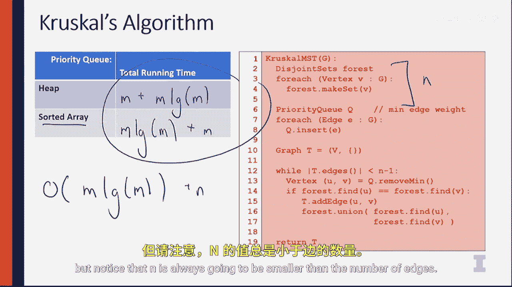

# 伊利诺伊大学【中英⚡计算机科学基础｜Accelerated Computer Science Fundamentals Specialization】 p45 P45 03_4-2-3-MST克鲁斯卡尔算法II -BV1KnLCzXEcQ_p45-

In the previous video， we talked about how to run Criisco's algorithm In this video。

 I want to look at the code that we actually ran so you can see an implementation of it and we can discuss the running time of running CRisco's algorithm。

 Let's take a look。Looking at this， we have Krshko's minimum spanning tree algorithm。

 and this algorithm is going to run using both our。

Minimum heap are our priority Q here as well as their disjoint sets。

 so you're going to see the first few lines of code what we're going to do is we're going to go ahead and set up our disjoint sets for every single vertex in our graph。

 and we're going to set up our priority Q Then we're going to set up our final graph T that we're going to add edges to as we remove them from our minimum heap。

And see if they're in the same disjoint set。So to do this running time analysis。

 I'm going to go ahead and focus on two region of the code to see what the total amount of time it takes is。

 The first region is I want to look at building this data structure。

 as well as removing the minimum element from the data structure and I want to do this with both looking at using a heap or sorted array for my implementation of my priority queue because I could just simply use a heap and removing the minimum element every time。

 or I can use a sorted array， sort it once and know I have a total ordering We'll see the different runtime and compare and contrast them。

Let's take a look。The first thing I'm going to do is build a priority Q。

 If I want to build a priority Q in with a heap， we know that from when we discussed earlier。

 that we can build a he in O of n time。 So this is a fantastic result because if we were to use a sort and if we want to sort all of our data。

 we would need to use a in login algorithm here it's not going to be O of n because our heap doesn't include n as our data point instead our he is a heap of edges So this is going to be an O of M algorithm here。

And to sort an array， it's going to be O of M log M。

So we know the amount of time it takes to go ahead and create a sort array。Or create a heap。

 Now we want to see how much time it takes to use these structures。 So down here in line 13。

 we can see that while we go through every single edge。In our edge list。

 we're going to want to remove min from those edges。

 So each remove operation is going to take log m time when we're doing a heap because we have to do that we have to when we remove min。

 we have to swap at the last element， heap P down。 So as part of doing that。

 we know we have this log m run time for every single remove on a sorted array， though。

 we can simply remove M in constant time。 So it's just an order one operation。

And that's really simple。Each of these remove operations in totality though。

 is going to run while we're still looking for edges to add to our minimum spanning tree。

 so we potentially need to look at every single edge。

 so we're going to have to multiply both of these by M to get the total running time。

So what we know is we know that after building a forest of elements inside a disjoint set。

 we're going to have to build a priority queue and then loop through removing min a total of M times the cost of remove min。

 So the total running time for all of these algorithms for the heap。

 We know that it was m time to build a heap， but it's going to be M times log M time to go about removing the minimum element。

 a total m time。 On the other hand， assorted array takes M log M time to sort that array。

 even though it takes only plus m time to actually travel through every single vertex。

 So notice that the running time of using different structures。

 It's either M plus M log n or M log n plus M。 The total running time is going to be M log M。

In both cases。That Ksco's algorithm is going to take time proportional to the total number of edges。

Times the log of the number of edges。 There's one term that we haven't considered that I just want to mention here。

 we completely ignored lines 2 through 4。 The running time to create a disjoint set of n items is going to be in。

 So we could say plus in here。 But notice that n is always going to be smaller than the number of edges。

So we know that this is true because we know that this graph has to be connected。

 So we know that it needs to be at least in-1 edges。 So M is going to account for those edges。

 The total running time of running Ksko's algorithm using the algorithm that just developed is going to be M times the log of M。

 So it's going to be entirely proportional on the number of edges in the tree。

Crshical's algorithm is one approach to building a minimum Sp tree。

 We'll now discuss the next approach， a new algorithm called Prims algorithm that's going to take a whole new view about building the exact same structure。

 I'll see then。