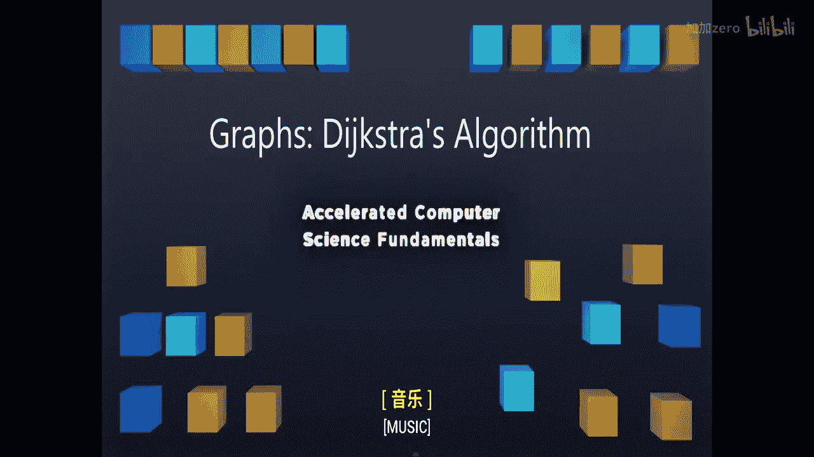

# 计算机科学基础：P47：图论-迪杰斯特拉算法 🧭




在本节课中，我们将要学习计算机科学中最著名的算法之一——迪杰斯特拉算法。该算法用于在图中寻找从一个特定起点到所有其他节点的最短路径。我们将通过一个具体的例子，详细拆解算法的每一步，并与之前学过的普里姆算法进行对比，以帮助你理解其核心思想和工作原理。

## 算法概述

迪杰斯特拉算法与上周学习的普里姆算法非常相似，但有一个根本性的不同。普里姆算法用于寻找最小生成树，而迪杰斯特拉算法的目标是找到图中从一个源节点出发到所有其他节点的最短路径。

让我们通过观察一个具体的图来了解算法是如何工作的。图中包含一系列节点和连接它们的边。请注意，这些边是有向边，每条边都有一个源节点和一个目标节点，用箭头表示。

## 算法流程详解

以下是迪杰斯特拉算法的核心代码逻辑。我们将逐一解释每个步骤。

```python
# 伪代码示意
for each vertex v in Graph:
    v.distance = INFINITY
    v.previous = None
source.distance = 0
Q = priority_queue_of_all_vertices
labeled_set = empty_set

while Q is not empty:
    u = Q.remove_min()
    labeled_set.add(u)
    for each neighbor v of u:
        # 核心更新逻辑
        alt = u.distance + weight(u, v)
        if alt < v.distance:
            v.distance = alt
            v.previous = u
```

算法的前几行代码会遍历图中的每一个顶点，将其距离初始化为无穷大，前驱指针设为空。这与普里姆算法的初始化步骤完全相同。接着，我们将起始顶点的距离设为0。我们建立一个以顶点距离为优先级的优先队列（通常用堆实现），并初始化一个空集合，用于存放已确定最短路径的“已标记”节点。

然后，算法进入循环。在每一步中，我们从优先队列中移除距离最小的节点，将其加入“已标记”集合。接着，我们遍历这个节点的所有邻居，并更新它们的权重。到目前为止，这些步骤都与普里姆算法一致。

## 核心差异：路径总成本

迪杰斯特拉算法与普里姆算法的唯一关键区别在于更新权重的规则。在普里姆算法中，我们只比较和更新跨越“已标记”和“未标记”节点集合的边的权重。而在迪杰斯特拉算法中，我们更新的是从源节点到该邻居节点的**总路径成本**。

具体来说，当我们从节点 `u` 查看其邻居 `v` 时，我们计算的是：
**新距离 = u.distance + weight(u, v)**
只有当这个**新距离**小于 `v` 当前存储的距离时，我们才会更新 `v.distance` 和 `v.previous`。

## 逐步演示例

让我们用一个例子来具体说明。假设我们从节点A开始。

1.  **初始化**：A的距离为0，其他所有节点（B, C, D, E, F, G）的距离为无穷大。
2.  **处理A**：将A加入已标记集合。更新A的邻居：
    *   B的距离更新为 `0 + 10 = 10`
    *   F的距离更新为 `0 + 7 = 7`
3.  **处理F**（当前最小距离为7）：将F加入已标记集合。更新F的邻居：
    *   E的新距离为 `7 + 5 = 12`（小于无穷大，更新）
    *   G的新距离为 `7 + 4 = 11`（小于无穷大，更新）
4.  **处理B**（当前最小距离为10）：将B加入已标记集合。更新B的邻居：
    *   C的新距离为 `10 + 7 = 17`
    *   D的新距离为 `10 + 5 = 15`
5.  **处理G**（当前最小距离为11）：将G加入已标记集合。更新G的邻居：
    *   E的新距离为 `11 + 2 = 13`，但E当前距离为12，13 > 12，因此**不更新**。
6.  **处理E**（当前最小距离为12）：将E加入已标记集合。更新E的邻居：
    *   C的新距离为 `12 + 6 = 18`，但C当前距离为17，18 > 17，因此**不更新**。
7.  **处理D**（当前最小距离为15）：将D加入已标记集合。更新D的邻居（此例中无新更新）。
8.  **处理C**（当前最小距离为17）：将C加入已标记集合。算法结束。

最终，我们得到从A到所有节点的最短距离：
*   A: 0
*   B: 10
*   C: 17
*   D: 15
*   E: 12
*   F: 7
*   G: 11

## 算法结果与应用

运行完迪杰斯特拉算法后，我们得到了一张记录最短路径信息的表。通过每个节点的 `previous` 指针，我们可以回溯出从源节点A到任意目标节点的具体路径。

例如，要找到A到E的路径：
1.  E的前驱是F。
2.  F的前驱是A。
3.  因此路径是 A -> F -> E，总距离为12。

正因为迪杰斯特拉算法能够从一个指定的源节点出发，计算出到图中所有其他节点的最短路径，所以它被称为**单源最短路径算法**。你必须给定一个源节点，算法总是从该节点开始计算。它无法直接告诉你从B到D的最短路径，除非你将B设为新的源节点重新运行算法。

## 总结

本节课中，我们一起学习了迪杰斯特拉算法。我们了解到：

*   迪杰斯特拉算法是一种用于在带权有向图中寻找**单源最短路径**的算法。
*   其核心思想是贪心算法，通过不断将距离源点最近的未处理节点加入“已确定集合”，并松弛其邻边来逐步求得全局最短路径。
*   与普里姆算法的关键区别在于，迪杰斯特拉算法在更新节点距离时，计算的是从**源节点到该节点的累计路径总成本**，而不仅仅是单条边的权重。
*   算法最终输出每个节点到源节点的最短距离和前驱节点，利用前驱节点可以重构出完整的最短路径。


在接下来的课程中，我们将进一步探讨如何应用迪杰斯特拉算法以及它能解决的其他问题。