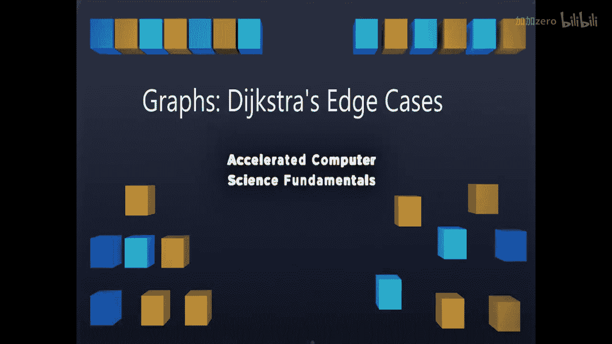

# 伊利诺伊大学【中英⚡计算机科学基础｜Accelerated Computer Science Fundamentals Specialization】 p48 P48 02_4-3-2-图论-迪杰斯特拉算法边界情况 -BV1KnLCzXEcQ_p48-

You've just learned about Dysch's algorithm and how it's a very similar algorithm to Prim's algorithm with only a modest change to allow us to find the shortest path。

Dsterms is amazing in how it works， because it handles a lot of edge cases。

 though it also fails in a few other edge cases。Let's go ahead and take a look at a few edge cases and see how Dg's algorithm performs by quickly running the algorithm on a few different graphs。

Here in this first graph， we have Dexture's algorithm handling a single heavyweight path versus multiple lightweight paths。

 So if I want to go from A to B， I want to know the shortest path to go from A to B。

Here you're going to see that there's a path that costs 10 to go directly from A to B and a path that costs somewhat less than 10 that goes through a number of other destinations。

So think about how D diagramm performs， we know it's going to label everything initially as infinity。

 which I won't label and then start labeling things away from A。 So C will have a weight of 1。

 B will have weight of 10。 So we'll choose C first。Then C will update the weight of D to 2。

Keep going two is less than 10， E to3。F to4。G to5。H to 6。

And now HB is going to be calculated with a weight of 7，7 is less than 10， so B's node gets updated7。

And we'd choose H to B to get from A to B。So you'll see right here in this previous example。

 we actually have an example where Dys's algorithm successfully finds taking lots of short paths。

Which results in a smaller total distance will be found using Dxs algorithm。

 Despite the fact there's this direct route from A to B。

So Dtures algorithm is able to overcome the fact that there may be multiple different nodes that have to be taken。

 so the actual number of nodes along the path is larger。

 but the total distance is what Dexture minimizes。 and you can see it successfully minimizes in this example。

Let's change this example slightly so that the longer path is optimal and make sure it will choose it even among a lot of shorter paths that get us there。

Here we have a single heavyweight cycle5， but that five is going to be the desired path to take from A to B instead of this longer path of shorter nodes。

 let's see if Dary accounts for this。So again， A is going to update B's weight to 5， C to 1。

 continue A to C。C to D。GDE。E to F。And at F， we're going to update the weight of G to be 5。

 We can go ahead and take that edge， even though there maybe it's high breaking case。

 So G now gets added。 and then we update the weight of H to be 6。

 Now D algorithm has to decide using its priority Q is 5 less than 6。 And because 5 is less than 6。

 we're going to go ahead and use that at that edge A to B at this point。

 saying the shortest path from A to B is indeed the direct path A to B。Now we have A to B right here。

 this is added， and finally we finish up with G to H。

So here we find that even under the presence of a long path， Dykeser still finds the shortest path。

In the previous two examples， you saw awesome examples of really the power of Dykesster's algorithm to always find out the very。

 very shortest path on any graph。The next thing I want to look at is what happens when you start looking at weights that are negative。

So in a lot of applications， we may have edges that will give us back a cost。

 so it's going to reduce the total running time if we actually take a certain path and that path's going to be denoted with a negative edge weight。

Does Dych's algorithm still perform well there？ Let's take a look。So handling negative weight cycles。

 we have。Starting with A， we can look at this classic graph that we've seen before and update B2 B 10。

And then F to be 7， we choose F as our next node。E becomes 12 and G becomes 11。

 We go ahead and take B 17，15。And then we take G that becomes 11。

Now we can go ahead and take F that becomes still 12。 So we take the EF。Then12 to negative 6。

That's going to become。6ix。We go ahead and find that six is a minimum weight。

 so we go ahead and take six，6 plus4 is 10。And then we take this and we see， oh。

The shortest path is actually a really interesting path。So the shortest path here。

 we can look at the path AF。EC， and the path to do AFEC is6。

But I think I just found a shortest path because what if we took the same path that we found earlier。

 AFEC， that was6。And then took the path。H， G，EC C。Because adding the path H G，EC。

 So adding the path we have right here， H， E， GC。We see。

That to get back to C is going to have a weight of 4 minus5， which is negative 1 plus 2， which is1。

 negative6， which is 5。So this longer path is6 minus5 or1。

So what happens here is Dter's algorithm wasn't able to find the shortest path。😡。

Because the shortest path keeps on growing。 In fact。

 the shortest path to C involves looping around to get back to sea an infinite number of times。

 because every time we loop around， our path gets five units shorter。

 So the first time we get there is 6， the next time it's  one。 the next time we be negative 4。

 then negative 9， then negative 14， than negative 19。

This algorithm keeps looping around or the shortest path keeps looping around。

 and Dger's algorithms unable to account for this。 and in fact， there's something true in all graphs。

 Anytime you have a negative weight cycle， there does not exist a shortest path。

So we absolutely cannot run any shortest path algorithm with the existence of a negative weight cycle。

Dexter's algorithm does not work。Under any graph that has any negative weights。

So not even a negative weight cycle， not even a negative weight that's not part of a cycle。

 because Dyure's algorithm assumes that everything going out from the source is monotonically increasing。

 So one of the biggest weaknesses is that Dycher's algorithm fails。

As soon as you bring in a negative weight edge。There's going to be more advanced algorithms that help us solve problems on graphs that look at negative weight edges。

Though as soon as we have a negative weight cycle， there will never be a shortest path because mathematically。

 that shortest path is infinite。Let's look at one final edge case on Dyke's diagram。

 Let's look at the case where we have an undirected graph where edges go both forward and backwards。

In this undirected graph， we see that D diagram has no problem。 starting with a。

 we simply go A to C that's going to have an updated weight of1，3， we go to D， that's 2， E， that's3。

A B， that's three。Then a Bta H is 4。E to f is4。And H to G is 5。

 So having undirected edges doesn't phase diys at all。

 So what we know is diy algorithm works really great on any graph。

 nomaning what the structure is so long as every single edge weight is positive。

 As soon as we introduce a negative edge weight。 we can no longer use diy algorithm。

 But diys algorithm is a fantastic algorithm to find the shortest path on all usual graphs where we don't have negative edge weights。

😊，In the next lecture， we'll dive in and do a little bit of analysis on how this algorithm works。

 and I will see you then。

