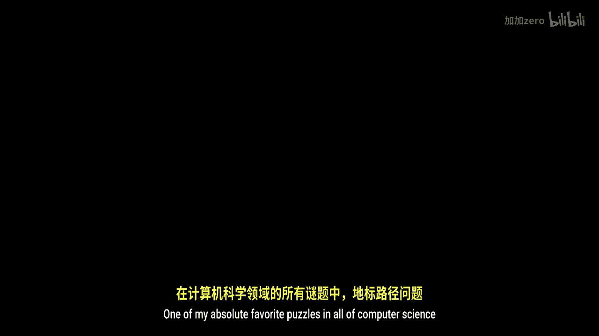
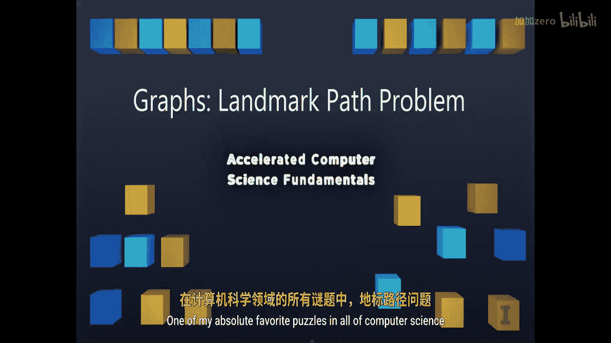
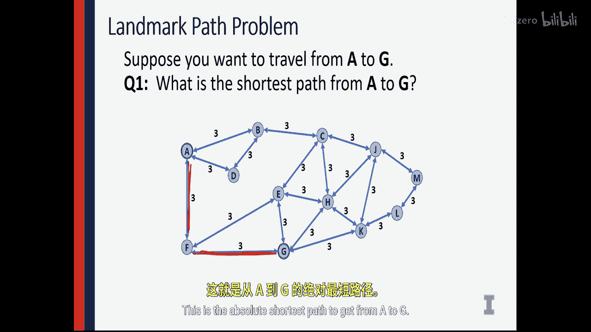
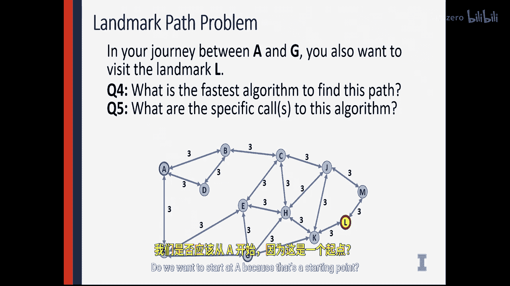
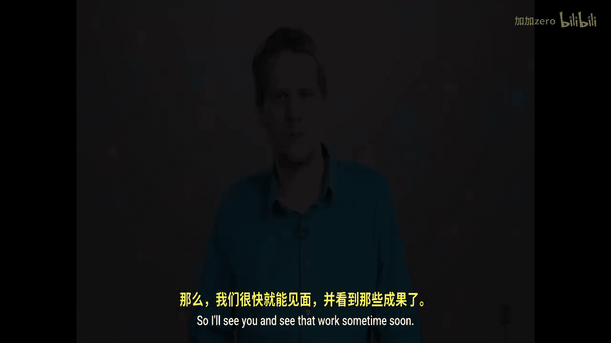

# 伊利诺伊大学【中英⚡计算机科学基础｜Accelerated Computer Science Fundamentals Specialization】 p50 P50 04_4-3-4-图论-地标路径问题 -BV1KnLCzXEcQ_p50-

One of my absolute favorite puzzles in all of computer science is the landmark path problem。

This is a really fun problem because the intuitive answer doesn't always actually solve the problem。

 and you're going to see a different way of thinking about classic graph problems through solving this problem with me。

So in the landmark path problem， we have a series of nodes inside a graph。

 and we want to find the path between certain nodes in this graph every single edge has the exact same weight。

 they all have a weight of three。And we need to travel。

 We need to find out what the shortest path is from different locations。 We'll start simple。

 and then we'll add additional constraints to this graph。So here in my first question。

 I'm going to look at this graph right here。 and I'm going to ask。

 what is the shortest path from A to G。And finding the shortest path from A to G。

 I'm going to go ahead and simply say， okay， to get from A to G。

 it looks like I can simply go down to F。And move over to G。

And this path takes a total distance of six， and I can do that by traveling over just two edges。

This is the absolute shortest path to get from A to G。

Second thing is we can ask， what is the running time？

The fastest algorithm that we can do to find the shortest path。

And because we just studied Dexture's algorithm， it would seem that Dter's algorithm might be the shortest path。

But notice that all of the edge weights are equal。 So because all of the edge weights are equal。

 that means we just need to know the shortest number of edges that we need to travel。

And the shortest number of edges we need to travel， not necessarily the shortest path。In this case。

 them being the same is going to be。Exactly what the minimum spanning tree gives us。

 So instead of writing Dex algorithm， which takes an extra log in time， n plus n log n。

We can just run a minimum spanning tree algorithm， like a breadth first search。

 and a breadth first search is going to find us the shortest path。

By finding all of our neighbors visiting it using the cross edges do an entire breadth for search algorithm。

And that's going to discover the shortest path in just the cost of a traversal and just M plus in time。

 So let's run breadth for search and let's see that this actually works。

So running at Bret first search， I start with A， I'm going to visit all of my neighbors first， B。

 D F。We're going to have a cross edge here from D to B。

 then we're going to have new discovery edges coming out from our children nodes。

And we can continue this process of adding more discovery nodes。And cross edges。

And then we continue with more cross edges and a couple more discovery edges。So here running BFS。

 we see that we have a path right here。That allows us to find the absolute shorts path。

 It part of the in the spanning tree。 It still has a distance of6。 We found the exact same thing。

 but we found it with a faster algorithm。We found it using a spanning tree instead of the shortest path。

 So even though dexs may Ds absolutely will find the shortest path。

 there's sometimes faster ways to solve it， depending on the structure of the graph。

But this isn't just called the shortest path problem。 This is called the landmark path problem。

 So let's introduce another constraint to this problem。Here， I don't want to just go from A to G。

 I want to go to A to G via landmark L。 So I know I must visit L on my way from A to G。

 So I want to know the shortest path from A to G that happens to visit L。😡。

So here I can do a BFS from。A to all of the nodes， like I did earlier。

 and we can see from a previous graph， A to L makes a path right along the bottom of the graph。

 So I know the shortest path from A to L is here。And then I can run another shortest path algorithm from L。

 spanning out from L， building what that tree looks like。

 and we can see then the shortest path is from L to G。

So using two applications of a breadth first search。

 we can see the minimum spanning tree that it creates is going to go ahead and find a fantastic solution to this problem。

But I don't think I'm done yet。There's a few more questions we can ask about this graph。

In total running time， what is the absolute fastest time？That we can find this entire path。

And in fact， which vertex should we start at？Do we want to start at a。

 because that's a starting point？

But if we think about this problem for a little bit， we can find that when we actually started L。

 we didn't just get the shortest path from L to our destination。In fact， the shortest path from L。

 a minimum spanning trans L is going to get the minimum path from L to every point on the graph。

I'm going to argue because we have a bidirectional graph where all of the weights of all of the edges are equal。

And we're creating spanning trees。 We know the path from L to A is also the shortest path from A to L。

 So as long as we find the L to a shortest path， we know that that can be used for A to L。

 So by running BFS just once， starting with L， we get a spanning tree that that shows us a path in fact。

 not just a path， the shortest path from the landmark to a。

As well as from the landmark to the finale。Combining these things。

 we can do the reverse of the LDA path to get from A to L。

And then use the L to the finale path to get us the entire path that visits L first。

So the solution to one of my favorite problems is that we don't use di algorithm at all to find the shortest path along the landmark problem graph。

 We absolutely must start with the landmark， run BFS exactly one time。

 It's going give us the shortest path。 And we can solve this in just a single traersal of the entire graph。

😊，This is a fantastic running time and a fantastic result。

 and these are some of the problems that you' going to think about as a computer scientist that you' going to dive in and see given a set of constraints and given the entire wealth of algorithms I know。

 how do I apply the algorithms I know to solve a really， really interesting problem？

This concludes our discussion on Dture's algorithm。

And really wraps up everything we're going to cover with graphs。

We've had an amazing string of weeks where we've talked about all different application to graph。

 Now you have an immense amount of knowledge， all about how to apply graph algorithms to real world problems。

 I look forward to seeing all the work you create， using some often graph algorithms。

 So I'll see you and see that work sometime soon。😊。

