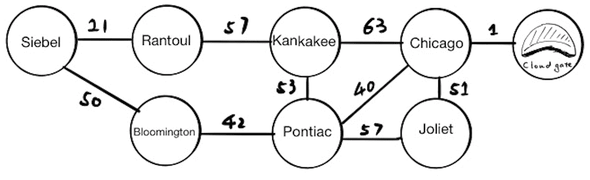
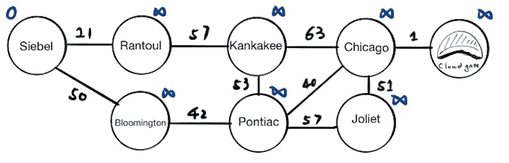
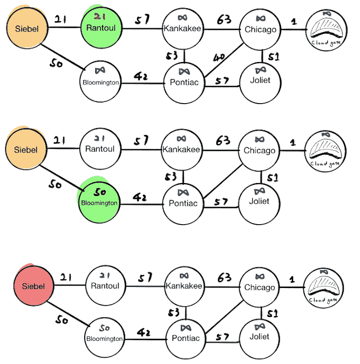
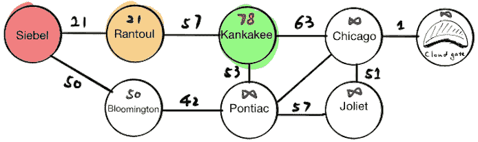
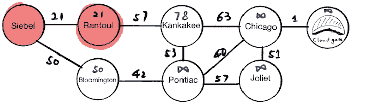
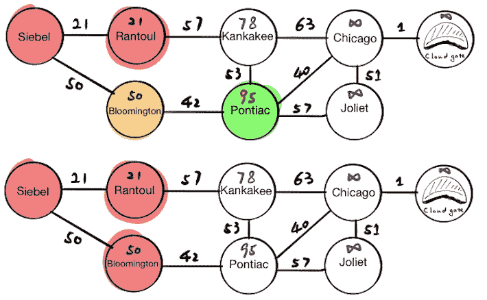
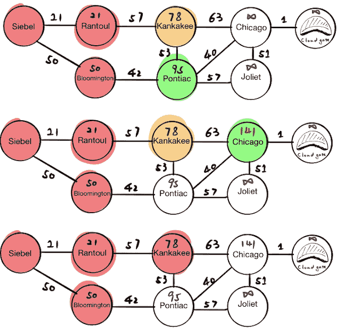
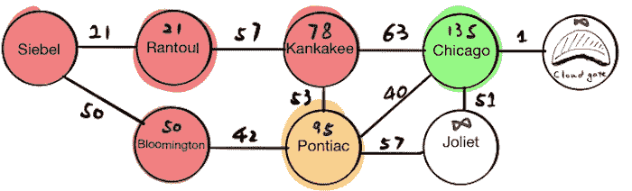
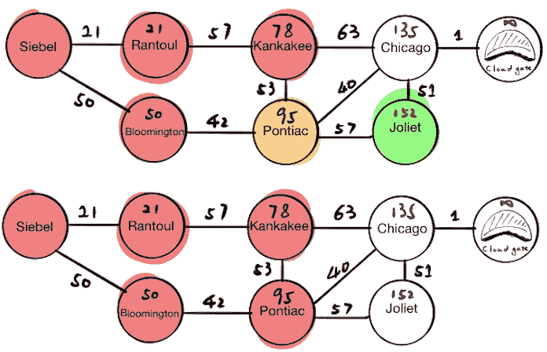
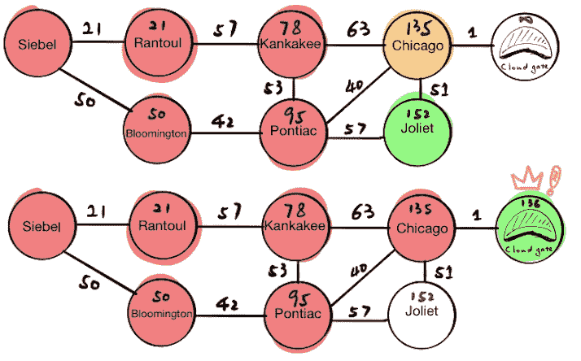

# Dijkstra 算法

> 原文：[`courses.physics.illinois.edu/cs225/sp2019/notes/dijkstra/`](https://courses.physics.illinois.edu/cs225/sp2019/notes/dijkstra/)

返回笔记 by Siping Meng

### 概述

我们知道从 mp_traversals 中，BFS 可以用来找到两点之间的最短路径。那么为什么是[Dijkstra 算法](https://en.wikipedia.org/wiki/Dijkstra%27s_algorithm)呢？除了它们不同的时间和空间复杂度之外，BFS 只能用于无向图，例如迷宫。然而，Dijkstra 算法可以用于带权重的边。例如，如果你想找到从 Siebel 中心到位于芝加哥市中心的 Cloud Gate 的最短驾驶路径，你必须考虑每条道路需要驾驶多长时间。边权重是你需要在道路上花费的时间（在限速下）。在本笔记中，我们将假设 Siebel 和 Cloud Gate 之间的所有道路都是相同的，并且没有交通堵塞。

在这个问题中，每个节点代表我们可能旅行的城市，每条边代表两个城市之间旅行的时间（分钟）。起始节点是“Siebel”，目标节点是“Cloud Gate”。



### 算法

#### 我们需要什么？

在运行 Dijkstra 算法之前，我们需要为每个节点设置一个已访问集合和一个试探距离值。

首先，我们将起始节点(Siebel)的**试探距离值**设为 0，而所有其他节点设为无穷大。试探距离表示该节点与起始节点之间的最新距离。由于我们尚未开始探索，除了起始节点之外的所有节点都被设置为无穷大。

其次，我们现在有一个空的**已访问**集合，因为我们尚未访问任何节点。为了在图上可视化这个集合，我们将使用红色。

第三，我们需要一个**优先队列**来找到下一个最近的未访问节点。队列中的每个项目包含两个元素：节点和它的试探距离值。如果我们现在从优先队列中弹出所有内容，我们将得到：

**[(“Siebel”, 0)]**



#### 运行 Dijkstra 算法

我们将保持遍历优先队列顶部的节点的邻居。对于每个邻居，我们将：

1.  如果我们发现了一条更近的路径，则更新邻居的试探距离值。

1.  将邻居放入优先队列。

1.  将当前节点放入已访问集合。

这是我们将如何遍历此图的图例。


##### Siebel

第一站是 Siebel，它有两个邻居，Rantoul 和 Bloomington。我们将分别更新它们的试探距离值并将结果推入优先队列。如果我们现在从优先队列中弹出所有内容，我们将得到：

**[(“Rantoul”, 21), (“Bloomington”, 50)]**

最后，我们将标记 Siebel 为已访问。



##### Rantoul

由于 Rantoul 位于优先队列的顶部，当前节点将变为 Rantoul。我们将更新 Rantoul 邻居的试探距离值，如果我们现在从优先队列中弹出所有内容，我们将得到：

**[（“Bloomington”，50），（“Kankakee”，78）]**

最后，我们将 Rantoul 标记为已访问。



##### Bloomington

现在，Bloomington 位于优先队列的顶部，当前节点将变为 Bloomington。我们将更新 Bloomington 邻居的试探距离值，如果我们现在从优先队列中弹出所有内容，我们将得到：

**[（“Kankakee”，78），（“Pontiac”，90）]**

最后，我们将 Bloomington 标记为已访问。



##### Kankakee

现在，Kankakee 位于优先队列的顶部，当前节点将变为 Kankakee。我们将更新 Kankakee 邻居的试探距离值，如果我们现在从优先队列中弹出所有内容，我们将得到：

**[（“Pontiac”，90），（“Chicago”，141）]**

最后，我们将 Kankakee 标记为已访问。



##### Pontiac

现在，Pontiac 位于优先队列的顶部，当前节点将变为 Pontiac。我们将更新 Pontiac 邻居的试探距离值。**在这个步骤中，请注意，我们覆盖了 Chicago 的试探距离值，因为我们找到了更短的路径。**如果我们现在从优先队列中弹出所有内容，我们将得到：

**[（“Chicago”，135），（“Joliet”，152）]**

最后，我们将 Pontiac 标记为已访问。



##### Chicago

现在，Chicago 位于优先队列的顶部，当前节点将变为 Chicago。我们将更新 Chicago 邻居的试探距离值，如果我们现在从优先队列中弹出所有内容，我们将得到：

**[（“Cloud Gate”，136），（“Joliet”，152）]**



#### Cloud Gate

算法完成，因为这是目的地。

### Psedocode

```c
Dijkstra(Graph, source, destination):

  initialize distances  // initialize tentative distance value
  initialize previous   // initialize a map that maps current node -> its previous node
  initialize priority_queue   // initialize the priority queue
  initialize visited

  while the top of priority_queue is not destination:
      get the current_node from priority_queue
      for neighbor in current_node's neighbors and not in visited:
          if update its neighbor's distances:
              previous[neighbor] = current_node
      save current_node into visited

  extract path from previous
  return path and distance 
```

### 复杂度

+   每条边最多被查看两次

+   每个节点最多被查看两次：一次是将其添加到队列中，另一次是查询。如果我们使用堆作为优先队列（例如二叉堆），则将节点入队需要常数时间，查询节点需要对数时间

总运行时间：
