# 分离集合

> 原文：[`courses.physics.illinois.edu/cs225/sp2019/notes/disjoint-sets/`](https://courses.physics.illinois.edu/cs225/sp2019/notes/disjoint-sets/)

返回笔记 by Eddie Huang

### 概述

分离集合允许您以基本常数时间将元素组织成集合，并能够查询一个元素属于哪个集合。表示分离集合的数据结构是一棵树森林，其中每个集合由一棵树表示，每棵树由其根节点标识。因此，我们称树的根节点为其集合的`代表`。

### 合并集合

有两种合并方式

+   `按秩（高度）合并`：通过将较小秩的树附加到另一个树的根节点来最小化分离集合的秩（高度）

+   `按大小合并`：将较小大小的树附加到另一个树的根节点

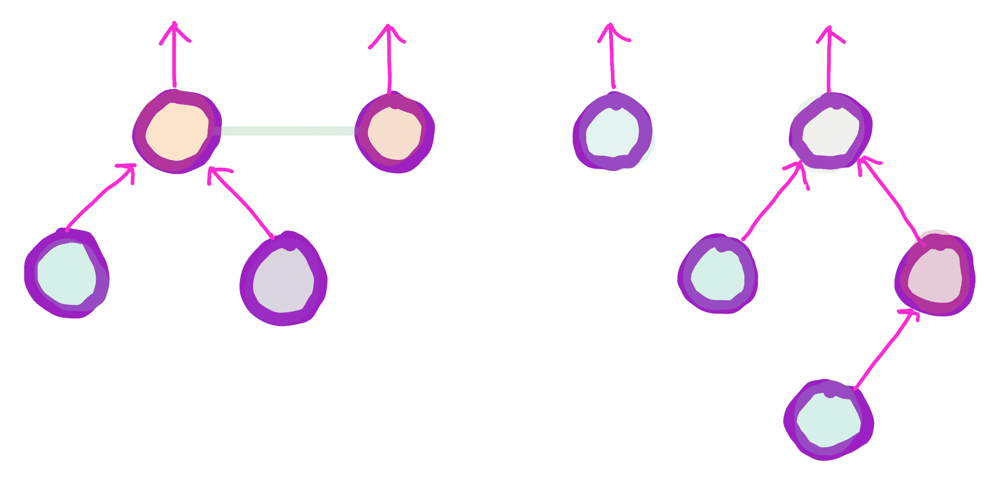

1: 分离集合

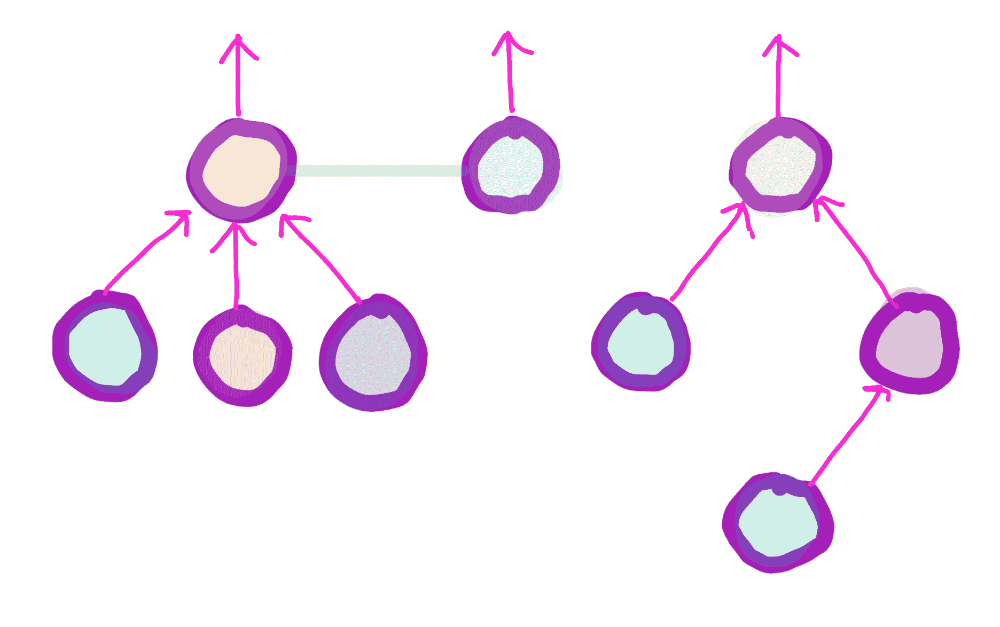

2: 按秩合并

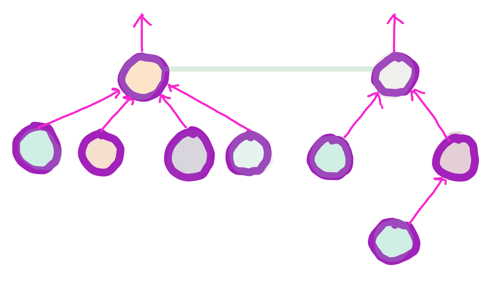

3: 按秩合并

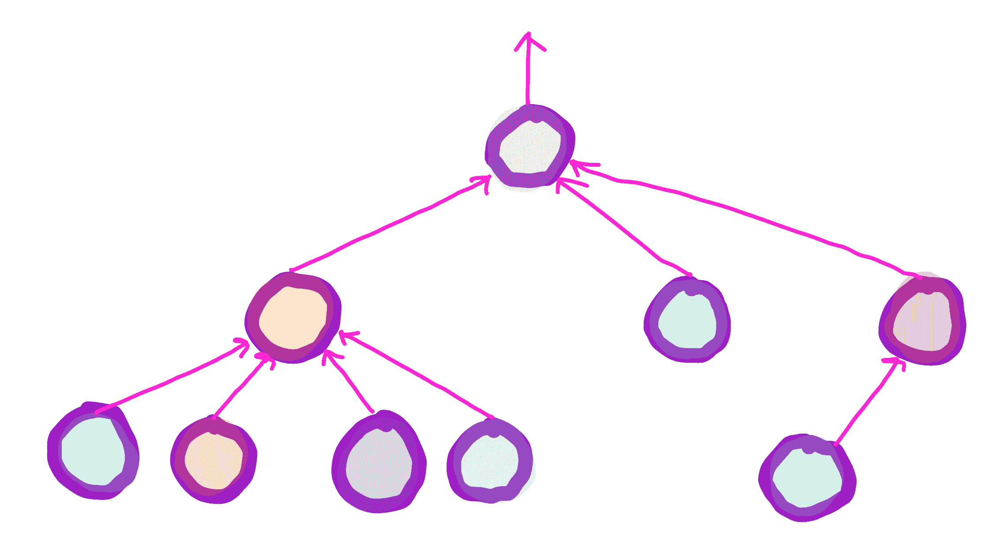

4: 按秩合并

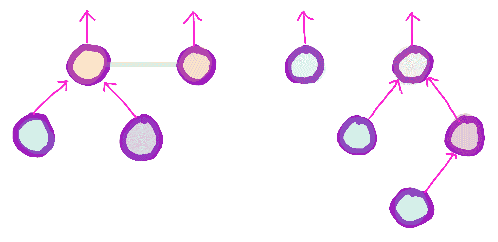

1: 分离集合

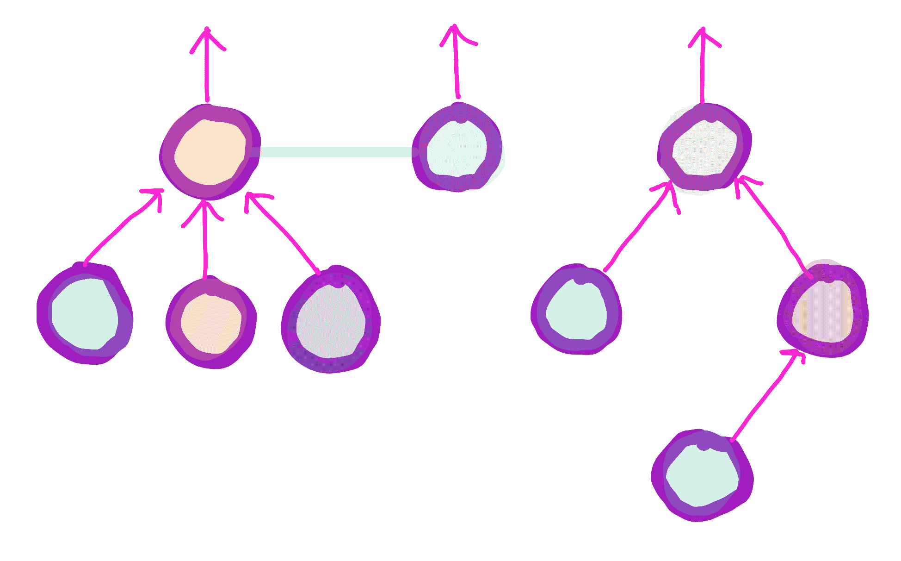

2: 按大小合并

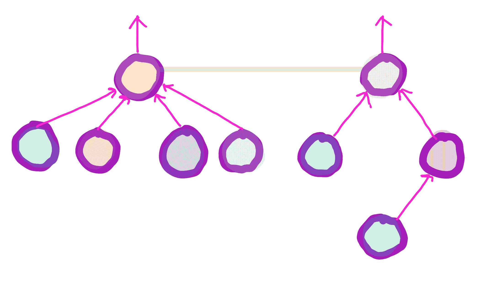

3: 按大小合并

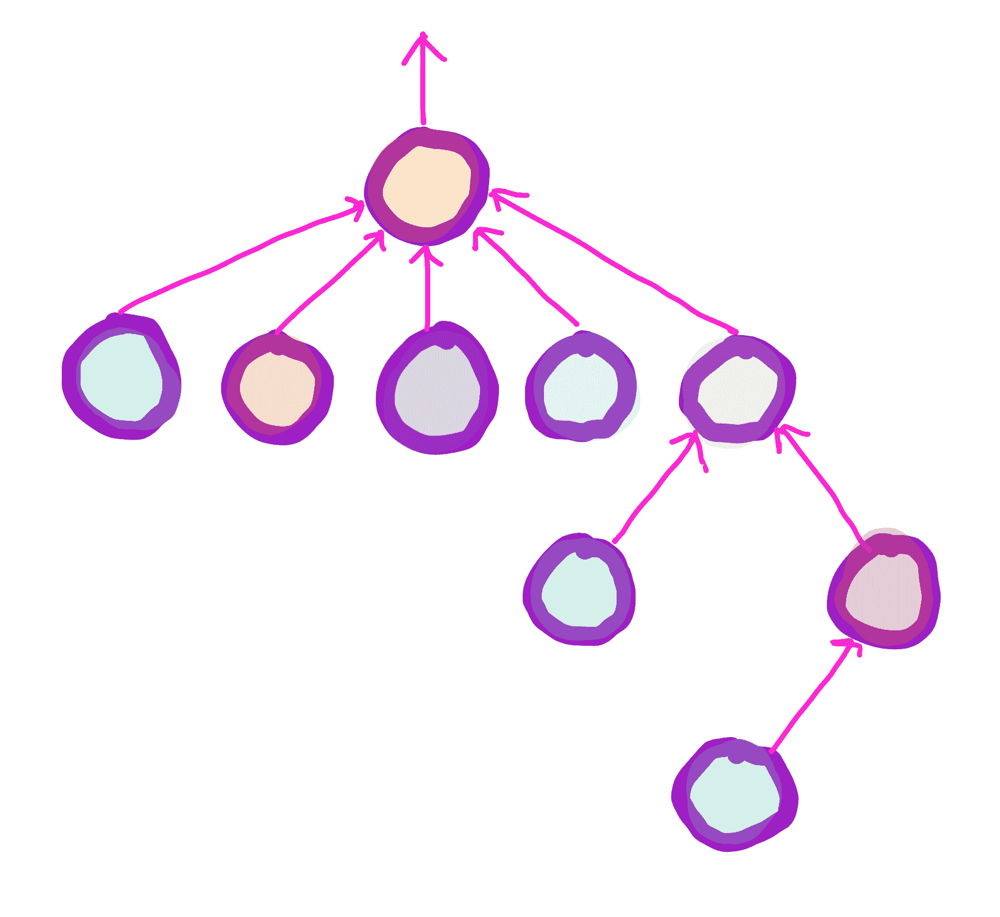

4: 按大小合并

### 路径压缩

在查找节点时，将所有节点移动到查询节点的路径上，以便下次查询这些节点时，运行时间会更快，这是一种有效的方法。

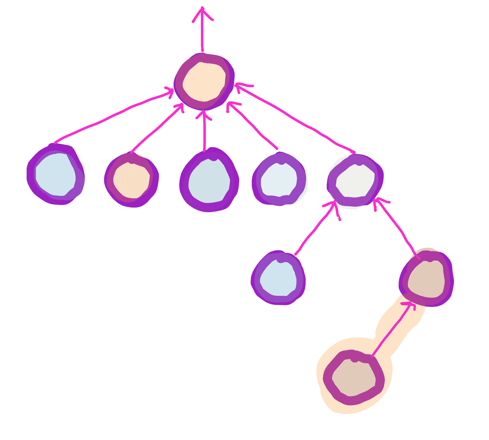

1: 压缩查询节点的路径

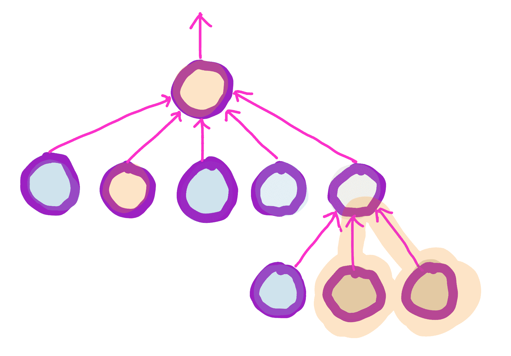

2: 压缩查询节点的路径

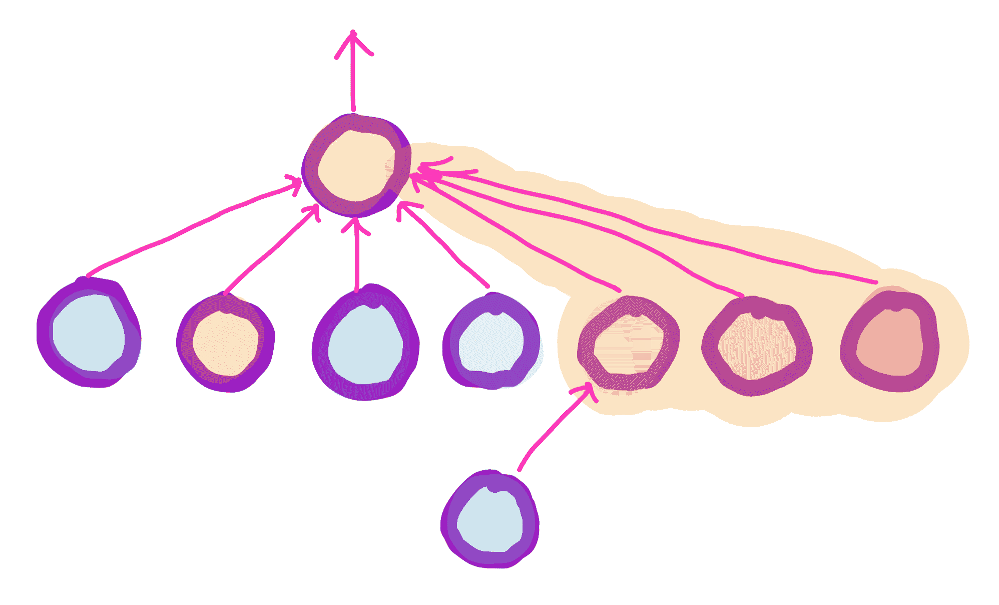

3: 压缩查询节点的路径

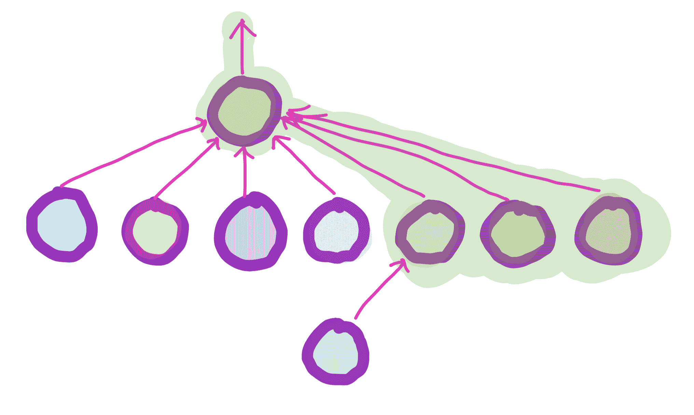

4: 已识别的集合和路径压缩

### 时间复杂度

通过路径压缩和按秩或大小进行合并，`find` 和 `union` 操作的运行时间基本上是常数时间

### 数组实现

分离集合可以作为数组实现，其中负数表示它们是代表，正数是它们父节点的指针。

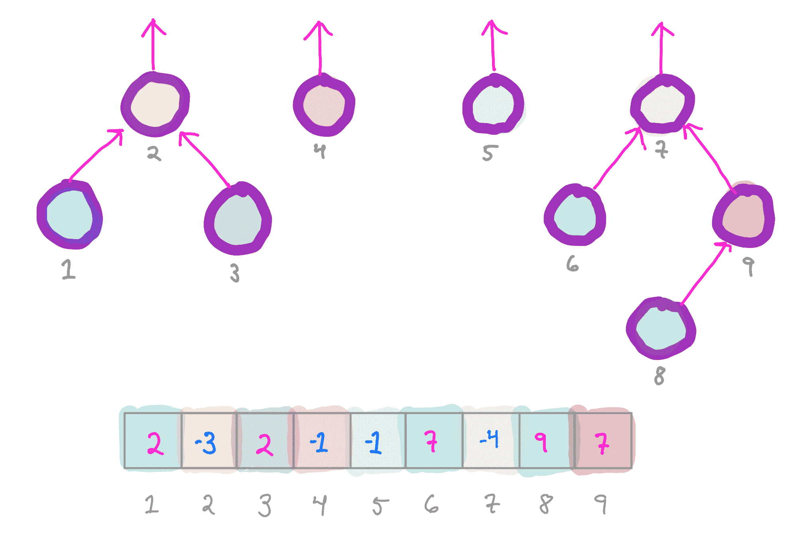

一种将集合的大小存储在代表中的数组实现，其中集合的大小存储在代表中
